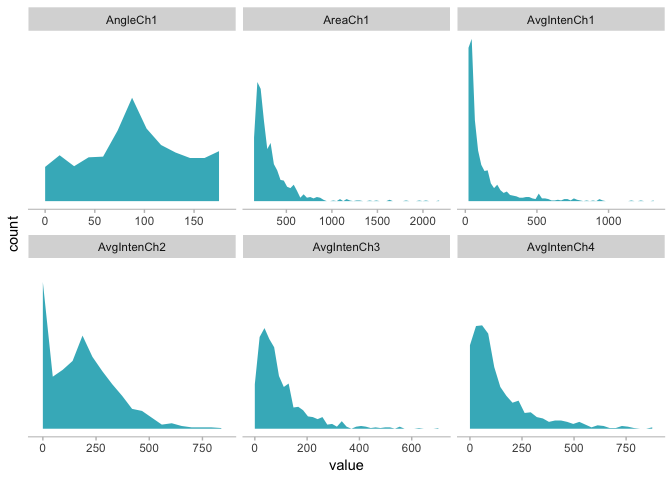
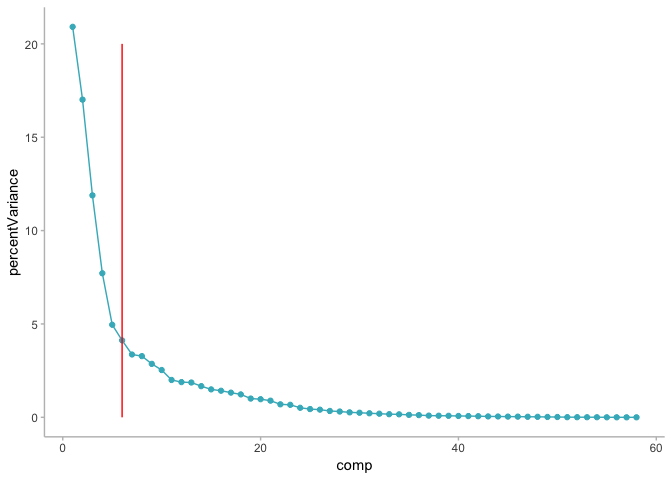
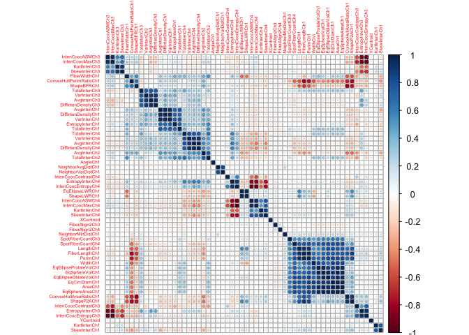

Applied Predictive Modeling
================
Santiago Toso

Data pre-procesing
==================

During this notebooks we will follow the computing in examples of the book [Applied Predictive Modelling](http://appliedpredictivemodeling.com/) by Max Kuhn and Kjell Johnson. Some of the commands will be exactly the ones you find on the book. Others, could be modified but always getting the same results.

``` r
#install.packages('AppliedPredictiveModeling')
#install.packages('caret')
library('AppliedPredictiveModeling')
library(tidyverse)
```

    ## ── Attaching packages ────────────────────────────────────────────────────────────────────────────────── tidyverse 1.2.1 ──

    ## ✔ ggplot2 3.1.0     ✔ purrr   0.2.5
    ## ✔ tibble  1.4.2     ✔ dplyr   0.7.6
    ## ✔ tidyr   0.8.1     ✔ stringr 1.3.1
    ## ✔ readr   1.1.1     ✔ forcats 0.3.0

    ## ── Conflicts ───────────────────────────────────────────────────────────────────────────────────── tidyverse_conflicts() ──
    ## ✖ dplyr::filter() masks stats::filter()
    ## ✖ dplyr::lag()    masks stats::lag()

``` r
library(pryr)
```

    ## 
    ## Attaching package: 'pryr'

    ## The following objects are masked from 'package:purrr':
    ## 
    ##     compose, partial

``` r
library(dplyr)
library(ggplot2)
library(reshape2)
```

    ## 
    ## Attaching package: 'reshape2'

    ## The following object is masked from 'package:tidyr':
    ## 
    ##     smiths

``` r
library(knitr)
```

We'll use the sample data the author shows during this chapter. This data comes from the library `AppliedPredictiveModeling` that we uploaded below.

``` r
data("segmentationOriginal")
```

The variable `Case` indicates if that specific sample was part of the training or testing set. We'll only keep the ones for training right now.

``` r
segData <- segmentationOriginal %>% 
  filter(Case == 'Train')
kable(as.tibble(head(segData)[1:10]))
```

|       Cell| Case  | Class |   AngleCh1|  AngleStatusCh1|  AreaCh1|  AreaStatusCh1|  AvgIntenCh1|  AvgIntenCh2|  AvgIntenCh3|
|----------:|:------|:------|----------:|---------------:|--------:|--------------:|------------:|------------:|------------:|
|  207932307| Train | PS    |  133.75204|               0|      819|              1|     31.92327|     205.8785|     69.91688|
|  207932463| Train | WS    |  106.64639|               0|      431|              0|     28.03883|     115.3155|     63.94175|
|  207932470| Train | PS    |   69.15032|               0|      298|              0|     19.45614|     101.2947|     28.21754|
|  207932484| Train | WS    |  109.41643|               0|      256|              0|     18.82857|     125.9388|     13.60000|
|  207932459| Train | PS    |  104.27865|               0|      258|              0|     17.57085|     124.3684|     22.46154|
|  207827779| Train | PS    |   77.99194|               0|      358|              0|     42.28363|     217.1316|     42.32164|

The `Class` and `Cell` fields will be saved in their own vector, then removed from the main object:

``` r
cellID <- segData$Cell
clase <- segData$Class
case <- segData$Case

segData <- segData[, -(1:3)]
```

The original data contained several "status" columns which were binary versions of the predictors. To remove these, we find the column names containing "Status" and remove them:

``` r
statusColNum <- grep("Status", names(segData))
statusColNum
```

    ##  [1]   2   4   9  10  11  12  14  16  20  21  22  26  27  28  30  32  34
    ## [18]  36  38  40  43  44  46  48  51  52  55  56  59  60  63  64  68  69
    ## [35]  70  72  73  74  76  78  80  82  84  86  88  92  93  94  97  98 103
    ## [52] 104 105 106 110 111 112 114

``` r
segData <- segData[, -statusColNum]
```

Data Transformations
--------------------

### Skewness

We are going to treat the skewness of these predictors with the `skewness` function of the library `e1071`.

``` r
library(e1071)
```

We will see first what kind of variables we are dealing with in this data frame.

``` r
kable(unique(lapply(segData, class)))
```

<table class="kable_wrapper">
<tbody>
<tr>
<td>
| x       |
|:--------|
| numeric |

</td>
<td>
| x       |
|:--------|
| integer |

</td>
</tr>
</tbody>
</table>
Since all the predictors are numeric or integer we can apply the `skewness` function to all of them.

``` r
skewValues <- apply(segData, 2, skewness)
head(skewValues)
```

    ##    AngleCh1     AreaCh1 AvgIntenCh1 AvgIntenCh2 AvgIntenCh3 AvgIntenCh4 
    ## -0.02426252  3.52510745  2.95918524  0.84816033  2.20234214  1.90047128

We can see that some of the variables have considerable skewness (numbers different from zero). Taking these variables as an example we could make an histogram of each of them to visually see the skewness.

```{r message=FALSE, warning=FALSE}
sixVar <- melt(segData[,1:6])
ggplot(sixVar, aes(value)) + facet_wrap(~variable, scales = 'free_x') +
  geom_area(stat = 'bin', binwidth = function(x) 2 * IQR(x) / (length(x)^(1/3)), fill = '#41b6c4') +
  # If we wanted to see histograms or frequency curves instead of the area graph we could use the next lines
  # geom_histogram(binwidth = function(x) 2 * IQR(x) / (length(x)^(1/3)), fill = '#41b6c4') +
  # geom_freqpoly(binwidth = function(x) 2 * IQR(x) / (length(x)^(1/3)), color = '#41b6c4') +
  theme(panel.grid = element_blank(),
        panel.background = element_blank(),
        axis.line.x = element_line(colour = "grey"),
        axis.line.y = element_blank(),
        axis.text.y = element_blank(),
        axis.ticks.x = element_line(colour = "grey"),
        axis.ticks.y = element_blank()
        )
```




We can specify a function for calculating binwidth, particularly useful when faceting along variables with different ranges as it is the case for us. In this particular case, we make the binwidth a function of the Inter-Quartile range of the variable (function `IQR`) and the number of samples.

Visually, it is pretty easy to notice the high skewness calculated in the step before.

Now, how can we deal with this? The authors proposed to use the Box-Cox method to determine what kind of transformation we should use. They propose the `BoxCoxTrans` function from the `caret` package to estimate λ for each of the variable and directly apply the correspondig transformation.

``` r
library(caret)
```

    ## Loading required package: lattice

    ## 
    ## Attaching package: 'caret'

    ## The following object is masked from 'package:purrr':
    ## 
    ##     lift

``` r
Ch1AreaTrans <- BoxCoxTrans(segData$AreaCh1)
Ch1AreaTrans
```

    ## Box-Cox Transformation
    ## 
    ## 1009 data points used to estimate Lambda
    ## 
    ## Input data summary:
    ##    Min. 1st Qu.  Median    Mean 3rd Qu.    Max. 
    ##   150.0   194.0   256.0   325.1   376.0  2186.0 
    ## 
    ## Largest/Smallest: 14.6 
    ## Sample Skewness: 3.53 
    ## 
    ## Estimated Lambda: -0.9

We can compare the original data set with the transformed one:

``` r
kable(head(segData$AreaCh1))
```

|    x|
|----:|
|  819|
|  431|
|  298|
|  256|
|  258|
|  358|

After the transformation:

``` r
kable(predict(Ch1AreaTrans, head(segData$AreaCh1)))
```

|         x|
|---------:|
|  1.108458|
|  1.106383|
|  1.104520|
|  1.103554|
|  1.103607|
|  1.105523|

If we apply the Box-Cox formula with the `λ = -0.9` we can check the transformation.

``` r
kable((head(segData$AreaCh1)^(-.9) - 1) / (-.9))
```

|         x|
|---------:|
|  1.108458|
|  1.106383|
|  1.104520|
|  1.103554|
|  1.103607|
|  1.105523|

### Centereing, Scaling and using PCA

To complete the transformations we need to do to our data, the authors propose to use another `caret` function, `preProcess`, that allows us to apply more than one transformation to a set of predictors. This function will be discussed in a minute.

First, we are going to center and scale the data. Then, we'll apply the `prcomp` function to apply **PCA** to our data.

``` r
pcaObject <- prcomp(segData,
                    center = TRUE,
                    scale. = TRUE)
```

We could check the cumulative percentage of variance which each component accounts for and then make a graph of it.

``` r
percentVariance <- (pcaObject$sdev^2) / sum(pcaObject$sdev^2) * 100
percentVariance[1:3]
```

    ## [1] 20.91236 17.01330 11.88689

We can also put it graphically. We create a line in the 6th variable since it is that is the last variable the PCA method considered.

``` r
dfPercentVariance<- as.data.frame(percentVariance)

dfPercentVariance <- dfPercentVariance %>% 
  mutate(comp = c(1:length(percentVariance)))

ggplot(data = dfPercentVariance, aes(x = comp, y = percentVariance)) +
  geom_point(color = '#41b6c4') + 
  geom_line(color = '#41b6c4') +
  theme(panel.grid = element_blank(),
        panel.background = element_blank(),
        axis.line = element_line(colour = "grey"),
        axis.ticks = element_line(colour = "grey")
        ) +
   annotate("segment", x = 6, xend = 6, y = 0, yend = 20, colour = "red")
```



The transformed values are stored in our object `pcaObject` as the sub-object called `x`:

``` r
head(pcaObject$x[,1:5])
```

    ##             PC1        PC2         PC3       PC4        PC5
    ## [1,]  5.0985749  4.5513804 -0.03345155 -2.640339  1.2783212
    ## [2,] -0.2546261  1.1980326 -1.02059569 -3.731079  0.9994635
    ## [3,]  1.2928941 -1.8639348 -1.25110461 -2.414857 -1.4914838
    ## [4,] -1.4646613 -1.5658327  0.46962088 -3.388716 -0.3302324
    ## [5,] -0.8762771 -1.2790055 -1.33794261 -3.516794  0.3936099
    ## [6,] -0.8615416 -0.3286842 -0.15546723 -2.206636  1.4731658

The other sub-object called `rotation` tells us the varible loadings:

``` r
head(pcaObject$rotation[,1:3])
```

    ##                      PC1         PC2          PC3
    ## AngleCh1     0.001213758 -0.01284461  0.006816473
    ## AreaCh1      0.229171873  0.16061734  0.089811727
    ## AvgIntenCh1 -0.102708778  0.17971332  0.067696745
    ## AvgIntenCh2 -0.154828672  0.16376018  0.073534399
    ## AvgIntenCh3 -0.058042158  0.11197704 -0.185473286
    ## AvgIntenCh4 -0.117343465  0.21039086 -0.105060977

The author points out that if we wanted to use the functionality for the *spatial sign* transformation we could get it in the class `spatialSign` that is included in the `caret` package. We will not apply it now, but the sintax would simpy be `spatialSign(segData)`.

Also, these data has no missing values, which means we won't be able to practice the values imputation. Nonetheless, the authors point out that we could apply the **K-Nearest neighbor** method to it using the `impute.knn` functionality from the `imput` package. The previously mentioned `preProcess` function applies imputation methods based on K-nearest neighbor or bagged trees.

To administer a series of transformations to multiple data sets (or variables) the `caret` class `preProcess` has the ability to transform, center, scale or impute values, as well as apply the spatial sign transformation and feature extraction. The function calculates the required quantities for the transformation. After calling the `preProcess` function, the `predict` method applies the results to a set of data. For example, Box-Cox transform, center and scale the data, then execute PCA for signal extraction, the syntax would be:

``` r
trans <- preProcess(segData,
                    method = c('BoxCox', "center", "scale", "pca"))
trans
```

    ## Created from 1009 samples and 58 variables
    ## 
    ## Pre-processing:
    ##   - Box-Cox transformation (47)
    ##   - centered (58)
    ##   - ignored (0)
    ##   - principal component signal extraction (58)
    ##   - scaled (58)
    ## 
    ## Lambda estimates for Box-Cox transformation:
    ##     Min.  1st Qu.   Median     Mean  3rd Qu.     Max. 
    ## -2.00000 -0.50000 -0.10000  0.05106  0.30000  2.00000 
    ## 
    ## PCA needed 19 components to capture 95 percent of the variance

Now we can apply the transformations.

``` r
transformed <- predict(trans, segData)
head(transformed[,1:5])
```

    ##          PC1        PC2        PC3       PC4        PC5
    ## 1  1.5684742  6.2907855 -0.3333299 -3.063327 -1.3415782
    ## 2 -0.6664055  2.0455375 -1.4416841 -4.701183 -1.7422020
    ## 3  3.7500055 -0.3915610 -0.6690260 -4.020753  1.7927777
    ## 4  0.3768509 -2.1897554  1.4380167 -5.327116 -0.4066757
    ## 5  1.0644951 -1.4646516 -0.9900478 -5.627351 -0.8650174
    ## 6 -0.3798629  0.2173028  0.4387980 -2.069880 -1.9363920

The order in which the transformations are applied is transformation, centering, scaling, imputation, feature extracton and then spatial sign.

Many modeling functions have options to center and scale prior to modeling. For example, when using the `train` function (discussed in later chapters), there is an option to use `preProcess` prior to modeling within the resampling iterations.

Filtering
---------

The author tells us that to filter for near-zero variance predictors, the `caret` package function `nearZeroVar` will return the column numbers of any predictors that fulfill these conditions:

-   The fraction of unique values over the sample size is &lt; 10%.
-   The ratio of the frequency of the most prevalent value to the frequency of the second most prevalent value is large (~20).

For our data, it looks that none of the variables are problematic.

``` r
nearZeroVar(segData)
```

    ## integer(0)

In case we had some problematic predictors, the function would return a vector of integers with the column numbers of the predictors that should be removed.

Similarly, to filter the on betwee-predictor correlations the `cor` function can calculate the correlations between predictor variables:

``` r
correlations <- cor(segData)
correlations[1:4, 1:4]
```

    ##                 AngleCh1      AreaCh1 AvgIntenCh1 AvgIntenCh2
    ## AngleCh1     1.000000000 -0.002627172 -0.04300776 -0.01944681
    ## AreaCh1     -0.002627172  1.000000000 -0.02529739 -0.15330301
    ## AvgIntenCh1 -0.043007757 -0.025297394  1.00000000  0.52521711
    ## AvgIntenCh2 -0.019446810 -0.153303007  0.52521711  1.00000000

To visually examine the correlations structure of the data the `corrplot` package contains an excellent function of the same name. The function has many options including one that will reorder the variables in a way that reveals clusters of highly correlated predictors. The following command can help.

``` r
#install.packages('corrplot')
library(corrplot)
```

    ## corrplot 0.84 loaded

``` r
corrplot(correlations, order = 'hclust', tl.cex = 0.4)
```



The size and color of the points is associated with the strenght of correlations between two predictor variables.

To filter based on correlations the `findCorrelation` function will apply the algorithm explained by the authors in Sect. 3.5:

1- Calculate the correlation matrix of the predictors. 2- Determine the 2 predictors with the higher correlation (call them A and B). 3- Determine the average correlation between A and the rest of the predictors. Do the same for B. 4- Remove the predictor with the highest average correlation. 5- Repeat steps 2-4 until all absolute correlations are above the threshold defined.

For a given threshold of pairwise correlations, the function returns column numbers denoting the predictors recommended for deletion.

``` r
highCorr <- findCorrelation(correlations, cutoff = .75)
length(highCorr)
```

    ## [1] 32

The algorithm recommends us to remove 32 variables in order to respect the threshold.

``` r
filteredSegData <- segData[, -highCorr]
```

Creating Dummy variables
------------------------

Will leave this subject for section 4.9 where several methods to create dummy variables are introduced.
