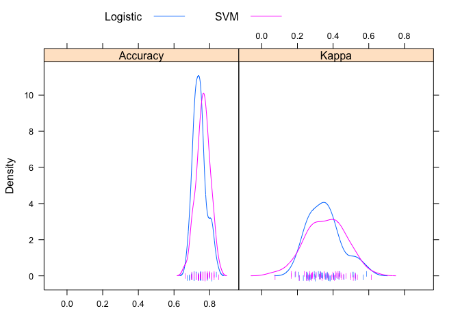

Applied Predictive Modeling
================
Santiago Toso

Data Splitting
==============

We'll use the data the authors use in this chapter.

``` r
library(AppliedPredictiveModeling)
data(twoClassData)
```

The predictors are stored in the data frame `predictors` and has 208 samples.

``` r
as.tibble(predictors)
```

    ## # A tibble: 208 x 2
    ##    PredictorA PredictorB
    ##  *      <dbl>      <dbl>
    ##  1     0.158      0.161 
    ##  2     0.655      0.492 
    ##  3     0.706      0.633 
    ##  4     0.199      0.0881
    ##  5     0.395      0.415 
    ##  6     0.425      0.299 
    ##  7     0.0658     0.179 
    ##  8     0.309      0.280 
    ##  9     0.165      0.116 
    ## 10     0.106      0.0801
    ## # ... with 198 more rows

The outcome classes are contained in a factor vector called `classes`.

``` r
str(classes)
```

    ##  Factor w/ 2 levels "Class1","Class2": 2 2 2 2 2 2 2 2 2 2 ...

The base R function `sample` can create simple random splits of the data. To create stratified random splits of the data (based on the classes), the `createDataPartition` function in the `caret` package can be used. The percent of data that will be allocated to the training set should be specified.

First, we set the random seed so we can reproduce the results.

``` r
set.seed(1)
```

By default, the numbers are returned as a list. Using **list = FALSE**, a matrix of row numbers is generated. These samples are allocated to the training set.

``` r
trainingRows <- createDataPartition(classes,
                                    p = .8,
                                    list = FALSE)
head(trainingRows)
```

    ##      Resample1
    ## [1,]         1
    ## [2,]         2
    ## [3,]         3
    ## [4,]         4
    ## [5,]         5
    ## [6,]         6

Now we can create the training set.

``` r
trainPredictors <- predictors[trainingRows, ]
trainClasses <- classes[trainingRows]

as_tibble(trainPredictors)
```

    ## # A tibble: 167 x 2
    ##    PredictorA PredictorB
    ##  *      <dbl>      <dbl>
    ##  1     0.158      0.161 
    ##  2     0.655      0.492 
    ##  3     0.706      0.633 
    ##  4     0.199      0.0881
    ##  5     0.395      0.415 
    ##  6     0.425      0.299 
    ##  7     0.309      0.280 
    ##  8     0.165      0.116 
    ##  9     0.0996     0.0492
    ## 10     0.0847     0.0548
    ## # ... with 157 more rows

And the test set.

``` r
testPredictors <- predictors[-trainingRows, ]
testClasses <- classes[-trainingRows]

as_tibble(testPredictors)
```

    ## # A tibble: 41 x 2
    ##    PredictorA PredictorB
    ##  *      <dbl>      <dbl>
    ##  1     0.0658     0.179 
    ##  2     0.106      0.0801
    ##  3     0.291      0.302 
    ##  4     0.413      0.287 
    ##  5     0.0472     0.0414
    ##  6     0.052      0.115 
    ##  7     0.372      0.214 
    ##  8     0.139      0.174 
    ##  9     0.078      0.156 
    ## 10     0.0948     0.144 
    ## # ... with 31 more rows

To generate a test set using maximum dissimilarity sampling, the `caret` function `maxDissim` can be used to sequentially sample the data.

Resampling
==========

The `caret` package has various functions for data splitting. For example, to use repeated training/test splits, the function `createDataPartition` could be used again with an additional argument named `times` to generate multiple splits. For illustration, we'll generate the information needed for three resampled versions of the training set.

``` r
set.seed(1)
repeatedSplits <- createDataPartition(trainClasses, 
                                      p = 0.8,
                                      times = 3)

as.tibble(repeatedSplits)
```

    ## # A tibble: 135 x 3
    ##    Resample1 Resample2 Resample3
    ##        <int>     <int>     <int>
    ##  1         1         2         4
    ##  2         2         3         5
    ##  3         4         4         6
    ##  4         5         6         7
    ##  5         6         7         8
    ##  6         8         8         9
    ##  7         9         9        11
    ##  8        10        11        13
    ##  9        11        14        14
    ## 10        12        15        15
    ## # ... with 125 more rows

Similarly, the `caret` package has functions `createResamples` (for bootstrapping), `createFolds` (for **k**-fold cross-validation) and `createMultiSamples` (for Monte Carlos cross-validation). To create indicators for 10-fold cross-validation:

``` r
set.seed(1)
cvSplits <- createFolds(trainClasses, k=10, returnTrain = TRUE)

str(cvSplits)
```

    ## List of 10
    ##  $ Fold01: int [1:151] 2 3 4 5 6 7 11 12 13 14 ...
    ##  $ Fold02: int [1:150] 1 2 3 4 5 6 7 8 9 10 ...
    ##  $ Fold03: int [1:150] 1 2 3 4 5 6 7 8 9 10 ...
    ##  $ Fold04: int [1:151] 1 2 3 4 5 7 8 9 10 11 ...
    ##  $ Fold05: int [1:150] 1 2 3 5 6 7 8 9 10 11 ...
    ##  $ Fold06: int [1:150] 1 2 3 4 5 6 8 9 10 11 ...
    ##  $ Fold07: int [1:150] 1 3 4 5 6 7 8 9 10 11 ...
    ##  $ Fold08: int [1:151] 1 2 3 4 5 6 7 8 9 10 ...
    ##  $ Fold09: int [1:150] 1 2 4 5 6 7 8 9 10 12 ...
    ##  $ Fold10: int [1:150] 1 2 3 4 6 7 8 9 10 11 ...

Each fold is a list of rows from the `trainClasses` vector.

Get the first fold (training set). Notice that `cvSplits` is a list of data frames:

``` r
fold1 <- cvSplits[[1]]
```

To get the first 90% of the data (first fold):

``` r
cvPredictors1 <- trainPredictors[fold1, ]
cvClasses1 <- trainClasses[fold1]
paste('The original training sample has ', nrow(trainPredictors), ' rows', sep = '')
```

    ## [1] "The original training sample has 167 rows"

``` r
paste('The first fold training sample has ', nrow(cvPredictors1), ' rows', sep = '')
```

    ## [1] "The first fold training sample has 151 rows"

In practice, functions discussed in the next section can be used to automatically create a resampled data sets, fit models and evaluate performance.

Basic Model Building in R
=========================

Now that we have training and test sets, we could fit a 5-nearest neighbor classification model to the trianing data and use it to predict the test set. There are miltiple R functions for building this model: the `knn` function in the `MASS` package, the `ipredknn` function in the `ipred` package, and the `knn3` function in `caret`. The `knn3` function can produce class predictions as well as the proportion of neighbors for each class.

There are two main conventions for specifying models in R: the formula interface and the non-formula (or "matrix") interface. For the former, the predictors are explicitly listed. A basic R formula has two sides: the left-hand side denotes the outcome and the right-hand side describes how the predictors are used. These are separated with a tilde (~). For example, the fomrula `modelFuction(price ~ numBedrooms + numBaths + acres, data = housingData)` would predict the closing price of a house using three quantitative charasteristics. The formla `y ~ .` can be used to indicate that all the coulumns in the data set (except y) should be used as a predictor. The formula interface has many conveniences. For example, trnasformations such as `log(acres)` can be specified in line. Unfortunately, R does not efficiently store the information about the formula. Using this interdace with data sets that contain a large number of predictors may unnecessarily slow the computations.

The non-formula interface specifies the preductors for the model using a matrix or data frame (all the predictors in the object are used in the model). The outcome data are usually passed into the model as a vector object. For example `modelFunction(x = housePredictors, y = price)`.

Note that not all R functions have both interfaces.

For `knn3`, we can estimate the 5-nearest neighbor model with

``` r
trainPredictors <- as.matrix(trainPredictors)
knnFit <- knn3(x = trainPredictors, y = trainClasses, k = 5)
knnFit
```

    ## 5-nearest neighbor model
    ## Training set outcome distribution:
    ## 
    ## Class1 Class2 
    ##     89     78

At this point, the `knn3` object is ready to predict new samples. To assign new samples to classes, the `predict` method is used with the model object. The standard convention is:

``` r
testPredictions <- predict(knnFit, newdata =  testPredictors, type = 'class')
head(testPredictions)
```

    ## [1] Class2 Class2 Class1 Class1 Class2 Class2
    ## Levels: Class1 Class2

Let's see how the model did

``` r
results <-as.vector(testPredictions == testClasses) 
performance <- length(subset(results, results == TRUE))/length(results)*100
paste('The model made the right prediction for ', round(performance, 1), '% of the test classes', sep = '')
```

    ## [1] "The model made the right prediction for 73.2% of the test classes"

Determination of the Tuning Parameters
======================================

Section 4.6 illustrated parameter tuning for a SVM using credit scoring data. Using resampling, a value of the cost parameter was estimated. As discussed in later chapters, the SVM model is characterized by what type of kernel function the model uses. For example, the linear kernel function specifies a linear relationship between the predictors and the function outcome. For the example, a radial basis function (RBF) kernel function was used. The kernel function has an additional tuning parameter associated with it denoted as `σ`, which impacts the smoothness of the decision boundary. Normally, several combinations of both tuning parameters would be evaluated using resampling. However, Caputo et al. (2002) describe an analytical formula that can be used to get reasonable estimates of σ. The `caret` function `train` uses this approach to estimate the kernel parameter, leaving only the cost parameter for tuning.

To tune an SVM model using the credit scroing training set samples, the `train` function can be used. Both the training set predictors and outcome are contained in an R data frame called `GermanCreditTrain`.

``` r
library(caret)
data("GermanCredit")
as_tibble(GermanCredit)
```

    ## # A tibble: 1,000 x 62
    ##    Duration Amount InstallmentRate… ResidenceDurati…   Age NumberExistingC…
    ##       <int>  <int>            <int>            <int> <int>            <int>
    ##  1        6   1169                4                4    67                2
    ##  2       48   5951                2                2    22                1
    ##  3       12   2096                2                3    49                1
    ##  4       42   7882                2                4    45                1
    ##  5       24   4870                3                4    53                2
    ##  6       36   9055                2                4    35                1
    ##  7       24   2835                3                4    53                1
    ##  8       36   6948                2                2    35                1
    ##  9       12   3059                2                4    61                1
    ## 10       30   5234                4                2    28                2
    ## # ... with 990 more rows, and 56 more variables:
    ## #   NumberPeopleMaintenance <int>, Telephone <dbl>, ForeignWorker <dbl>,
    ## #   Class <fct>, CheckingAccountStatus.lt.0 <dbl>,
    ## #   CheckingAccountStatus.0.to.200 <dbl>,
    ## #   CheckingAccountStatus.gt.200 <dbl>, CheckingAccountStatus.none <dbl>,
    ## #   CreditHistory.NoCredit.AllPaid <dbl>,
    ## #   CreditHistory.ThisBank.AllPaid <dbl>, CreditHistory.PaidDuly <dbl>,
    ## #   CreditHistory.Delay <dbl>, CreditHistory.Critical <dbl>,
    ## #   Purpose.NewCar <dbl>, Purpose.UsedCar <dbl>,
    ## #   Purpose.Furniture.Equipment <dbl>, Purpose.Radio.Television <dbl>,
    ## #   Purpose.DomesticAppliance <dbl>, Purpose.Repairs <dbl>,
    ## #   Purpose.Education <dbl>, Purpose.Vacation <dbl>,
    ## #   Purpose.Retraining <dbl>, Purpose.Business <dbl>, Purpose.Other <dbl>,
    ## #   SavingsAccountBonds.lt.100 <dbl>,
    ## #   SavingsAccountBonds.100.to.500 <dbl>,
    ## #   SavingsAccountBonds.500.to.1000 <dbl>,
    ## #   SavingsAccountBonds.gt.1000 <dbl>, SavingsAccountBonds.Unknown <dbl>,
    ## #   EmploymentDuration.lt.1 <dbl>, EmploymentDuration.1.to.4 <dbl>,
    ## #   EmploymentDuration.4.to.7 <dbl>, EmploymentDuration.gt.7 <dbl>,
    ## #   EmploymentDuration.Unemployed <dbl>,
    ## #   Personal.Male.Divorced.Seperated <dbl>,
    ## #   Personal.Female.NotSingle <dbl>, Personal.Male.Single <dbl>,
    ## #   Personal.Male.Married.Widowed <dbl>, Personal.Female.Single <dbl>,
    ## #   OtherDebtorsGuarantors.None <dbl>,
    ## #   OtherDebtorsGuarantors.CoApplicant <dbl>,
    ## #   OtherDebtorsGuarantors.Guarantor <dbl>, Property.RealEstate <dbl>,
    ## #   Property.Insurance <dbl>, Property.CarOther <dbl>,
    ## #   Property.Unknown <dbl>, OtherInstallmentPlans.Bank <dbl>,
    ## #   OtherInstallmentPlans.Stores <dbl>, OtherInstallmentPlans.None <dbl>,
    ## #   Housing.Rent <dbl>, Housing.Own <dbl>, Housing.ForFree <dbl>,
    ## #   Job.UnemployedUnskilled <dbl>, Job.UnskilledResident <dbl>,
    ## #   Job.SkilledEmployee <dbl>,
    ## #   Job.Management.SelfEmp.HighlyQualified <dbl>

The `chapters` directory of the `AppliedPredictiveModeling` package contains the code for creating the training and test sets. These data sets are contained in the data frames `GermanCreditTrain` and `GermanCreditTest`, respectively.

``` r
trainRows <- createDataPartition(GermanCredit$Class, 
                                 p = .8,
                                 list = FALSE)
GermanCreditTrain <- GermanCredit[trainRows, ]
GermanCreditTest <- GermanCredit[-trainRows, ]
```

We will use all the predictors to model the outcome. To do this we use the formula interface with the formula `Class ~ .` the classes are stored in the data frame column called `class`. The most basic function would be

``` r
set.seed(1056)
svmFit1 <- train(Class ~ .,
                data = GermanCreditTrain,
                # The method argument indicates the model type.
                # See ?train for a list of available models.
                method = 'svmRadial')
svmFit1
```

    ## Support Vector Machines with Radial Basis Function Kernel 
    ## 
    ## 800 samples
    ##  61 predictor
    ##   2 classes: 'Bad', 'Good' 
    ## 
    ## No pre-processing
    ## Resampling: Bootstrapped (25 reps) 
    ## Summary of sample sizes: 800, 800, 800, 800, 800, 800, ... 
    ## Resampling results across tuning parameters:
    ## 
    ##   C     Accuracy   Kappa      
    ##   0.25  0.6888989  0.009594586
    ##   0.50  0.6837618  0.035132048
    ##   1.00  0.6789756  0.046972557
    ## 
    ## Tuning parameter 'sigma' was held constant at a value of 8.703629e-06
    ## Accuracy was used to select the optimal model using the largest value.
    ## The final values used for the model were sigma = 8.703629e-06 and C = 0.25.

However we would like to tailor the computations by overriding several of the default values. First, we would like to pre-process the predictor data by centering and scaling their values. To do this, the `preProc` argument can be used:

``` r
set.seed(1056)
svmFit2 <- train(Class ~ .,
                 data = GermanCreditTrain,
                 method = 'svmRadial',
                 preProcess = c('center', "scale"))
svmFit2
```

    ## Support Vector Machines with Radial Basis Function Kernel 
    ## 
    ## 800 samples
    ##  61 predictor
    ##   2 classes: 'Bad', 'Good' 
    ## 
    ## Pre-processing: centered (61), scaled (61) 
    ## Resampling: Bootstrapped (25 reps) 
    ## Summary of sample sizes: 800, 800, 800, 800, 800, 800, ... 
    ## Resampling results across tuning parameters:
    ## 
    ##   C     Accuracy   Kappa     
    ##   0.25  0.7080736  0.07533983
    ##   0.50  0.7349981  0.25115659
    ##   1.00  0.7441455  0.32568261
    ## 
    ## Tuning parameter 'sigma' was held constant at a value of 0.01030314
    ## Accuracy was used to select the optimal model using the largest value.
    ## The final values used for the model were sigma = 0.01030314 and C = 1.

Also, for this function, the user can specify the exact cost values to investigate. In addition, the function has algorithms to determine reasonable values for many models. Using the option `tuneLength = 10`, the cost values 2^-2, 2^-1,..., 2^7 are evaluated.

``` r
set.seed(1056)
svmFit3 <- train(Class ~ .,
                 data = GermanCreditTrain,
                 method = 'svmRadial',
                 preProcess = c("center", "scale"),
                 tuneLength = 10)
svmFit3
```

    ## Support Vector Machines with Radial Basis Function Kernel 
    ## 
    ## 800 samples
    ##  61 predictor
    ##   2 classes: 'Bad', 'Good' 
    ## 
    ## Pre-processing: centered (61), scaled (61) 
    ## Resampling: Bootstrapped (25 reps) 
    ## Summary of sample sizes: 800, 800, 800, 800, 800, 800, ... 
    ## Resampling results across tuning parameters:
    ## 
    ##   C       Accuracy   Kappa     
    ##     0.25  0.7080736  0.07533983
    ##     0.50  0.7349981  0.25115659
    ##     1.00  0.7441455  0.32568261
    ##     2.00  0.7457114  0.35174199
    ##     4.00  0.7400403  0.35090799
    ##     8.00  0.7354524  0.34656252
    ##    16.00  0.7319051  0.34247955
    ##    32.00  0.7243998  0.32683324
    ##    64.00  0.7224520  0.32468443
    ##   128.00  0.7223259  0.32534162
    ## 
    ## Tuning parameter 'sigma' was held constant at a value of 0.01030314
    ## Accuracy was used to select the optimal model using the largest value.
    ## The final values used for the model were sigma = 0.01030314 and C = 2.

By default, the it uses the bootstrap method for resampling and calculate performance measures. Repeated 10-fold cross-validation can be specified with the `trainControl` function. The final sintax is then

``` r
set.seed(1056)
svmFit <- train(Class ~ .,
                data = GermanCreditTrain,
                method = 'svmRadial',
                preProcess = c("center", "scale"),
                tuneLength = 10,
                trControl = trainControl(method = 'repeatedcv',
                                         repeats = 5,
                                         classProbs = TRUE))
svmFit
```

    ## Support Vector Machines with Radial Basis Function Kernel 
    ## 
    ## 800 samples
    ##  61 predictor
    ##   2 classes: 'Bad', 'Good' 
    ## 
    ## Pre-processing: centered (61), scaled (61) 
    ## Resampling: Cross-Validated (10 fold, repeated 5 times) 
    ## Summary of sample sizes: 720, 720, 720, 720, 720, 720, ... 
    ## Resampling results across tuning parameters:
    ## 
    ##   C       Accuracy  Kappa    
    ##     0.25  0.75575   0.3880794
    ##     0.50  0.75350   0.3760204
    ##     1.00  0.75275   0.3484386
    ##     2.00  0.75300   0.3452424
    ##     4.00  0.75900   0.3596971
    ##     8.00  0.76300   0.3592262
    ##    16.00  0.76200   0.3518612
    ##    32.00  0.75450   0.3285427
    ##    64.00  0.75075   0.3167262
    ##   128.00  0.74650   0.3076034
    ## 
    ## Tuning parameter 'sigma' was held constant at a value of 0.01030314
    ## Accuracy was used to select the optimal model using the largest value.
    ## The final values used for the model were sigma = 0.01030314 and C = 8.

A line plot of average performance depending on the cost.

``` r
#plot(svmFit, scales = list(x = list(log = 2)))
library(scales)
ggplot(svmFit, aes(x = svmFit$xlevels, y = svmFit$yLimits)) +
  geom_point(color = '#41b6c4') +
  geom_line(color = '#41b6c4') +
  scale_x_continuous(trans = log2_trans(),
    breaks = trans_breaks("log2", function(x) 2^x),
    labels = trans_format("log2", math_format(2^.x))) +
  scale_y_continuous(labels = percent) +
  theme(panel.grid = element_blank(),
        panel.background = element_blank(),
        axis.line.x = element_line(colour = "grey"),
        axis.line.y = element_line(colour = "grey"),
        axis.ticks.x = element_line(colour = "grey"),
        axis.ticks.y = element_line(colour = "grey")
        )
```


To predict new samples with this model, we use the `predict` function

``` r
predictedClasses <- predict(svmFit, GermanCreditTest)
str(predictedClasses)
```

    ##  Factor w/ 2 levels "Bad","Good": 1 2 1 2 2 2 1 2 2 1 ...

``` r
summary(predictedClasses)
```

    ##  Bad Good 
    ##   37  163

We can use the `type` option to get class probabilities

``` r
predictedProb <- predict(svmFit, GermanCreditTest, type = 'prob')
head(predictedProb)
```

    ##          Bad      Good
    ## 1 0.52860243 0.4713976
    ## 2 0.07282403 0.9271760
    ## 3 0.70884851 0.2911515
    ## 4 0.42623401 0.5737660
    ## 5 0.26555339 0.7344466
    ## 6 0.36819024 0.6318098

Between-Model Comparisons
=========================

In section 4.6, the SVM model was contrasted with a logistic regression model. While basic logistic regression has no tuning parameters, resampling can still be used to charaterize the performance of the model. The `train` function is once again used with a different `method` argument of `glm` (for generalized linear models). The same resampling specification is used and, since the random number seed is set prior to modeling, the resamples are exactly the same as those in the SVM model.

``` r
set.seed(1056)
logisticReg <- train(Class ~ . ,
                     GermanCreditTrain,
                     method = 'glm',
                     #preProcess = c("center", "scale") this preprocess doesn't affect the results, so we can skip it
                     trControl = trainControl(method = 'repeatedcv',
                                              repeats = 5,
                                              classProbs = TRUE)
                     #doesn't have "tuneLength" since linear models don't have tuning parameters
)
logisticReg
```

    ## Generalized Linear Model 
    ## 
    ## 800 samples
    ##  61 predictor
    ##   2 classes: 'Bad', 'Good' 
    ## 
    ## No pre-processing
    ## Resampling: Cross-Validated (10 fold, repeated 5 times) 
    ## Summary of sample sizes: 720, 720, 720, 720, 720, 720, ... 
    ## Resampling results:
    ## 
    ##   Accuracy  Kappa    
    ##   0.74375   0.3526291

To compare these two models based on their cross-validation statistics, the `resamples` function can be used with models that share a common set of resampled data sets. Since the random number seed was initialized prior to both models, paired accuracy measurements exist for each data set. First, we create a `resamples` object from the models:

``` r
resamp <- resamples(list(SVM = svmFit, Logistic = logisticReg))
summary(resamp)
```

    ## 
    ## Call:
    ## summary.resamples(object = resamp)
    ## 
    ## Models: SVM, Logistic 
    ## Number of resamples: 50 
    ## 
    ## Accuracy 
    ##            Min.  1st Qu. Median    Mean 3rd Qu.   Max. NA's
    ## SVM      0.6625 0.737500 0.7625 0.76300  0.7875 0.8500    0
    ## Logistic 0.6750 0.715625 0.7375 0.74375  0.7625 0.8375    0
    ## 
    ## Kappa 
    ##                Min.   1st Qu.    Median      Mean   3rd Qu.      Max. NA's
    ## SVM      0.07534247 0.2808219 0.3592593 0.3592262 0.4333333 0.6153846    0
    ## Logistic 0.18750000 0.2731929 0.3421053 0.3526291 0.4047619 0.5886076    0

The summary indicates that the performance distributions are very similar. The NA column corresponds to cases where the resampled models failed (usually due to numerical issues). The `resamples` class has several methods for visualizing the paired values (see ?xyplot.resamples for a list of plot types).

``` r
dotplot(resamp,
        scales =list(x = list(relation = "free")),
        between = list(x = 2))
```


``` r
# bwplot(resamp,
#        metric = "RMSE")

densityplot(resamp,
            auto.key = list(columns = 3),
            pch = "|")
```



``` r
# xyplot(resamp,
#        models = c("CART", "MARS"),
#        metric = "RMSE")

# splom(resamp, metric = "RMSE")
# splom(resamp, variables = "metrics")

# parallelplot(resamp, metric = "RMSE")


#?xyplot.resamples
```

To asses possible differences between methods the `diff` method is used.

``` r
modelDifferences <- diff(resamp)
summary(modelDifferences)
```

    ## 
    ## Call:
    ## summary.diff.resamples(object = modelDifferences)
    ## 
    ## p-value adjustment: bonferroni 
    ## Upper diagonal: estimates of the difference
    ## Lower diagonal: p-value for H0: difference = 0
    ## 
    ## Accuracy 
    ##          SVM      Logistic
    ## SVM               0.01925 
    ## Logistic 0.001456         
    ## 
    ## Kappa 
    ##          SVM    Logistic
    ## SVM             0.006597
    ## Logistic 0.6813

The p-values for the model comparisons are large (0.96 for accuracy and 0.89 &gt; 0.05 for kappa), which indicates that the models fail to show any significative difference in performance.
