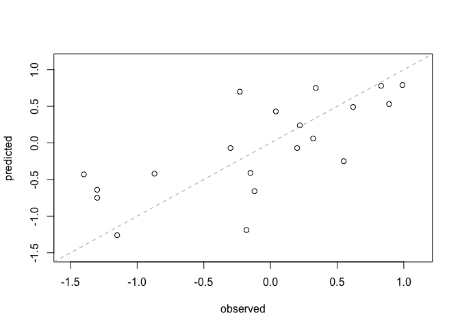
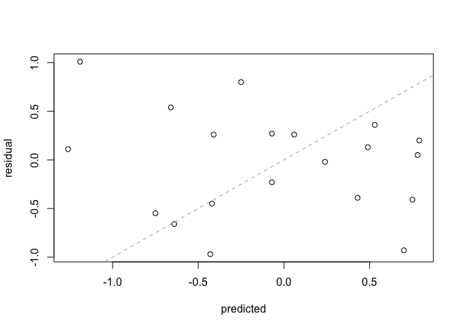

Applied Predictive Modeling
================
Santiago Toso

The following sections will reference functions from the `caret` package.

To compute model performance, the observed and predicted outcomes should be stored in vectors. For regression, the vectors should be numeric. Here two vectors are manually created to illustrate the techniques:

``` r
observed <- c(.22, .83, -.12, .89, -.23, -1.3, -.15, -1.4, .62, .99, -.18, .32, .34, -.30, .04, -.87, .55, -1.3, -1.15, .2)

predicted <- c(.24, .78, -.66, .53, .7, -.75, -.41, -.43, .49, .79, -1.19, .06, .75, -.07, .43, -.42, -.25, -.64, -1.26, -.07)

residualValues <- observed - predicted
summary(residualValues)
```

    ##    Min. 1st Qu.  Median    Mean 3rd Qu.    Max. 
    ## -0.9700 -0.4200  0.0800 -0.0310  0.2625  1.0100

An important step in evaluating the quality of the model is to visualize the results. First, a plot of the observed values against the predicted values helps one to understand how well the model fits. Also, a plot of the residuals versus the predicted values can help uncover systematic patterns in the model predictions.

``` r
axisRange <- extendrange(c(observed, predicted))
plot(observed, predicted,
     ylim = axisRange,
     xlim = axisRange)

#Add 45 degrees reference line
abline(0, 1, col = "darkgrey", lty = 2)
```



``` r
#Predicted values versus residuals
plot(predicted, residualValues, ylab = "residual")
abline(0, 1, col = "darkgrey", lty = 2)
```



The `caret` package contains functions for calculating the RMSE and R^2 value:

``` r
library(caret)
```

    ## Loading required package: lattice

    ## Loading required package: ggplot2

``` r
R2(predicted, observed)
```

    ## [1] 0.5170123

``` r
RMSE(predicted, observed)
```

    ## [1] 0.5234883

There are different formulas for R^2. By default, `R2` uses the square of the correlation coefficient. Base `R` contains a function to compute the correlation, including Spearman's rank correlation.

``` r
# Simple correlation
cor(predicted, observed)
```

    ## [1] 0.7190357

``` r
cor(predicted, observed)^2
```

    ## [1] 0.5170123

``` r
# Rank correlation
cor(predicted, observed, method = 'spearman')
```

    ## [1] 0.7554552
