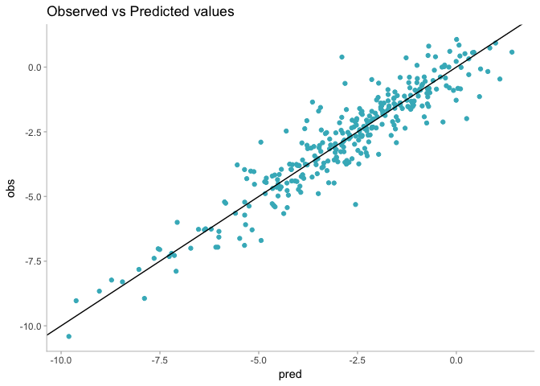
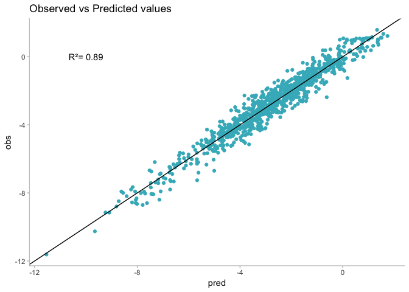
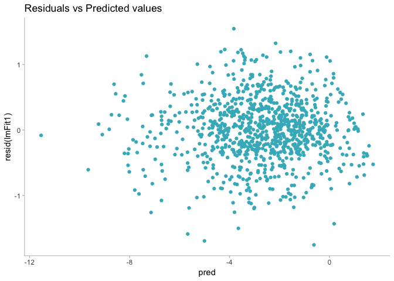
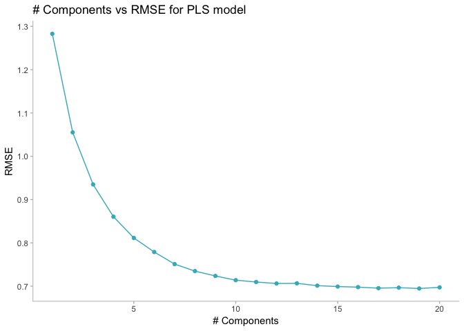
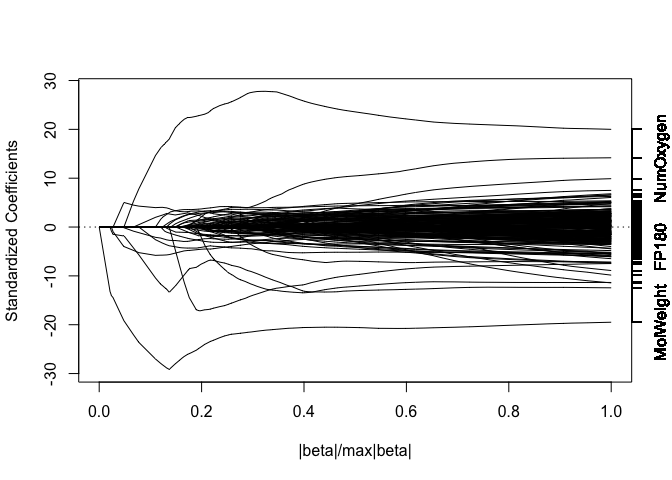
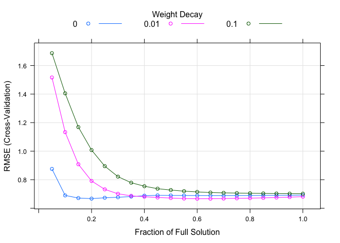
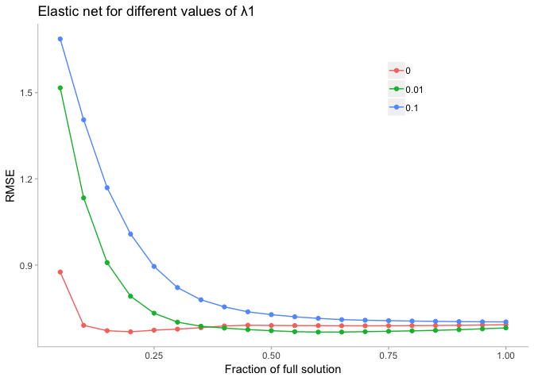
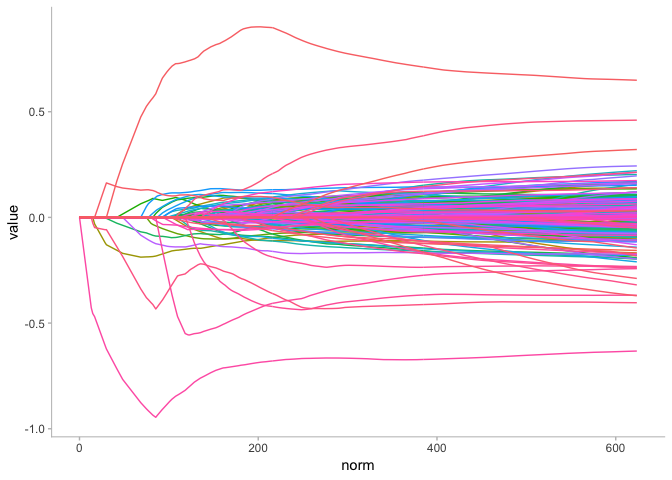
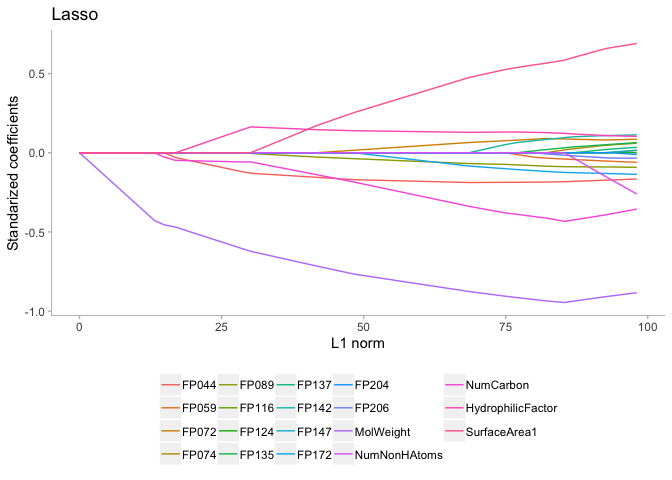
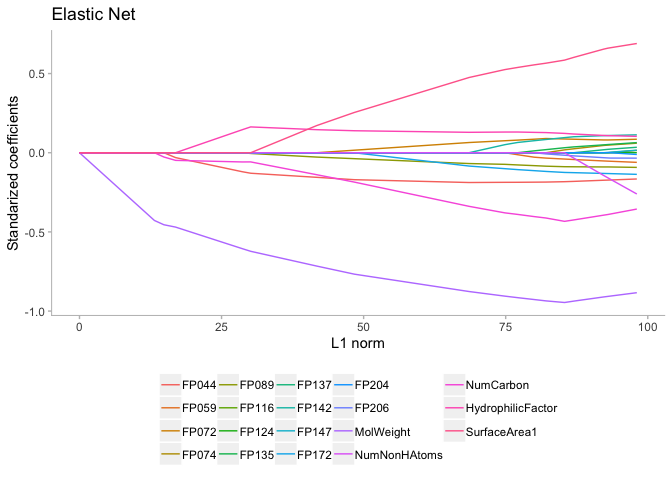

Applied Predictive Modeling
================
Santiago Toso

We'll use the solubility data treated on this chapter. The predictors for the training and test sets are contained in data frames called `solTrainX` and `solTestX`, respectively. To obtain the data in R,

``` r
library(AppliedPredictiveModeling)
data(solubility)
ls(pattern = "^solT")
```

    ## [1] "solTestX"       "solTestXtrans"  "solTestY"       "solTrainX"     
    ## [5] "solTrainXtrans" "solTrainY"

Each column of the data corresponds to a predictor and rows correspond to compounds. There are 228 columns in the data. A random sample of column names is

``` r
set.seed(2)
sample(names(solTrainX), 8)
```

    ## [1] "FP043"        "FP160"        "FP130"        "FP038"       
    ## [5] "NumBonds"     "NumNonHAtoms" "FP029"        "FP185"

The `FP` columns correspond to binary 0/1 fingerprint predictors that are associated with the presence or absence of a particular chemical structure. Alternate versions of these data that have been Box-Cox transformed are contained in the data frames `solTrainXtrans` and `solTestXtrans`. The solubility values for each compound are contained in numeric vectors named `solTrainY` and `solTestY`.

Ordinary Linear Regression
==========================

The primary function for creating linear regression models using simple least squares is `lm`. This function takes a formula and data frame as input. Because of this, the training set predictors and outcome should be contained in the same data frame. We can create a new data frame for this purpose:

``` r
trainingData <- solTrainXtrans
trainingData <- trainingData %>% 
  mutate(solubility = solTrainY)
```

To fit a linear model with all the predictor entering in the model as simple, independent linear terms, the formula shortcut `solubility ~ .` can be used:

``` r
lmFitAllPredictors <- lm(solubility ~ ., data = trainingData)
summary(lmFitAllPredictors)
```

    ## 
    ## Call:
    ## lm(formula = solubility ~ ., data = trainingData)
    ## 
    ## Residuals:
    ##      Min       1Q   Median       3Q      Max 
    ## -1.75620 -0.28304  0.01165  0.30030  1.54887 
    ## 
    ## Coefficients:
    ##                     Estimate Std. Error t value Pr(>|t|)    
    ## (Intercept)        2.431e+00  2.162e+00   1.124 0.261303    
    ## FP001              3.594e-01  3.185e-01   1.128 0.259635    
    ## FP002              1.456e-01  2.637e-01   0.552 0.580960    
    ## FP003             -3.969e-02  1.314e-01  -0.302 0.762617    
    ## FP004             -3.049e-01  1.371e-01  -2.223 0.026520 *  
    ## FP005              2.837e+00  9.598e-01   2.956 0.003223 ** 
    ## FP006             -6.886e-02  2.041e-01  -0.337 0.735917    
    ## FP007              4.044e-02  1.152e-01   0.351 0.725643    
    ## FP008              1.121e-01  1.636e-01   0.685 0.493331    
    ## FP009             -8.242e-01  8.395e-01  -0.982 0.326536    
    ## FP010              4.193e-01  3.136e-01   1.337 0.181579    
    ## FP011              5.158e-02  2.198e-01   0.235 0.814503    
    ## FP012             -1.346e-02  1.611e-01  -0.084 0.933452    
    ## FP013             -4.519e-01  5.473e-01  -0.826 0.409311    
    ## FP014              3.281e-01  4.550e-01   0.721 0.471044    
    ## FP015             -1.839e-01  1.521e-01  -1.209 0.226971    
    ## FP016             -1.367e-01  1.548e-01  -0.883 0.377340    
    ## FP017             -1.704e-01  1.386e-01  -1.230 0.219187    
    ## FP018             -3.824e-01  2.388e-01  -1.602 0.109655    
    ## FP019             -3.131e-01  3.863e-01  -0.811 0.417862    
    ## FP020              2.072e-01  2.135e-01   0.971 0.332078    
    ## FP021             -5.956e-02  2.632e-01  -0.226 0.821060    
    ## FP022              2.336e-01  3.456e-01   0.676 0.499180    
    ## FP023             -3.193e-01  1.909e-01  -1.672 0.094866 .  
    ## FP024             -4.272e-01  2.827e-01  -1.511 0.131162    
    ## FP025              4.376e-01  4.538e-01   0.964 0.335184    
    ## FP026              2.068e-01  2.564e-01   0.806 0.420273    
    ## FP027              2.424e-01  2.429e-01   0.998 0.318594    
    ## FP028              1.070e-01  1.200e-01   0.892 0.372547    
    ## FP029             -9.857e-02  2.199e-01  -0.448 0.654163    
    ## FP030             -2.361e-01  2.468e-01  -0.957 0.339048    
    ## FP031              8.690e-02  1.346e-01   0.646 0.518754    
    ## FP032             -1.204e+00  7.772e-01  -1.550 0.121628    
    ## FP033              5.766e-01  4.236e-01   1.361 0.173882    
    ## FP034             -1.794e-01  2.618e-01  -0.685 0.493486    
    ## FP035             -2.140e-01  1.704e-01  -1.256 0.209605    
    ## FP036              7.701e-02  1.657e-01   0.465 0.642133    
    ## FP037              1.098e-01  1.725e-01   0.636 0.524693    
    ## FP038              2.721e-01  1.888e-01   1.441 0.150030    
    ## FP039              2.011e-02  2.888e-01   0.070 0.944491    
    ## FP040              5.477e-01  1.890e-01   2.898 0.003873 ** 
    ## FP041             -4.265e-01  3.004e-01  -1.420 0.156143    
    ## FP042             -9.901e-01  7.078e-01  -1.399 0.162294    
    ## FP043             -3.725e-02  2.096e-01  -0.178 0.859011    
    ## FP044             -3.860e-01  2.184e-01  -1.768 0.077562 .  
    ## FP045              2.120e-01  1.299e-01   1.631 0.103238    
    ## FP046             -3.504e-02  2.733e-01  -0.128 0.898010    
    ## FP047             -1.675e-02  1.414e-01  -0.118 0.905775    
    ## FP048              2.610e-01  2.434e-01   1.073 0.283810    
    ## FP049              1.241e-01  1.971e-01   0.630 0.529036    
    ## FP050              9.087e-03  1.410e-01   0.064 0.948648    
    ## FP051              1.050e-01  2.014e-01   0.521 0.602210    
    ## FP052             -4.569e-01  2.482e-01  -1.841 0.066029 .  
    ## FP053              2.994e-01  2.466e-01   1.214 0.225129    
    ## FP054              2.734e-02  1.829e-01   0.149 0.881229    
    ## FP055             -3.662e-01  1.970e-01  -1.858 0.063530 .  
    ## FP056             -2.961e-01  2.979e-01  -0.994 0.320541    
    ## FP057             -1.002e-01  1.379e-01  -0.727 0.467703    
    ## FP058              3.100e-01  8.074e-01   0.384 0.701129    
    ## FP059             -1.615e-01  1.690e-01  -0.956 0.339514    
    ## FP060              2.350e-01  1.474e-01   1.595 0.111209    
    ## FP061             -6.365e-01  1.440e-01  -4.421 1.13e-05 ***
    ## FP062             -5.224e-01  2.961e-01  -1.764 0.078078 .  
    ## FP063             -2.001e+00  1.287e+00  -1.554 0.120553    
    ## FP064              2.549e-01  1.221e-01   2.087 0.037207 *  
    ## FP065             -2.844e-01  1.197e-01  -2.377 0.017714 *  
    ## FP066              2.093e-01  1.264e-01   1.655 0.098301 .  
    ## FP067             -1.406e-01  1.540e-01  -0.913 0.361631    
    ## FP068              4.964e-01  2.028e-01   2.447 0.014630 *  
    ## FP069              1.324e-01  8.824e-02   1.501 0.133885    
    ## FP070              3.453e-03  8.088e-02   0.043 0.965963    
    ## FP071              1.474e-01  1.237e-01   1.192 0.233775    
    ## FP072             -9.773e-01  2.763e-01  -3.537 0.000431 ***
    ## FP073             -4.671e-01  2.072e-01  -2.254 0.024474 *  
    ## FP074              1.793e-01  1.206e-01   1.487 0.137566    
    ## FP075              1.231e-01  1.035e-01   1.188 0.235034    
    ## FP076              5.166e-01  1.704e-01   3.031 0.002525 ** 
    ## FP077              1.644e-01  1.236e-01   1.331 0.183739    
    ## FP078             -3.715e-01  1.588e-01  -2.339 0.019608 *  
    ## FP079              4.254e-01  1.881e-01   2.262 0.023992 *  
    ## FP080              3.101e-01  1.554e-01   1.996 0.046340 *  
    ## FP081             -3.208e-01  1.117e-01  -2.873 0.004192 ** 
    ## FP082              1.243e-01  9.524e-02   1.305 0.192379    
    ## FP083             -6.916e-01  2.134e-01  -3.241 0.001248 ** 
    ## FP084              3.626e-01  2.381e-01   1.523 0.128171    
    ## FP085             -3.310e-01  1.428e-01  -2.317 0.020785 *  
    ## FP086              1.169e-02  9.774e-02   0.120 0.904834    
    ## FP087              4.559e-02  2.797e-01   0.163 0.870568    
    ## FP088              2.416e-01  9.959e-02   2.425 0.015534 *  
    ## FP089              5.999e-01  2.320e-01   2.586 0.009915 ** 
    ## FP090             -2.450e-02  1.154e-01  -0.212 0.831930    
    ## FP091             -2.858e-01  3.185e-01  -0.897 0.369847    
    ## FP092              2.665e-01  2.069e-01   1.288 0.198156    
    ## FP093              1.974e-01  1.087e-01   1.816 0.069803 .  
    ## FP094             -1.991e-01  1.441e-01  -1.381 0.167707    
    ## FP095             -1.403e-01  1.124e-01  -1.248 0.212449    
    ## FP096             -5.024e-01  1.459e-01  -3.445 0.000605 ***
    ## FP097             -2.635e-01  1.666e-01  -1.582 0.114020    
    ## FP098             -2.865e-01  1.633e-01  -1.754 0.079863 .  
    ## FP099              2.592e-01  2.568e-01   1.009 0.313136    
    ## FP100             -4.008e-01  3.034e-01  -1.321 0.186949    
    ## FP101             -1.760e-01  3.019e-01  -0.583 0.560147    
    ## FP102              2.445e-01  3.449e-01   0.709 0.478579    
    ## FP103             -1.493e-01  9.148e-02  -1.632 0.103176    
    ## FP104             -1.428e-01  1.176e-01  -1.214 0.225238    
    ## FP105             -6.912e-02  1.395e-01  -0.495 0.620482    
    ## FP106              1.128e-01  1.288e-01   0.876 0.381495    
    ## FP107              2.778e+00  8.247e-01   3.369 0.000796 ***
    ## FP108              8.836e-03  1.852e-01   0.048 0.961970    
    ## FP109              8.200e-01  2.267e-01   3.617 0.000319 ***
    ## FP110              3.680e-01  3.311e-01   1.111 0.266811    
    ## FP111             -5.565e-01  1.420e-01  -3.918 9.80e-05 ***
    ## FP112             -1.079e-01  2.705e-01  -0.399 0.690108    
    ## FP113              1.511e-01  9.481e-02   1.594 0.111478    
    ## FP114             -1.201e-01  1.891e-01  -0.635 0.525628    
    ## FP115             -1.896e-01  1.405e-01  -1.349 0.177736    
    ## FP116              7.778e-03  1.897e-01   0.041 0.967300    
    ## FP117              2.583e-01  1.779e-01   1.452 0.147070    
    ## FP118             -1.964e-01  1.230e-01  -1.596 0.110940    
    ## FP119              7.515e-01  2.630e-01   2.857 0.004402 ** 
    ## FP120             -1.814e-01  1.794e-01  -1.011 0.312362    
    ## FP121             -4.731e-02  3.957e-01  -0.120 0.904866    
    ## FP122              1.048e-01  1.041e-01   1.007 0.314268    
    ## FP123              3.926e-02  1.765e-01   0.222 0.824066    
    ## FP124              1.235e-01  1.705e-01   0.724 0.469243    
    ## FP125             -2.633e-04  1.151e-01  -0.002 0.998175    
    ## FP126             -2.782e-01  1.177e-01  -2.363 0.018373 *  
    ## FP127             -6.123e-01  1.739e-01  -3.521 0.000457 ***
    ## FP128             -5.424e-01  1.932e-01  -2.807 0.005136 ** 
    ## FP129             -6.731e-02  2.243e-01  -0.300 0.764167    
    ## FP130             -1.034e+00  4.106e-01  -2.518 0.012009 *  
    ## FP131              2.158e-01  1.617e-01   1.335 0.182405    
    ## FP132             -1.976e-01  2.382e-01  -0.830 0.406998    
    ## FP133             -1.573e-01  1.217e-01  -1.293 0.196319    
    ## FP134              2.496e+00  1.196e+00   2.086 0.037310 *  
    ## FP135              1.818e-01  1.319e-01   1.379 0.168460    
    ## FP136             -7.763e-02  3.131e-01  -0.248 0.804237    
    ## FP137             -4.613e-02  2.978e-01  -0.155 0.876947    
    ## FP138             -9.392e-02  1.906e-01  -0.493 0.622251    
    ## FP139              7.659e-02  4.063e-01   0.189 0.850517    
    ## FP140              3.145e-01  2.149e-01   1.463 0.143784    
    ## FP141              2.219e-01  2.765e-01   0.802 0.422532    
    ## FP142              6.272e-01  1.488e-01   4.214 2.83e-05 ***
    ## FP143              9.981e-01  2.929e-01   3.407 0.000692 ***
    ## FP144              2.207e-01  2.839e-01   0.777 0.437195    
    ## FP145             -1.146e-01  1.188e-01  -0.964 0.335169    
    ## FP146             -2.324e-01  2.086e-01  -1.114 0.265716    
    ## FP147              1.502e-01  1.228e-01   1.223 0.221703    
    ## FP148             -1.600e-01  1.319e-01  -1.213 0.225560    
    ## FP149              1.172e-01  1.650e-01   0.710 0.477770    
    ## FP150              9.046e-02  1.577e-01   0.574 0.566368    
    ## FP151              2.899e-01  3.120e-01   0.929 0.353202    
    ## FP152             -2.544e-01  2.990e-01  -0.851 0.395087    
    ## FP153             -3.765e-01  2.773e-01  -1.358 0.175029    
    ## FP154             -1.027e+00  2.033e-01  -5.054 5.50e-07 ***
    ## FP155              4.888e-01  2.916e-01   1.676 0.094163 .  
    ## FP156             -3.602e-02  3.636e-01  -0.099 0.921109    
    ## FP157             -4.715e-01  2.468e-01  -1.910 0.056505 .  
    ## FP158              1.669e-02  1.925e-01   0.087 0.930943    
    ## FP159              1.800e-01  2.432e-01   0.740 0.459378    
    ## FP160              1.525e-02  2.177e-01   0.070 0.944155    
    ## FP161             -2.440e-01  1.433e-01  -1.703 0.089063 .  
    ## FP162              4.910e-02  1.859e-01   0.264 0.791710    
    ## FP163              4.785e-01  3.121e-01   1.533 0.125659    
    ## FP164              5.096e-01  1.899e-01   2.684 0.007446 ** 
    ## FP165              5.793e-01  2.146e-01   2.700 0.007103 ** 
    ## FP166             -6.582e-02  2.185e-01  -0.301 0.763293    
    ## FP167             -6.044e-01  2.515e-01  -2.403 0.016502 *  
    ## FP168             -1.187e-01  1.872e-01  -0.634 0.526173    
    ## FP169             -1.705e-01  8.312e-02  -2.051 0.040650 *  
    ## FP170             -7.902e-02  1.560e-01  -0.506 0.612745    
    ## FP171              4.651e-01  1.186e-01   3.922 9.64e-05 ***
    ## FP172             -4.426e-01  2.440e-01  -1.814 0.070120 .  
    ## FP173              4.243e-01  1.657e-01   2.561 0.010634 *  
    ## FP174             -1.010e-01  2.098e-01  -0.481 0.630311    
    ## FP175             -4.657e-02  2.481e-01  -0.188 0.851136    
    ## FP176              9.736e-01  2.644e-01   3.682 0.000249 ***
    ## FP177              1.386e-01  2.393e-01   0.579 0.562538    
    ## FP178              6.497e-02  2.079e-01   0.313 0.754691    
    ## FP179             -3.415e-02  2.232e-01  -0.153 0.878437    
    ## FP180             -7.905e-01  5.523e-01  -1.431 0.152839    
    ## FP181              4.925e-01  3.218e-01   1.531 0.126309    
    ## FP182             -1.124e-01  1.310e-01  -0.858 0.391384    
    ## FP183              2.998e-01  7.143e-01   0.420 0.674836    
    ## FP184              4.876e-01  1.580e-01   3.087 0.002103 ** 
    ## FP185             -3.778e-01  2.037e-01  -1.854 0.064108 .  
    ## FP186             -3.654e-01  1.953e-01  -1.871 0.061710 .  
    ## FP187              4.457e-01  2.682e-01   1.662 0.097015 .  
    ## FP188              1.475e-01  1.258e-01   1.172 0.241519    
    ## FP189             -1.984e-02  3.468e-01  -0.057 0.954384    
    ## FP190              2.629e-01  3.018e-01   0.871 0.383981    
    ## FP191              2.799e-01  1.465e-01   1.911 0.056388 .  
    ## FP192             -2.404e-01  2.751e-01  -0.874 0.382534    
    ## FP193              1.502e-01  1.494e-01   1.005 0.315159    
    ## FP194              8.029e-01  6.379e-01   1.259 0.208566    
    ## FP195              5.967e-02  3.435e-01   0.174 0.862158    
    ## FP196              1.091e-02  2.544e-01   0.043 0.965812    
    ## FP197             -3.736e-02  1.569e-01  -0.238 0.811793    
    ## FP198              1.896e-01  2.665e-01   0.712 0.476893    
    ## FP199             -9.932e-02  1.797e-01  -0.553 0.580702    
    ## FP200             -6.421e-02  2.161e-01  -0.297 0.766462    
    ## FP201             -4.838e-01  1.980e-01  -2.444 0.014771 *  
    ## FP202              5.664e-01  1.869e-01   3.031 0.002527 ** 
    ## FP203              2.586e-01  6.447e-01   0.401 0.688462    
    ## FP204             -1.371e-01  2.543e-01  -0.539 0.590008    
    ## FP205              7.177e-02  1.561e-01   0.460 0.645857    
    ## FP206             -6.769e-02  1.860e-01  -0.364 0.716094    
    ## FP207             -5.538e-03  2.060e-01  -0.027 0.978560    
    ## FP208             -5.338e-01  6.324e-01  -0.844 0.398925    
    ## MolWeight         -1.232e+00  2.296e-01  -5.365 1.09e-07 ***
    ## NumAtoms          -1.478e+01  3.473e+00  -4.257 2.35e-05 ***
    ## NumNonHAtoms       1.795e+01  3.166e+00   5.670 2.07e-08 ***
    ## NumBonds           9.843e+00  2.681e+00   3.671 0.000260 ***
    ## NumNonHBonds      -1.030e+01  1.793e+00  -5.746 1.35e-08 ***
    ## NumMultBonds       2.107e-01  1.754e-01   1.201 0.229990    
    ## NumRotBonds       -5.213e-01  1.334e-01  -3.908 0.000102 ***
    ## NumDblBonds       -7.492e-01  3.163e-01  -2.369 0.018111 *  
    ## NumAromaticBonds  -2.364e+00  6.232e-01  -3.794 0.000161 ***
    ## NumHydrogen        8.347e-01  1.880e-01   4.439 1.04e-05 ***
    ## NumCarbon          1.730e-02  3.763e-01   0.046 0.963335    
    ## NumNitrogen        6.125e+00  3.045e+00   2.011 0.044645 *  
    ## NumOxygen          2.389e+00  4.523e-01   5.283 1.69e-07 ***
    ## NumSulfer         -8.508e+00  3.619e+00  -2.351 0.018994 *  
    ## NumChlorine       -7.449e+00  1.989e+00  -3.744 0.000195 ***
    ## NumHalogen         1.408e+00  2.109e+00   0.668 0.504615    
    ## NumRings           1.276e+00  6.716e-01   1.901 0.057731 .  
    ## HydrophilicFactor  1.099e-02  1.137e-01   0.097 0.922998    
    ## SurfaceArea1       8.825e-02  6.058e-02   1.457 0.145643    
    ## SurfaceArea2       9.555e-02  5.615e-02   1.702 0.089208 .  
    ## ---
    ## Signif. codes:  0 '***' 0.001 '**' 0.01 '*' 0.05 '.' 0.1 ' ' 1
    ## 
    ## Residual standard error: 0.5524 on 722 degrees of freedom
    ## Multiple R-squared:  0.9446, Adjusted R-squared:  0.9271 
    ## F-statistic: 54.03 on 228 and 722 DF,  p-value: < 2.2e-16

An interecept is automatically added to the model. The `summary` method displays model summary statistics, the parameter estimates, their standard errors, and *p*-values for testing whether each individual coefficient is different than 0.

The simple estimates for R^2 and RMSE were 0.94 and 0.55 respectively. Note that these values are likely optimistic as they have been derived by re-predicting the training data set.

To compute the model solubility values for new samples, the `predict` method is used:

``` r
lmPred1 <- predict(lmFitAllPredictors, solTestXtrans)
kable(t(head(lmPred1)))
```

|         20|         21|          23|         25|          28|        31|
|----------:|----------:|-----------:|----------:|-----------:|---------:|
|  0.9937093|  0.0683463|  -0.6987763|  0.8479636|  -0.1657832|  1.408151|

We can collect the observed and predicted values into a data frame, then use the `caret` function `defaultSummary` to estimate the test set performance:

``` r
lmValues <- data.frame(obs = solTestY, pred = lmPred1)
defaultSummary(lmValues)
```

    ##      RMSE  Rsquared       MAE 
    ## 0.7455802 0.8722236 0.5497605

Based on the test set, the summaries produced by the summary function for `lm` were optimistic. We can see this on a scatter plot too.

``` r
ggplot(lmValues, aes(x= pred, y= obs)) + 
  geom_point(color = '#41b6c4') +
  geom_abline() +
  labs(title = 'Observed vs Predicted values') +
  theme(panel.grid = element_blank(),
      panel.background = element_blank(),
      axis.line.x = element_line(colour = "grey"),
      axis.line.y = element_line(colour = "grey"),
      axis.ticks.x = element_line(colour = "grey"),
      axis.ticks.y = element_line(colour = "grey")
      )
```



If we wanted a robust linear model, the the robust linear model function (`rlm`) from `MASS` package could be used, which by default employs the Huber approach. Similar to the `lm` function, `rlm` is called as follows:

``` r
library(MASS)
```

    ## 
    ## Attaching package: 'MASS'

    ## The following object is masked from 'package:dplyr':
    ## 
    ##     select

``` r
rlmFitAllPredictors <- rlm(solubility ~ ., data = trainingData)
```

The `train` function generates a resampling estimate of performance. Because the training set size is not small, 10-fold cross-validation should produce reasonalbe estimates of model performance. The function `trainControl` specifies the type of resampling:

``` r
ctrl <- trainControl(method = 'cv', number = 10)
```

Now we can set the `train` function:

``` r
set.seed(100)
lmFit1 <- train(x = solTrainXtrans, y = solTrainY,
                method = 'lm',
                trControl = ctrl)
lmFit1
```

    ## Linear Regression 
    ## 
    ## 951 samples
    ## 228 predictors
    ## 
    ## No pre-processing
    ## Resampling: Cross-Validated (10 fold) 
    ## Summary of sample sizes: 856, 856, 855, 855, 857, 856, ... 
    ## Resampling results:
    ## 
    ##   RMSE       Rsquared   MAE      
    ##   0.6926348  0.8872058  0.5199216
    ## 
    ## Tuning parameter 'intercept' was held constant at a value of TRUE

For models built to explain, it is important to check model assumptions, such as the residual distribution. For predictive models, some of the same diagnostic techniques can shed light on areas where the model is not predicting well. For example, we could plot the residuals versus the predicted values for the model. If the plot shows a random cloud of points, we will feel more comfortable that there are no major terms missing from the model (such as a quadratic term, etc.) or significant outliers. Another important plot is the predicted values versus the observed values to asses how close the predictions are to the actual values. Two methods of doing this (using the training set samples) are

``` r
lmFit1Values <- data_frame(pred = predict(lmFit1), obs = solTrainY)
rsquared <- round(mean(lmFit1$results$Rsquared),2)
ggplot(data = lmFit1Values, aes(x = pred, y = obs))+
  geom_point(color = '#41b6c4') +
  geom_abline() +
  labs(title = 'Observed vs Predicted values') +
  annotate('text', x = -10, y = 0, label = paste("R²= ", rsquared, sep = '')) +
  theme(panel.grid = element_blank(),
      panel.background = element_blank(),
      axis.line.x = element_line(colour = "grey"),
      axis.line.y = element_line(colour = "grey"),
      axis.ticks.x = element_line(colour = "grey"),
      axis.ticks.y = element_line(colour = "grey")
      )
```



``` r
ggplot(data = lmFit1Values, aes(x = pred, y = resid(lmFit1))) +
  geom_point(color = '#41b6c4') +
  labs(title = 'Residuals vs Predicted values') +
  theme(panel.grid = element_blank(),
      panel.background = element_blank(),
      axis.line.x = element_line(colour = "grey"),
      axis.line.y = element_line(colour = "grey"),
      axis.ticks.x = element_line(colour = "grey"),
      axis.ticks.y = element_line(colour = "grey")
      )
```



Note that the `resid` function generates the model residuals for the training set and that using the \`predict function without a additional data argument returns the predicted values for the training set. For this model, there are no obvious warning signs in the diagnostic plots.

To build a smaller model without predictors with extremely high correlations, we can use the feature selection methods we saw in previous chapters to reduce the number of predictors such that there are no absolute correlations above 0.9:

``` r
corThresh <- 0.9
tooHigh <- findCorrelation(cor(solTrainXtrans), corThresh)
corrPred <- names(solTrainXtrans)[tooHigh]
trainXfiltered <- solTrainXtrans[ , -tooHigh]
testXfiltered <- solTestXtrans[ , -tooHigh]

set.seed(100)
lmFiltered <- train(x = trainXfiltered, y = solTrainY,
                    method = 'lm',
                    trControl = ctrl)
lmFiltered
```

    ## Linear Regression 
    ## 
    ## 951 samples
    ## 190 predictors
    ## 
    ## No pre-processing
    ## Resampling: Cross-Validated (10 fold) 
    ## Summary of sample sizes: 856, 856, 855, 855, 857, 856, ... 
    ## Resampling results:
    ## 
    ##   RMSE       Rsquared   MAE      
    ##   0.6980579  0.8857871  0.5251033
    ## 
    ## Tuning parameter 'intercept' was held constant at a value of TRUE

Robust linear regression can also be performed using the `train` function which employs the `rlm` function. However, it is important to note that `rlm` does not allow the covariance matrix of the predictors to be singular (unlike the `lm` function). To ensure that predictors are not singular, we will pre-process the predictors using PCA. Using the filtered set of predictors, the robust regression model performance is

``` r
set.seed(100)
rlmPCA <- train(x = solTrainXtrans, y = solTrainY,
                method = 'rlm',
                preProcess = 'pca',
                trControl = ctrl)
```

    ## Warning in rlm.default(x, y, weights, method = method, wt.method =
    ## wt.method, : 'rlm' failed to converge in 20 steps

    ## Warning in rlm.default(x, y, weights, method = method, wt.method =
    ## wt.method, : 'rlm' failed to converge in 20 steps

``` r
rlmPCA
```

    ## Robust Linear Model 
    ## 
    ## 951 samples
    ## 228 predictors
    ## 
    ## Pre-processing: principal component signal extraction (228),
    ##  centered (228), scaled (228) 
    ## Resampling: Cross-Validated (10 fold) 
    ## Summary of sample sizes: 856, 856, 855, 855, 857, 856, ... 
    ## Resampling results across tuning parameters:
    ## 
    ##   intercept  psi           RMSE       Rsquared   MAE      
    ##   FALSE      psi.huber     2.8245812  0.8561008  2.7155082
    ##   FALSE      psi.hampel    2.8245118  0.8561763  2.7154817
    ##   FALSE      psi.bisquare  2.8244621  0.8562213  2.7154216
    ##    TRUE      psi.huber     0.7828457  0.8550937  0.5970333
    ##    TRUE      psi.hampel    0.7825426  0.8552118  0.5972415
    ##    TRUE      psi.bisquare  0.7903976  0.8524410  0.6016888
    ## 
    ## RMSE was used to select the optimal model using the smallest value.
    ## The final values used for the model were intercept = TRUE and psi
    ##  = psi.hampel.

Partial Least Squares
=====================

The `pls` package has functions for PLS and PCR. SIMPLS, the first Dayal and MacGregor algorithm, and the algorithm developed by Rännar are each available. By default, the `pls` package uses the first Dayal and MacGregor kernel algorithm while the other algorithms can be specified using the `method` argument using values `oscorespls`, `simpls`, or `widekernelpls`. The `plsr` function, like the `lm` function, requires a model formula:

``` r
library("pls")
```

    ## 
    ## Attaching package: 'pls'

    ## The following object is masked from 'package:caret':
    ## 
    ##     R2

    ## The following object is masked from 'package:stats':
    ## 
    ##     loadings

``` r
plsFit <- plsr(solubility ~ ., data = trainingData)
```

The number of components can be fixed using the `ncomp` argument or, if left to default, the maximum number of componenets will be calculated. Predictions on new samples can be calculated using the `predict` function. Predictions can be made for a specific number of components or for several values at a time. For example,

``` r
predict(plsFit, solTestXtrans[1:5, ], ncomp = 1:2)
```

    ## , , 1 comps
    ## 
    ##    solubility
    ## 20  -1.789335
    ## 21  -1.427551
    ## 23  -2.268798
    ## 25  -2.269782
    ## 28  -1.867960
    ## 
    ## , , 2 comps
    ## 
    ##    solubility
    ## 20  0.2520469
    ## 21  0.3555028
    ## 23 -1.8795338
    ## 25 -0.6848584
    ## 28 -1.5531552

The `plsr` function has options for either K-fold or leave-one-out cross-validation (via the `validation` argument) or the PLS algorithm to use, such as SIMPLS (using the `method` argument). There are several helper functions to extract the PLS components (in the function `loadings`), the PLS scores (`scores`), and other quantities. The `plot` function has visualizations for many aspects of the model. `train` can also be used with `method` values of `pls`, such as `oscorespls`, `simpls`, or `widekernelpls`. For example,

``` r
set.seed(100)
plsTune <- train(solTrainXtrans, solTrainY,
                 method = 'pls',
                 # The default tuning grid evaluates
                 # components 1... tuneLength
                 tuneLength = 20,
                 trControl = ctrl,
                 preProcess = c("center", "scale"))
plsTune
```

    ## Partial Least Squares 
    ## 
    ## 951 samples
    ## 228 predictors
    ## 
    ## Pre-processing: centered (228), scaled (228) 
    ## Resampling: Cross-Validated (10 fold) 
    ## Summary of sample sizes: 856, 856, 855, 855, 857, 856, ... 
    ## Resampling results across tuning parameters:
    ## 
    ##   ncomp  RMSE       Rsquared   MAE      
    ##    1     1.2828145  0.6079795  0.9893636
    ##    2     1.0551277  0.7378376  0.8297133
    ##    3     0.9349505  0.7939934  0.7229185
    ##    4     0.8603662  0.8254588  0.6695206
    ##    5     0.8114226  0.8443879  0.6341178
    ##    6     0.7789089  0.8568821  0.6043381
    ##    7     0.7509779  0.8674586  0.5737601
    ##    8     0.7347473  0.8730535  0.5616286
    ##    9     0.7235864  0.8772237  0.5525797
    ##   10     0.7138120  0.8803802  0.5489714
    ##   11     0.7096044  0.8818434  0.5459290
    ##   12     0.7061430  0.8832626  0.5419456
    ##   13     0.7065012  0.8838061  0.5403922
    ##   14     0.7011695  0.8855274  0.5360594
    ##   15     0.6990833  0.8859888  0.5310024
    ##   16     0.6977189  0.8865601  0.5326943
    ##   17     0.6953522  0.8874532  0.5316631
    ##   18     0.6964785  0.8869715  0.5329199
    ##   19     0.6945869  0.8874051  0.5301209
    ##   20     0.6972065  0.8864873  0.5320990
    ## 
    ## RMSE was used to select the optimal model using the smallest value.
    ## The final value used for the model was ncomp = 19.

This code reproduces the PLS model shown in Fig. 6.11.

``` r
ggplot(plsTune$results, aes(x = ncomp, y = RMSE)) +
  geom_line(color = '#41b6c4') +
  geom_point(color = '#41b6c4') +
  labs(title = '# Components vs RMSE for PLS model', x = '# Components') +
  theme(panel.grid = element_blank(),
      panel.background = element_blank(),
      axis.line.x = element_line(colour = "grey"),
      axis.line.y = element_line(colour = "grey"),
      axis.ticks.x = element_line(colour = "grey"),
      axis.ticks.y = element_line(colour = "grey")
      )
```



Penalized Regression Models
===========================

Ridge-regression models can be created using `lm.ridge` function in the `MASS` package or the `enet` function in the `elasticnet` package. When calling the `enet` function, the `lambda` argument specifies the ridge-regression penalty.

``` r
#install.packages("elasticnet")
library(elasticnet)
```

    ## Loading required package: lars

    ## Loaded lars 1.2

``` r
ridgeModel <- enet(x = as.matrix(solTrainXtrans), y = solTrainY,
                   lambda = 0.001)
```

Recall that the elastic net model has both ridge penalties and lasso penalties and, at this point, the R object `ridgeModel1` has only fixed the ridge penalty value. The lasso penalty can be computed efficiently for many values of the penalty. The `predict` function for `enet` objects generates predictions for one or more values of the lasso penalty simultaneaously using `s` and `mode` arguments. For ridge regression, we only desire a single lasso penalty of 0, so we want the full solution. To produce a ridge-regression solution we define `s=1` with `mode = fraction`. These last options specify the fraction of the full solution we want the ridge regression to be. `s=1` means we want the full solution to be ridge (no lasso); while `s=0` would mean we want the full solution to be lasso (no ridge):

``` r
ridgeModel <- predict(ridgeModel, newx = as.matrix(solTestXtrans),
                   s = 1, mode = 'fraction',
                   type = 'fit')
head(ridgeModel$fit)
```

    ##          20          21          23          25          28          31 
    ##  0.96795590  0.06918538 -0.54365077  0.96072014 -0.03594693  1.59284535

We have created a ridge regression and aplied it to the test set. No lasso was created since we specified a `s=1` in the `predict` function. If we want to use the lasso, we need to make `s` different than one to try different lasso penalties.

To tune over the penalty of the ridge regression in the elastic net model we can use `train` with a different method:

``` r
ridgeGrid <- data.frame(.lambda = seq(0, .1, length = 15))
set.seed(100)
ridgeRegFit <- train(solTrainXtrans, solTrainY,
                     method = "ridge",
                     # For the model over many penalty values
                     tuneGrid = ridgeGrid,
                     trControl = ctrl,
                     # Put the predictors on the same circle
                     preProcess = c("center", "scale"))
ridgeRegFit
```

    ## Ridge Regression 
    ## 
    ## 951 samples
    ## 228 predictors
    ## 
    ## Pre-processing: centered (228), scaled (228) 
    ## Resampling: Cross-Validated (10 fold) 
    ## Summary of sample sizes: 856, 856, 855, 855, 857, 856, ... 
    ## Resampling results across tuning parameters:
    ## 
    ##   lambda       RMSE       Rsquared   MAE      
    ##   0.000000000  0.6923558  0.8872977  0.5194817
    ##   0.007142857  0.6842051  0.8901855  0.5180204
    ##   0.014285714  0.6782572  0.8924345  0.5135023
    ##   0.021428571  0.6763196  0.8933364  0.5129646
    ##   0.028571429  0.6761659  0.8936611  0.5137609
    ##   0.035714286  0.6770285  0.8936769  0.5150076
    ##   0.042857143  0.6785555  0.8935075  0.5169778
    ##   0.050000000  0.6805575  0.8932196  0.5190373
    ##   0.057142857  0.6829220  0.8928530  0.5213703
    ##   0.064285714  0.6855755  0.8924331  0.5238093
    ##   0.071428571  0.6884742  0.8919761  0.5263585
    ##   0.078571429  0.6915802  0.8914943  0.5290529
    ##   0.085714286  0.6948706  0.8909958  0.5318508
    ##   0.092857143  0.6983276  0.8904864  0.5347012
    ##   0.100000000  0.7019378  0.8899703  0.5375828
    ## 
    ## RMSE was used to select the optimal model using the smallest value.
    ## The final value used for the model was lambda = 0.02857143.

The lasso model can be estimated using a number of different functions. The `lars` package contains the `lars` function, the `elasticnet` package has `enet`, and the `glmnet` package has a function of the same name. The syntax for these fuctions is very similar. For the `enet` function, the usage would be

``` r
enetModel <- enet(x = as.matrix(solTrainXtrans), y= solTrainY,
                  lambda = 0.01, normalize = TRUE)
```

The predictor data must be a matrix object, so the data frame `solTrainXtrans` needs to be converted for the `enet` function. The predictors should be centered and scaled prior to modeling. The `normalize` argument will do this standarization automatically. The parameter `lambda` controls the ridge-regression penalty and, setting this value to 0, fits the lasso model. The lasso penalty does not need to be specified until the time of prediction:

``` r
enetPred <- predict(enetModel, newx = as.matrix(solTestXtrans),
                    s = .1, mode = 'fraction',
                    type = 'fit')
# A list is returned with several items
names(enetPred)
```

    ## [1] "s"        "fraction" "mode"     "fit"

``` r
plot.enet(enetModel)
```



The `fit` component has the predicted values:

``` r
head(enetPred$fit)
```

    ##          20          21          23          25          28          31 
    ## -0.60186178 -0.42226814 -1.20465564 -1.23652963 -1.25023517 -0.05587631

To determine which predictors are used in the model the `predict` method is used with `type = "coefficients"`:

``` r
enetCoef <- predict(enetModel, newx = as.matrix(solTestXtrans),
                    s = .1, mode = "fraction",
                    type = "coefficients")
tail(enetCoef$coefficients)
```

    ##       NumChlorine        NumHalogen          NumRings HydrophilicFactor 
    ##        0.00000000        0.00000000        0.00000000        0.12678967 
    ##      SurfaceArea1      SurfaceArea2 
    ##        0.09035596        0.00000000

More than one value of `s` can bu used with the `predict` function to generate predictions for more than one model simultaneously. Other packages you can use to fit the lasso model or its variantes are `biglars`(for large data sets), `FLLat` (for the fused lasso), `gprlasso` (group lasso), `penalized`, `relaxo` (the relaxed lasso), and others. To tune the elastic net model using `train` we specify `method = "enet"`. Here, we tune the model over a custom set of penalties.

``` r
enetGrid <- expand.grid(.lambda = c(0, 0.01, 0.1),
                        .fraction = seq(.05, 1, length = 20))
set.seed(100)
enetTune <- train(solTrainXtrans, solTrainY,
                  method = 'enet',
                  tuneGrid = enetGrid,
                  trControl = ctrl,
                  preProcess = c("center", "scale"))
plot(enetTune)
```



``` r
#enetTune$results
ggplot(enetTune$results, aes(x = fraction, y = RMSE, group = lambda)) +
  geom_line(aes(color = as.character(lambda))) +
  geom_point(aes(color = as.character(lambda))) +
  labs(title = 'Elastic net for different values of λ1', x = 'Fraction of full solution') +
  theme(panel.grid = element_blank(),
      panel.background = element_blank(),
      axis.line.x = element_line(colour = "grey"),
      axis.line.y = element_line(colour = "grey"),
      axis.ticks.x = element_line(colour = "grey"),
      axis.ticks.y = element_line(colour = "grey"),
      legend.position = c(0.75, 0.8),
      legend.title = element_blank()
      )
```



λ1 = 0 is the lasso.

``` r
beta <- enetTune$finalModel$beta.pure
tmp <- as.data.frame(as.matrix(beta))
tmp$coef <- row.names(tmp)
tmp <- reshape::melt(tmp, id = "coef")
tmp$norm <- enetTune$finalModel$L1norm # compute L1 norm


# x11(width = 13/2.54, height = 9/2.54)
g1 <- ggplot(tmp, aes(norm, value, color = variable)) + 
  geom_line() +
  theme(panel.grid = element_blank(),
        panel.background = element_blank(),
        axis.line.x = element_line(colour = "grey"),
        axis.line.y = element_line(colour = "grey"),
        axis.ticks.x = element_line(colour = "grey"),
        axis.ticks.y = element_line(colour = "grey"),
        legend.position = "none")

g1
```



``` r
# If you're using an html_document as output myght be better to make it interactive:
# library(plotly)
# ggplotly(g1)
```

We could clean it, or zoom in a bit till L1 norm = 100 to take a better look at the first variables that participate in the model.

``` r
tmp1 <- tmp %>% 
  filter(norm < 100)

tmp2 <- tmp1 %>% 
  group_by(variable) %>% 
  summarize(sum = sum(value)) %>% 
  filter(sum != 0)

tmp1 <- tmp1 %>% 
  filter(variable %in% tmp2$variable)

g <- ggplot(tmp1, aes(norm, value, color = variable)) + 
  geom_line() +
  labs(title = "Lasso", x = "L1 norm", y = "Standarized coefficients") +
  #scale_color_brewer(palette="Set3") +
  theme(panel.grid = element_blank(),
        panel.background = element_blank(),
        axis.line.x = element_line(colour = "grey"),
        axis.line.y = element_line(colour = "grey"),
        axis.ticks.x = element_line(colour = "grey"),
        axis.ticks.y = element_line(colour = "grey"),
        legend.direction = "horizontal",
        legend.position = "bottom",
        legend.title = element_blank())

g
```



``` r
# If you're using an html_document as output myght be better to make it interactive:
# library(plotly)
# ggplotly(g)
```

I saw that I've been using the lasso plot a lot and it takes a lot of code to get the plot I wanted. To solve that problem I created my own function. It takes the object that you get as a result from the `train` function of the `caret` package when you use `method = enet`.

``` r
source("/Users/santiagotoso/GoogleDrive/Master/R/Functions/enetPlot.R")
source("/Users/santiagotoso/GoogleDrive/Master/R/Functions/enetPlotCompare.R")
enetPlot(enetModel = enetTune, L1norm = 100, maxlegend = 40)
```



``` r
enetPlotCompare(enetModel = enetTune)
```


