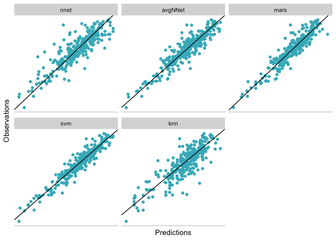

Applied Predictive Modeling
================
Santiago Toso

This section will reference functions from the `caret`, `earth`, `kernlab` and `nnet` packages.

`R` has a number of packages and functions for creating neural networks. Relevant packages include `nnet`, `neural` and `RSNNS`. The `nnet` package is the focus here since it supports the basic neural network models outlined in this chapter (single layer of hidden units) and weight decay and has simple sintax. `RSNNS` supports a wide array of neural networks. Bergmeir and Benites (2012) outline the various network packages in `R` and contain a tutorial on `RSNNS`.

Like the previous chapter, we'll use the solubility data treated on this chapter. The predictors for the training and test sets are contained in data frames called `solTrainX` and `solTestX`, respectively. To obtain the data in R,

``` r
data(solubility)
ls(pattern = "^solT")
```

    ## [1] "solTestX"       "solTestXtrans"  "solTestY"       "solTrainX"     
    ## [5] "solTrainXtrans" "solTrainY"

The `FP` columns correspond to binary 0/1 fingerprint predictors that are associated with the presence or absence of a particular chemical structure. Alternate versions of these data that have been Box-Cox transformed are contained in the data frames `solTrainXtrans` and `solTestXtrans`. The solubility values for each compound are contained in numeric vectors named `solTrainY` and `solTestY`.

Neural Networks
===============

To fit a regression model, the `nnet` package takes both the formula and non-formula interfaces. For regression, the linear relationship between the hidden units and the prediction can be used with the option `linout = TRUE`. A basic neural network function call would be:

``` r
library(nnet)
nnetFit <- nnet(solTrainXtrans, solTrainY,
                size = 5,
                decay = 0.01,
                linout = TRUE,
                # Reduce the amount of printed output
                trace = FALSE,
                # Expand the number of iterations to find
                # parameter estimates...
                maxit = 500,
                # add the number of parameters used by the model
                MaxNWts = 5 * (ncol(solTrainXtrans) + 1) + 5 + 1)
nnetFit
```

    ## a 228-5-1 network with 1151 weights
    ## options were - linear output units  decay=0.01

This would create a single model with 5 hidden units. Note, this assumes that the data in `solTrainXtrans` have been standarized to be on the same scale.

To use the model averaging, the `avNNet` function in the `caret` package has a nearly identical syntax.

``` r
nnetAvg <- avNNet(solTrainXtrans, solTrainY,
                size = 5,
                decay = 0.01,
                # Specify how many models to average
                repeats = 5,
                linout = TRUE,
                # Reduce the amount of printed output
                trace = FALSE,
                # Expand the number of iterations to find
                # parameter estimates...
                maxit = 500,
                # add the number of parameters used by the model
                MaxNWts = 5 * (ncol(solTrainXtrans) + 1) + 5 + 1)
```

    ## Warning: executing %dopar% sequentially: no parallel backend registered

``` r
nnetAvg
```

    ## Model Averaged Neural Network with 5 Repeats  
    ## 
    ## a 228-5-1 network with 1151 weights
    ## options were - linear output units  decay=0.01

Now we can use them with the testing set.

``` r
nnetPred <- predict(nnetFit, solTestXtrans)
avgPred <- predict(nnetAvg, solTestXtrans)
nnetValues <- data.frame(pred = nnetPred, obs = solTestY)
avgValues <- data.frame(pred = avgPred, obs = solTestY)
nnetSummary <- defaultSummary(nnetValues)
avgSummary <- defaultSummary(avgValues)
nnetSummary
```

    ##      RMSE  Rsquared       MAE 
    ## 1.0675288 0.7734816 0.7481900

``` r
avgSummary
```

    ##      RMSE  Rsquared       MAE 
    ## 0.7868936 0.8611708 0.5653572

Graphically

``` r
source("/Users/santiagotoso/GoogleDrive/Master/R/Functions/predObsPlot.R")
gnnet <- plot.pred(nnetPred, solTestY, title = 'Neural Network')
gavnnet <- plot.pred(avgPred, solTestY, title = 'Average Neural Network')

gnnet
```


``` r
gavnnet
```


To mimic the earlier approach of choosing the number of hidden units and the amount of weight decay via resampling, the `train` function can be applied using either `method = "nnet"` or `method = "avNNet"`. First, we remove predictors to ensure that the maximum absolute pairwise correlation between the predictors is less than 0.75.

``` r
# the findCorrelation tajes a correlation matrix and determines the 
# column numbers that should be rmeoved to keep all pair-wise
# correlations below a threshold
tooHigh <- findCorrelation(cor(solTrainXtrans), cutoff = 0.75)
trainXnnet <- solTrainXtrans[ , -tooHigh]
testXnnet <- solTestXtrans[ , -tooHigh]

# Cross-Validation
ctrl <- trainControl(method = 'cv', number = 10)

# Create a specific candidate set of models to evaluate:
nnetGrid <- expand.grid(.decay = c(0, .01, .1),
                        .size = c(1:10),
                        # The next option is to use bagging (see the
                        # next chapter) instead of different random
                        # seeds.
                        .bag = FALSE)

set.seed(100)
nnetTune <- train(solTrainXtrans, solTrainY,
                  method = "avNNet",
                  tuneGrid = nnetGrid,
                  trControl = ctrl,
                  # Automatically standarize data prior to modeling
                  # and prediction
                  preProcess = c("center", "scale", "pca"),
                  linout = TRUE,
                  trace = FALSE,
                  MaxNWts = 10 * (ncol(trainXnnet) + 1) + 10 + 1,
                  maxit = 500)

nnetTune
```

    ## Model Averaged Neural Network 
    ## 
    ## 951 samples
    ## 228 predictors
    ## 
    ## Pre-processing: centered (228), scaled (228), principal component
    ##  signal extraction (228) 
    ## Resampling: Cross-Validated (10 fold) 
    ## Summary of sample sizes: 856, 856, 855, 855, 857, 856, ... 
    ## Resampling results across tuning parameters:
    ## 
    ##   decay  size  RMSE       Rsquared   MAE      
    ##   0.00    1    0.8180503  0.8466032  0.6339186
    ##   0.00    2    0.7767657  0.8584152  0.5959312
    ##   0.00    3    0.8245714  0.8387155  0.6329513
    ##   0.00    4    0.8460216  0.8302621  0.6468973
    ##   0.00    5    0.7866047  0.8542000  0.6033698
    ##   0.00    6    0.7597890  0.8633704  0.5804401
    ##   0.00    7    0.7797191  0.8571399  0.5997954
    ##   0.00    8    0.8113506  0.8449576  0.6147818
    ##   0.00    9    0.7992320  0.8512868  0.6137166
    ##   0.00   10    0.8022672  0.8509772  0.6072240
    ##   0.01    1    0.7757153  0.8577562  0.5969807
    ##   0.01    2    0.7498869  0.8672192  0.5788606
    ##   0.01    3    0.7760723  0.8579872  0.6030028
    ##   0.01    4    0.7778997  0.8562965  0.5967658
    ##   0.01    5    0.7906130  0.8534414  0.5933629
    ##   0.01    6    0.7796504  0.8581278  0.5828631
    ##   0.01    7    0.7868540  0.8570544  0.5884115
    ##   0.01    8    0.8013160  0.8490970  0.6019605
    ##   0.01    9    0.8063198  0.8503425  0.6028744
    ##   0.01   10    0.8167961  0.8432208  0.6088097
    ##   0.10    1    0.7849383  0.8545276  0.6045516
    ##   0.10    2    0.7243216  0.8764334  0.5581197
    ##   0.10    3    0.7339015  0.8723197  0.5576080
    ##   0.10    4    0.7392585  0.8708509  0.5616564
    ##   0.10    5    0.7687439  0.8615174  0.5739865
    ##   0.10    6    0.7358018  0.8733964  0.5576899
    ##   0.10    7    0.7910680  0.8556165  0.5858469
    ##   0.10    8    0.7718935  0.8619079  0.5806877
    ##   0.10    9    0.7689976  0.8631420  0.5763925
    ##   0.10   10    0.8039311  0.8503227  0.5894953
    ## 
    ## Tuning parameter 'bag' was held constant at a value of FALSE
    ## RMSE was used to select the optimal model using the smallest value.
    ## The final values used for the model were size = 2, decay = 0.1 and bag
    ##  = FALSE.

``` r
source("/Users/santiagotoso/GoogleDrive/Master/R/Functions/plotModel.R")
plot.model(nnetTune)
```


``` r
# Create a specific candidate set of models to evaluate:
nnetGrid1 <- expand.grid(.decay = c(0, .01, .1),
                        .size = c(1:10))

set.seed(100)
nnetTune1 <- train(solTrainXtrans, solTrainY,
                  method = "nnet",
                  tuneGrid = nnetGrid1,
                  trControl = ctrl,
                  # Automatically standarize data prior to modeling
                  # and prediction
                  preProcess = c("center", "scale", "pca"),
                  linout = TRUE,
                  trace = FALSE,
                  MaxNWts = 10 * (ncol(trainXnnet) + 1) + 10 + 1,
                  maxit = 500)

nnetTune1
```

    ## Neural Network 
    ## 
    ## 951 samples
    ## 228 predictors
    ## 
    ## Pre-processing: centered (228), scaled (228), principal component
    ##  signal extraction (228) 
    ## Resampling: Cross-Validated (10 fold) 
    ## Summary of sample sizes: 856, 856, 855, 855, 857, 856, ... 
    ## Resampling results across tuning parameters:
    ## 
    ##   decay  size  RMSE       Rsquared   MAE      
    ##   0.00    1    0.8554297  0.8121948  0.6658961
    ##   0.00    2    0.8578808  0.8221175  0.6678914
    ##   0.00    3    1.1255431  0.7195477  0.8618524
    ##   0.00    4    1.1672670  0.7082742  0.9010699
    ##   0.00    5    1.1955751  0.7100262  0.9061804
    ##   0.00    6    1.1587842  0.7154739  0.8940917
    ##   0.00    7    1.1394561  0.7297012  0.8728694
    ##   0.00    8    1.2266827  0.6996991  0.9451224
    ##   0.00    9    1.4005722  0.6420475  1.0597473
    ##   0.00   10    1.1927787  0.7092258  0.9094741
    ##   0.01    1    0.7752763  0.8578949  0.5968807
    ##   0.01    2    0.8314379  0.8375112  0.6437866
    ##   0.01    3    1.0111932  0.7606531  0.7855346
    ##   0.01    4    1.0746605  0.7482304  0.8243297
    ##   0.01    5    1.1118196  0.7460311  0.8471834
    ##   0.01    6    1.0913144  0.7425181  0.8253042
    ##   0.01    7    1.1431345  0.7269159  0.8666090
    ##   0.01    8    1.2320410  0.7050212  0.9193943
    ##   0.01    9    1.2401823  0.6877311  0.9337584
    ##   0.01   10    1.1747547  0.7197468  0.8823555
    ##   0.10    1    0.7846616  0.8546042  0.6043727
    ##   0.10    2    0.8368901  0.8367378  0.6444517
    ##   0.10    3    0.9308469  0.8053751  0.7104211
    ##   0.10    4    1.0453065  0.7620223  0.7907890
    ##   0.10    5    1.0305697  0.7692994  0.7883202
    ##   0.10    6    1.0282782  0.7748763  0.7667464
    ##   0.10    7    1.1379599  0.7418472  0.8363902
    ##   0.10    8    1.1047372  0.7430954  0.8109895
    ##   0.10    9    1.1111458  0.7482690  0.8216933
    ##   0.10   10    1.1085931  0.7460717  0.8001166
    ## 
    ## RMSE was used to select the optimal model using the smallest value.
    ## The final values used for the model were size = 1 and decay = 0.01.

Multivariate Adaptive Regression Splines
========================================

MARS models are in several packages, but the most extensive implementation is in the `earth` package. The MARS model using the nominal forward pass and pruning step can be called simply

``` r
library(earth)
```

    ## Loading required package: plotmo

    ## Loading required package: plotrix

    ## Loading required package: TeachingDemos

``` r
marsFit <- earth(solTrainXtrans, solTrainY)
marsFit
```

    ## Selected 40 of 47 terms, and 31 of 228 predictors
    ## Termination condition: RSq changed by less than 0.001 at 47 terms
    ## Importance: NumNonHAtoms, SurfaceArea2, MolWeight, SurfaceArea1, ...
    ## Number of terms at each degree of interaction: 1 39 (additive model)
    ## GCV 0.3873018    RSS 309.672    GRSq 0.9076346    RSq 0.9221793

Note that since this model used the internal GCV technique for model selection, the details of this model are different than the one used previously in the cahpter. The `summary` emthod generates more extensive output:

``` r
summary(marsFit)
```

    ## Call: earth(x=solTrainXtrans, y=solTrainY)
    ## 
    ##                                 coefficients
    ## (Intercept)                        -4.455949
    ## FP002                               0.733904
    ## FP003                              -0.203502
    ## FP059                              -0.613495
    ## FP065                              -0.278610
    ## FP075                               0.295269
    ## FP083                              -0.563202
    ## FP085                              -0.193880
    ## FP099                               0.337591
    ## FP111                              -0.428246
    ## FP135                               0.405277
    ## FP142                               0.397119
    ## FP154                              -0.597650
    ## FP172                              -0.527362
    ## FP176                               0.294774
    ## FP188                               0.407757
    ## FP202                               0.279390
    ## FP204                              -0.336720
    ## FP207                               0.424005
    ## h(MolWeight-5.77157)               -1.964915
    ## h(5.94458-MolWeight)                0.686131
    ## h(2.99573-NumNonHAtoms)             2.755144
    ## h(NumNonHAtoms-2.99573)            -3.517132
    ## h(2.57858-NumNonHBonds)            -0.647484
    ## h(0.79877-NumMultBonds)            -0.501790
    ## h(2.19722-NumRotBonds)              0.120247
    ## h(NumRotBonds-2.19722)             -2.709055
    ## h(0.941208-NumDblBonds)             0.501773
    ## h(2.48491-NumAromaticBonds)         0.492052
    ## h(NumAromaticBonds-2.48491)        -2.811877
    ## h(0.584815-NumNitrogen)            -1.593633
    ## h(NumNitrogen-0.584815)             9.162309
    ## h(1.38629-NumOxygen)               -0.730829
    ## h(NumOxygen-1.38629)                3.358142
    ## h(NumChlorine-0.46875)            -51.880014
    ## h(-0.816625-HydrophilicFactor)     -0.374411
    ## h(HydrophilicFactor- -0.816625)     0.196559
    ## h(SurfaceArea1-1.9554)              0.148552
    ## h(4.66178-SurfaceArea2)            -0.158472
    ## h(SurfaceArea2-4.66178)            -0.168509
    ## 
    ## Selected 40 of 47 terms, and 31 of 228 predictors
    ## Termination condition: RSq changed by less than 0.001 at 47 terms
    ## Importance: NumNonHAtoms, SurfaceArea2, MolWeight, SurfaceArea1, ...
    ## Number of terms at each degree of interaction: 1 39 (additive model)
    ## GCV 0.3873018    RSS 309.672    GRSq 0.9076346    RSq 0.9221793

In this output, *h(.)* is the hingre function. In the output above, the term `h(MolWeight-5.77157)` is zero when the molecular weight is less than 5.77157. The reflected hinge function would be shown as `h(5.77157-MolWeight)`.

The `plotmo` function in the `earth` package can be used to produce plots.

``` r
plotmo(marsFit)
```

    ##  plotmo grid:    FP001 FP002 FP003 FP004 FP005 FP006 FP007 FP008 FP009
    ##                      0     1     0     1     1     0     0     0     0
    ##  FP010 FP011 FP012 FP013 FP014 FP015 FP016 FP017 FP018 FP019 FP020 FP021
    ##      0     0     0     0     0     1     0     0     0     0     0     0
    ##  FP022 FP023 FP024 FP025 FP026 FP027 FP028 FP029 FP030 FP031 FP032 FP033
    ##      0     0     0     0     0     0     0     0     0     0     0     0
    ##  FP034 FP035 FP036 FP037 FP038 FP039 FP040 FP041 FP042 FP043 FP044 FP045
    ##      0     0     0     0     0     0     0     0     0     0     0     0
    ##  FP046 FP047 FP048 FP049 FP050 FP051 FP052 FP053 FP054 FP055 FP056 FP057
    ##      0     0     0     0     0     0     0     0     0     0     0     0
    ##  FP058 FP059 FP060 FP061 FP062 FP063 FP064 FP065 FP066 FP067 FP068 FP069
    ##      0     0     0     0     0     0     0     1     1     0     0     0
    ##  FP070 FP071 FP072 FP073 FP074 FP075 FP076 FP077 FP078 FP079 FP080 FP081
    ##      0     0     1     0     0     0     0     0     0     1     0     0
    ##  FP082 FP083 FP084 FP085 FP086 FP087 FP088 FP089 FP090 FP091 FP092 FP093
    ##      1     0     0     0     0     1     0     0     0     0     0     0
    ##  FP094 FP095 FP096 FP097 FP098 FP099 FP100 FP101 FP102 FP103 FP104 FP105
    ##      0     0     0     0     0     0     0     0     0     0     0     0
    ##  FP106 FP107 FP108 FP109 FP110 FP111 FP112 FP113 FP114 FP115 FP116 FP117
    ##      0     0     0     0     0     0     0     0     0     0     0     0
    ##  FP118 FP119 FP120 FP121 FP122 FP123 FP124 FP125 FP126 FP127 FP128 FP129
    ##      0     0     0     0     0     0     0     0     0     0     0     0
    ##  FP130 FP131 FP132 FP133 FP134 FP135 FP136 FP137 FP138 FP139 FP140 FP141
    ##      0     0     0     0     0     0     0     0     0     0     0     0
    ##  FP142 FP143 FP144 FP145 FP146 FP147 FP148 FP149 FP150 FP151 FP152 FP153
    ##      0     0     0     0     0     0     0     0     0     0     0     0
    ##  FP154 FP155 FP156 FP157 FP158 FP159 FP160 FP161 FP162 FP163 FP164 FP165
    ##      0     0     0     0     0     0     0     0     0     0     1     0
    ##  FP166 FP167 FP168 FP169 FP170 FP171 FP172 FP173 FP174 FP175 FP176 FP177
    ##      0     0     1     0     0     0     0     0     0     0     0     0
    ##  FP178 FP179 FP180 FP181 FP182 FP183 FP184 FP185 FP186 FP187 FP188 FP189
    ##      0     0     0     0     0     0     0     0     0     0     0     0
    ##  FP190 FP191 FP192 FP193 FP194 FP195 FP196 FP197 FP198 FP199 FP200 FP201
    ##      0     0     0     0     0     0     0     0     0     0     0     0
    ##  FP202 FP203 FP204 FP205 FP206 FP207 FP208 MolWeight NumAtoms NumNonHAtoms
    ##      0     0     0     0     0     0     0  5.194234 3.135494     2.564949
    ##  NumBonds NumNonHBonds NumMultBonds NumRotBonds NumDblBonds
    ##  3.178054     3.351388     2.944766    1.098612   0.5670767
    ##  NumAromaticBonds NumHydrogen NumCarbon NumNitrogen NumOxygen NumSulfer
    ##           1.94591    3.691453  3.317541           0 0.6931472         0
    ##  NumChlorine NumHalogen  NumRings HydrophilicFactor SurfaceArea1
    ##            0          0 0.6931472        -0.3630242      7.25813
    ##  SurfaceArea2
    ##      7.759912


To tune the model using external resampling, the `train` function can be used. The following code reproduces the results in Fig. 7.4:

``` r
# Define the candidate models to test
# We define the degrees of the equation and the
# number of terms to use
marsGrid <- expand.grid(.degree = 1:2,
                        .nprune = 2:38)

# Fix the seed so that the results can be reproduced
set.seed(100)
marsTuned <- train(solTrainXtrans, solTrainY,
                   method = 'earth',
                   tuneGrid = marsGrid,
                   trControl = trainControl(method = "cv"))
marsTuned
```

    ## Multivariate Adaptive Regression Spline 
    ## 
    ## 951 samples
    ## 228 predictors
    ## 
    ## No pre-processing
    ## Resampling: Cross-Validated (10 fold) 
    ## Summary of sample sizes: 856, 856, 855, 855, 857, 856, ... 
    ## Resampling results across tuning parameters:
    ## 
    ##   degree  nprune  RMSE       Rsquared   MAE      
    ##   1        2      1.5610000  0.4198695  1.1947358
    ##   1        3      1.0734760  0.7254086  0.8215423
    ##   1        4      0.9865814  0.7648470  0.7598549
    ##   1        5      0.9107653  0.7992922  0.7060994
    ##   1        6      0.8843640  0.8119566  0.6828926
    ##   1        7      0.8504298  0.8276453  0.6625704
    ##   1        8      0.8394580  0.8324576  0.6511954
    ##   1        9      0.8476625  0.8290399  0.6542765
    ##   1       10      0.8369444  0.8322989  0.6466129
    ##   1       11      0.8247644  0.8365905  0.6370129
    ##   1       12      0.8220283  0.8385922  0.6330253
    ##   1       13      0.8019738  0.8454965  0.6148967
    ##   1       14      0.8011014  0.8463156  0.6130984
    ##   1       15      0.7771126  0.8542163  0.5927403
    ##   1       16      0.7751971  0.8552907  0.5874717
    ##   1       17      0.7611348  0.8611686  0.5754540
    ##   1       18      0.7641831  0.8598134  0.5761603
    ##   1       19      0.7568118  0.8626007  0.5753881
    ##   1       20      0.7510054  0.8638166  0.5700901
    ##   1       21      0.7401506  0.8681357  0.5632192
    ##   1       22      0.7381439  0.8691587  0.5603074
    ##   1       23      0.7323371  0.8717794  0.5563997
    ##   1       24      0.7298182  0.8730980  0.5529977
    ##   1       25      0.7251940  0.8747794  0.5498593
    ##   1       26      0.7206104  0.8765653  0.5473801
    ##   1       27      0.7131833  0.8788577  0.5417514
    ##   1       28      0.7106246  0.8798295  0.5394047
    ##   1       29      0.7040041  0.8823640  0.5367218
    ##   1       30      0.6974296  0.8847435  0.5312363
    ##   1       31      0.6932285  0.8859813  0.5275455
    ##   1       32      0.6931796  0.8859978  0.5282015
    ##   1       33      0.6926030  0.8862509  0.5289830
    ##   1       34      0.6952915  0.8852935  0.5298165
    ##   1       35      0.6945886  0.8853776  0.5313983
    ##   1       36      0.6928603  0.8858856  0.5298756
    ##   1       37      0.6940250  0.8855136  0.5297666
    ##   1       38      0.6949774  0.8853922  0.5286863
    ##   2        2      1.5294456  0.4428165  1.1620006
    ##   2        3      1.0824110  0.7182268  0.8327356
    ##   2        4      0.9635129  0.7755826  0.7419396
    ##   2        5      0.9326426  0.7919603  0.7207043
    ##   2        6      0.8876220  0.8130326  0.6933585
    ##   2        7      0.8568907  0.8263090  0.6654643
    ##   2        8      0.8346452  0.8348287  0.6488127
    ##   2        9      0.8198515  0.8402751  0.6420005
    ##   2       10      0.8108832  0.8446483  0.6268577
    ##   2       11      0.7900461  0.8535300  0.6043111
    ##   2       12      0.7757432  0.8576816  0.5926769
    ##   2       13      0.7470639  0.8673689  0.5720519
    ##   2       14      0.7462793  0.8682889  0.5653457
    ##   2       15      0.7432738  0.8694584  0.5621209
    ##   2       16      0.7389807  0.8711719  0.5589512
    ##   2       17      0.7259612  0.8748991  0.5528951
    ##   2       18      0.7161036  0.8783624  0.5434706
    ##   2       19      0.7040665  0.8821110  0.5360343
    ##   2       20      0.7016984  0.8830359  0.5363442
    ##   2       21      0.6978192  0.8842055  0.5317873
    ##   2       22      0.6924645  0.8856599  0.5277082
    ##   2       23      0.6834166  0.8887996  0.5229403
    ##   2       24      0.6772702  0.8905892  0.5195238
    ##   2       25      0.6768740  0.8905677  0.5170899
    ##   2       26      0.6810407  0.8893718  0.5205627
    ##   2       27      0.6803117  0.8893751  0.5188762
    ##   2       28      0.6781557  0.8900516  0.5176655
    ##   2       29      0.6798477  0.8895898  0.5177566
    ##   2       30      0.6830563  0.8886526  0.5183821
    ##   2       31      0.6824194  0.8887156  0.5165854
    ##   2       32      0.6816885  0.8889826  0.5157068
    ##   2       33      0.6815347  0.8890479  0.5146449
    ##   2       34      0.6821580  0.8888878  0.5129228
    ##   2       35      0.6776449  0.8903154  0.5076160
    ##   2       36      0.6776179  0.8903698  0.5075819
    ##   2       37      0.6767007  0.8906302  0.5071598
    ##   2       38      0.6768094  0.8906070  0.5072638
    ## 
    ## RMSE was used to select the optimal model using the smallest value.
    ## The final values used for the model were nprune = 37 and degree = 2.

We can test the model with the test set.

``` r
marsPred <- predict(marsTuned, solTestXtrans)
source("/Users/santiagotoso/GoogleDrive/Master/R/Functions/predObsPlot.R")
gmars <- plot.pred(marsPred, solTestY, title = 'MARS')
gmars
```


There are two functions that estimate the importance of each predictor in the MARS model: `evimp` in the `earth` package and `varImp` in the `caret` package (although the latter calls the former):

``` r
varImp(marsTuned)
```

    ## earth variable importance
    ## 
    ##   only 20 most important variables shown (out of 228)
    ## 
    ##                  Overall
    ## MolWeight        100.000
    ## NumNonHAtoms      92.084
    ## SurfaceArea1      92.084
    ## FP137             48.527
    ## NumHydrogen       38.121
    ## NumRotBonds       35.909
    ## NumOxygen         29.496
    ## FP043             23.949
    ## FP040             23.470
    ## SurfaceArea2      23.172
    ## FP101             19.746
    ## FP021             16.014
    ## NumMultBonds      16.014
    ## FP170             10.971
    ## FP059              9.569
    ## NumAromaticBonds   6.555
    ## NumHalogen         4.959
    ## FP070              0.000
    ## FP029              0.000
    ## FP147              0.000

These results are scaled to be between 0 and 100 and are different than those shown in table 7.1 (since the model in Table 7.1 did not undergo the full model growing and pruning process). Note that after the first few variables, the remainder have much smaller importance to the model.

Support Vector Machines
=======================

There are a number of packages with implementations of support vector machines models. The `svm` function in the `e1071` package has an interface to the `LIBSVM` library (Chang and Lin 2011) for regression. A more comprehensive implementation of SVM models for regression is the `kernlab` package. In that package, the `ksvm` function is available for the regression models and a large number of kernel functions. The radial basis function is the default kernel function. If appropiate values of the cost and kernel parameters are known, this model can be fit as

``` r
#library(kernlab)
# svmFit <- ksvm(x = solTrainXtrans, y = solTrainY,
#                kernel = "rbfdot", kpar = "automatic",
#                C = 1, epsilon = .1)
```

The function automatically uses the nalytical approach to estimate σ. Since `y` is a numeric vector, the function knows to fit a regression model (instead of a classification model). Other kernel functions can be used, including the polynomial (using `kernel = "polydot"`) and linear (`kernel = "vanilladot"`).

If the values are unknown, they can be estimated through resampling. In `train`, the `method` values of `svmRadial`, `svmLinear`, or `svmPoly` fit different kernels:

``` r
svmRTuned <- train(solTrainXtrans, solTrainY,
                   method = "svmRadial",
                   preProcess = c("center", "scale"),
                   tuneLength = 14,
                   trControl = trainControl(method = "cv"))
```

The `tuneLength` argument will use the default grid search of 14 cost values between 2^-2 - 2^11. Again, σ is estimated analytically by default.

``` r
svmRTuned
```

    ## Support Vector Machines with Radial Basis Function Kernel 
    ## 
    ## 951 samples
    ## 228 predictors
    ## 
    ## Pre-processing: centered (228), scaled (228) 
    ## Resampling: Cross-Validated (10 fold) 
    ## Summary of sample sizes: 857, 856, 856, 856, 855, 856, ... 
    ## Resampling results across tuning parameters:
    ## 
    ##   C        RMSE       Rsquared   MAE      
    ##      0.25  0.8086472  0.8650491  0.6040350
    ##      0.50  0.7158482  0.8871585  0.5331541
    ##      1.00  0.6684252  0.8978323  0.4960238
    ##      2.00  0.6366349  0.9052559  0.4700727
    ##      4.00  0.6217857  0.9088492  0.4571951
    ##      8.00  0.6059898  0.9132655  0.4473604
    ##     16.00  0.6009921  0.9145500  0.4425787
    ##     32.00  0.6017992  0.9142121  0.4429745
    ##     64.00  0.6011190  0.9142660  0.4441073
    ##    128.00  0.6017550  0.9139535  0.4448852
    ##    256.00  0.6038782  0.9133373  0.4473942
    ##    512.00  0.6055245  0.9127945  0.4489103
    ##   1024.00  0.6065738  0.9124243  0.4498322
    ##   2048.00  0.6090538  0.9116155  0.4528802
    ## 
    ## Tuning parameter 'sigma' was held constant at a value of 0.002662972
    ## RMSE was used to select the optimal model using the smallest value.
    ## The final values used for the model were sigma = 0.002662972 and C = 16.

Graphically,

``` r
library(scales)
```

    ## 
    ## Attaching package: 'scales'

    ## The following object is masked from 'package:plotrix':
    ## 
    ##     rescale

``` r
ggplot(svmRTuned, aes(x = svmRTuned$results$C, y = svmRTuned$results$RMSE)) +
  geom_point(color = '#41b6c4') +
  geom_line(color = '#41b6c4') +
  scale_x_continuous(trans = log2_trans(),
    breaks = trans_breaks("log2", function(x) 2^x),
    labels = trans_format("log2", math_format(2^.x))) +
  scale_y_continuous(labels = percent) +
  theme(panel.grid = element_blank(),
        panel.background = element_blank(),
        axis.line.x = element_line(colour = "grey"),
        axis.line.y = element_line(colour = "grey"),
        axis.ticks.x = element_line(colour = "grey"),
        axis.ticks.y = element_line(colour = "grey")
        )
```


We could now see how it goes with the test set.

``` r
svmRPred <- predict(svmRTuned, solTestXtrans)
gsvm <- plot.pred(svmRPred, solTestY, title = "SVM Radial")
gsvm
```


The subobject named `finalModel` contains the model created by the `ksvm` function:

``` r
svmRTuned$finalModel
```

    ## Support Vector Machine object of class "ksvm" 
    ## 
    ## SV type: eps-svr  (regression) 
    ##  parameter : epsilon = 0.1  cost C = 16 
    ## 
    ## Gaussian Radial Basis kernel function. 
    ##  Hyperparameter : sigma =  0.0026629721069908 
    ## 
    ## Number of Support Vectors : 623 
    ## 
    ## Objective Function Value : -303.8084 
    ## Training error : 0.01011

Here, we see that the model used 621 training set data points as support vectors (66% of the total training set).

`kernlab` has an implementation of the RVM model for regression in the function `rvm`. The sintax is very similar to the example shown for `ksvm`.

K-Nearest Neighbors
===================

The `knnreg` function in the `caret` package fits the KNN regression model; `train` tunes de model over K:

``` r
# Remove a few sparse and unbalanced fingerprints first
knnDescr <- solTrainXtrans[ , -nearZeroVar(solTrainXtrans)]
set.seed(100)
knnTune <- train(knnDescr, solTrainY,
                 method = "knn",
                 # Center and scaleing will occur for new predictions too
                 preProcess = c("center", "scale"),
                 tuneGrid = data.frame(.k = 1:20),
                 trControl = trainControl(method = "cv"))
```

When predicting new samples using this object, the new samples are automatically centered and scaled using the values determined by the training set.

``` r
knnTune
```

    ## k-Nearest Neighbors 
    ## 
    ## 951 samples
    ## 225 predictors
    ## 
    ## Pre-processing: centered (225), scaled (225) 
    ## Resampling: Cross-Validated (10 fold) 
    ## Summary of sample sizes: 856, 856, 855, 855, 857, 856, ... 
    ## Resampling results across tuning parameters:
    ## 
    ##   k   RMSE      Rsquared   MAE      
    ##    1  1.250232  0.6611312  0.9165221
    ##    2  1.103952  0.7197662  0.7988127
    ##    3  1.065688  0.7350824  0.7903996
    ##    4  1.043534  0.7449116  0.7860586
    ##    5  1.049529  0.7409384  0.7889923
    ##    6  1.058417  0.7359120  0.7986353
    ##    7  1.060938  0.7331595  0.7980003
    ##    8  1.055874  0.7358010  0.7974424
    ##    9  1.065884  0.7311823  0.8082185
    ##   10  1.070847  0.7286249  0.8134830
    ##   11  1.069596  0.7302802  0.8124852
    ##   12  1.076953  0.7269775  0.8202945
    ##   13  1.088453  0.7204797  0.8318907
    ##   14  1.093359  0.7181335  0.8380720
    ##   15  1.100073  0.7149682  0.8461514
    ##   16  1.104751  0.7127331  0.8533856
    ##   17  1.109370  0.7101825  0.8581988
    ##   18  1.119957  0.7059283  0.8669092
    ##   19  1.127248  0.7024141  0.8742935
    ##   20  1.132476  0.6998827  0.8761286
    ## 
    ## RMSE was used to select the optimal model using the smallest value.
    ## The final value used for the model was k = 4.

Graphically,

``` r
source("/Users/santiagotoso/GoogleDrive/Master/R/Functions/plotModel.R")
plot.model(knnTune)
```


With my own functions to make nice graphs on models and predictions,

``` r
knnPred <- predict(knnTune, solTestXtrans)
gknn <- plot.pred(knnPred, solTestY, title = "4 - Nearest Neighboor")
gknn
```


``` r
plot.pred(knnPred, solTestY, title = "Residuals for KNN", residuals = TRUE)
```


``` r
source("/Users/santiagotoso/GoogleDrive/Master/R/Functions/plotModel.R")
#plot.model(enetTune)
plot.model(nnetTune)
```


``` r
plot.model(nnetTune1)
```


``` r
plot.model(marsTuned)
```


``` r
plot.model(svmRTuned)
```


``` r
plot.model(knnTune)
```


We can generate a graph for to see how each of our models performed against the test set.

``` r
source("/Users/santiagotoso/GoogleDrive/Master/R/Functions/predObsPlot.R")
gnnet <- plot.pred(nnetPred, solTestY, title = 'Neural Network')
gavnnet <- plot.pred(avgPred, solTestY, title = 'Average Neural Network')
gmars <- plot.pred(marsPred, solTestY, title = 'MARS')
gsvm <- plot.pred(svmRPred, solTestY, title = "SVM Radial")
gknn <- plot.pred(knnPred, solTestY, title = "4 - Nearest Neighboor")
```

A nice way of taking a look at all of this at once would be,

``` r
library(reshape2)
values <- data.frame(id = c(1:length(solTestY)),
                     nnet = nnetPred,
                     avgNNet = avgPred, 
                     mars = as.numeric(marsPred),
                     svm = svmRPred,
                     knn = knnPred)
values <- melt(values, id = "id")
values$obs <- solTestY
ggplot(values, aes(x = value, y = obs)) + facet_wrap(~variable, scales = 'free_x') +
  geom_point(color = '#41b6c4') +
  geom_abline() +
  labs(x = 'Predictions', y = "Observations") +
  theme(panel.grid = element_blank(),
        panel.background = element_blank(),
        axis.line.x = element_line(colour = "grey"),
        axis.line.y = element_blank(),
        axis.text.x = element_blank(),
        axis.text.y = element_blank(),
        axis.ticks.x = element_blank(),#element_line(colour = "grey"),
        axis.ticks.y = element_blank()
        )
```



But this is a lot of code for each time we have to do something and might even be a bit difficult to see which one is the best model if we don't see R^2 or RMSE.

To improve that situation I created a function that would allow us to show the relevant data in a nice way and compare.

``` r
library(gridExtra)
source("/Users/santiagotoso/GoogleDrive/Master/R/Functions/plotGrid.R")
plot.grid(gnnet, gavnnet, gmars, gsvm, gknn, residuals = TRUE)
```


    ## TableGrob (3 x 4) "arrange": 7 grobs
    ##   z     cells    name                 grob
    ## 1 1 (1-1,2-2) arrange       gtable[layout]
    ## 2 2 (1-1,3-3) arrange       gtable[layout]
    ## 3 3 (1-1,4-4) arrange       gtable[layout]
    ## 4 4 (2-2,2-2) arrange       gtable[layout]
    ## 5 5 (2-2,3-3) arrange       gtable[layout]
    ## 6 6 (3-3,2-4) arrange text[GRID.text.1089]
    ## 7 7 (1-3,1-1) arrange text[GRID.text.1090]

We can do the same when ploting the residuals.

``` r
source("/Users/santiagotoso/GoogleDrive/Master/R/Functions/predObsPlot.R")
rgnnet <- plot.pred(nnetPred, solTestY, title = 'Neural Network',residuals = TRUE)
rgavnnet <- plot.pred(avgPred, solTestY, title = 'Average Neural Network',residuals = TRUE)
rgmars <- plot.pred(marsPred, solTestY, title = 'MARS',residuals = TRUE)
rgsvm <- plot.pred(svmRPred, solTestY, title = "SVM Radial",residuals = TRUE)
rgknn <- plot.pred(knnPred, solTestY, title = "4 - Nearest Neighboor",residuals = TRUE)

source("/Users/santiagotoso/GoogleDrive/Master/R/Functions/plotGrid.R")
plot.grid(rgnnet, rgavnnet, rgmars, rgsvm, rgknn, residuals = TRUE)
```


    ## TableGrob (3 x 4) "arrange": 7 grobs
    ##   z     cells    name                 grob
    ## 1 1 (1-1,2-2) arrange       gtable[layout]
    ## 2 2 (1-1,3-3) arrange       gtable[layout]
    ## 3 3 (1-1,4-4) arrange       gtable[layout]
    ## 4 4 (2-2,2-2) arrange       gtable[layout]
    ## 5 5 (2-2,3-3) arrange       gtable[layout]
    ## 6 6 (3-3,2-4) arrange text[GRID.text.1251]
    ## 7 7 (1-3,1-1) arrange text[GRID.text.1252]
