Applied Predictive Modeling
================
Santiago Toso

Chapter 3: Data Pre-Processing
==============================

The [UC Irvine Machine Learning Repository](http://archive.ics.uci.edu/ml/index.html) contains a data set related to glass identification. The data consist of 214 glass samples labeled as one of seven class categories. There are nince predictors, including the refractive index and precentage of eight elements: Na, Mg, Al, Si, K, Ca, Ba, and Fe.
----------------------------------------------------------------------------------------------------------------------------------------------------------------------------------------------------------------------------------------------------------------------------------------------------------------------------------------------------------

The data can be accessed via:

``` r
glassIdentification <- read.table( "https://archive.ics.uci.edu/ml/machine-learning-databases/glass/glass.data",
                           sep=",")
names(glassIdentification) <- c('ID', 'RI', 'NA2O', 'MGO', 'AL2O3', 'SIO2', 'K2O', 'CAO', 'BAO', 'FE2O3', 'TYPE')
glassIdentification <- glassIdentification[ , -1]
str(glassIdentification)
```

    ## 'data.frame':    214 obs. of  10 variables:
    ##  $ RI   : num  1.52 1.52 1.52 1.52 1.52 ...
    ##  $ NA2O : num  13.6 13.9 13.5 13.2 13.3 ...
    ##  $ MGO  : num  4.49 3.6 3.55 3.69 3.62 3.61 3.6 3.61 3.58 3.6 ...
    ##  $ AL2O3: num  1.1 1.36 1.54 1.29 1.24 1.62 1.14 1.05 1.37 1.36 ...
    ##  $ SIO2 : num  71.8 72.7 73 72.6 73.1 ...
    ##  $ K2O  : num  0.06 0.48 0.39 0.57 0.55 0.64 0.58 0.57 0.56 0.57 ...
    ##  $ CAO  : num  8.75 7.83 7.78 8.22 8.07 8.07 8.17 8.24 8.3 8.4 ...
    ##  $ BAO  : num  0 0 0 0 0 0 0 0 0 0 ...
    ##  $ FE2O3: num  0 0 0 0 0 0.26 0 0 0 0.11 ...
    ##  $ TYPE : int  1 1 1 1 1 1 1 1 1 1 ...

a- Using visualizations, explore the predictor variables to understand their distributions as well as the relationships between predictors.

Will start with the skewness and then see the histograms.

    ##         RI       NA2O        MGO      AL2O3       SIO2        K2O 
    ##  1.6027151  0.4478343 -1.1364523  0.8946104 -0.7202392  6.4600889 
    ##        CAO        BAO      FE2O3       TYPE 
    ##  2.0184463  3.3686800  1.7298107  1.0993342

    ## No id variables; using all as measure variables

    ## Warning: Computation failed in `stat_bin()`:
    ## `binwidth` must be positive

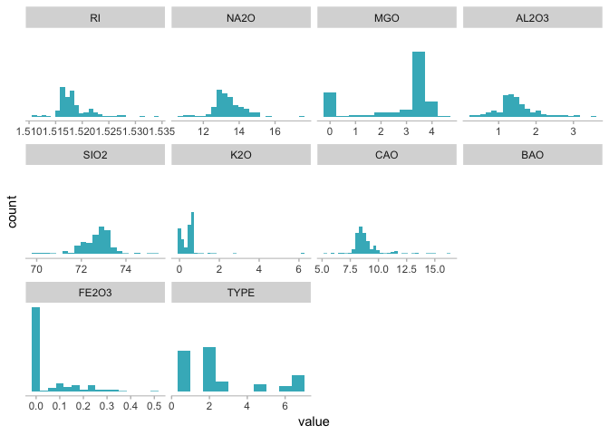

They look pretty skewed. Maybe with the box-plot is easier to identify outliers.

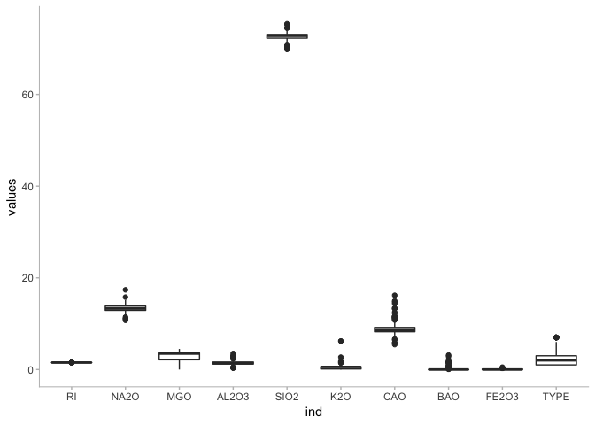

We see a lot of points here that tell us we have some outliers.

Maybe we can check their correlations too before doing anything else.

|       |          RI|        NA2O|         MGO|       AL2O3|        SIO2|         K2O|         CAO|         BAO|       FE2O3|        TYPE|
|-------|-----------:|-----------:|-----------:|-----------:|-----------:|-----------:|-----------:|-----------:|-----------:|-----------:|
| RI    |   1.0000000|  -0.1918854|  -0.1222740|  -0.4073260|  -0.5420522|  -0.2898327|   0.8104027|  -0.0003860|   0.1430096|  -0.1642372|
| NA2O  |  -0.1918854|   1.0000000|  -0.2737320|   0.1567937|  -0.0698088|  -0.2660865|  -0.2754425|   0.3266029|  -0.2413464|   0.5028980|
| MGO   |  -0.1222740|  -0.2737320|   1.0000000|  -0.4817985|  -0.1659267|   0.0053957|  -0.4437500|  -0.4922621|   0.0830595|  -0.7449929|
| AL2O3 |  -0.4073260|   0.1567937|  -0.4817985|   1.0000000|  -0.0055237|   0.3259584|  -0.2595920|   0.4794039|  -0.0744022|   0.5988292|
| SIO2  |  -0.5420522|  -0.0698088|  -0.1659267|  -0.0055237|   1.0000000|  -0.1933309|  -0.2087322|  -0.1021513|  -0.0942007|   0.1515653|
| K2O   |  -0.2898327|  -0.2660865|   0.0053957|   0.3259584|  -0.1933309|   1.0000000|  -0.3178362|  -0.0426181|  -0.0077190|  -0.0100545|
| CAO   |   0.8104027|  -0.2754425|  -0.4437500|  -0.2595920|  -0.2087322|  -0.3178362|   1.0000000|  -0.1128410|   0.1249682|   0.0009522|
| BAO   |  -0.0003860|   0.3266029|  -0.4922621|   0.4794039|  -0.1021513|  -0.0426181|  -0.1128410|   1.0000000|  -0.0586918|   0.5751615|
| FE2O3 |   0.1430096|  -0.2413464|   0.0830595|  -0.0744022|  -0.0942007|  -0.0077190|   0.1249682|  -0.0586918|   1.0000000|  -0.1882776|
| TYPE  |  -0.1642372|   0.5028980|  -0.7449929|   0.5988292|   0.1515653|  -0.0100545|   0.0009522|   0.5751615|  -0.1882776|   1.0000000|

    ## corrplot 0.84 loaded

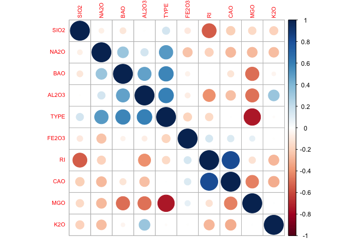

b- Do they appear to be any outliers in the data? Any predictors skewed?

We see that all predictors are skewed:

|       |           x|
|-------|-----------:|
| MGO   |  -1.1364523|
| SIO2  |  -0.7202392|
| NA2O  |   0.4478343|
| AL2O3 |   0.8946104|
| TYPE  |   1.0993342|
| RI    |   1.6027151|
| FE2O3 |   1.7298107|
| CAO   |   2.0184463|
| BAO   |   3.3686800|
| K2O   |   6.4600889|

The one with the lowest skewness is Na2O with 0.44, which is still, pretty skewed.

We also see many outliers as shown in the Box plot below.

c- Are there any relevant transformations of one or more predictors that might improve the classification model?

We can use the `preProcess` function to find the right transformations to use, scale the data, center it, and finally apply PCA.

    ## Loading required package: lattice

    ## Created from 214 samples and 10 variables
    ## 
    ## Pre-processing:
    ##   - Box-Cox transformation (6)
    ##   - centered (10)
    ##   - ignored (0)
    ##   - principal component signal extraction (10)
    ##   - scaled (10)
    ## 
    ## Lambda estimates for Box-Cox transformation:
    ## -2, -0.1, 0.5, 2, -1.1, -0.4
    ## PCA needed 7 components to capture 95 percent of the variance

It transformed 6 out of 10 variables and centered and scaled all of them. After the PCA transformation 7 principal components are needed to get the 95% of the variance.

The soybean data can also be found at the UC Irvine Machine Learning Repository. Data were collected to predict disease in 683 soybeans. The 35 predictors are mostly categorical and include information on te environmental condictions (e.g., temperature, precipitation) and plant conditions (e.g. left spots, mold growth). The outcome laels consist of 19 distinct classes.
-----------------------------------------------------------------------------------------------------------------------------------------------------------------------------------------------------------------------------------------------------------------------------------------------------------------------------------------------------------------------------------

The data can be loaded via:

    ## 'data.frame':    307 obs. of  36 variables:
    ##  $ date          : Factor w/ 19 levels "2-4-d-injury",..: 11 11 11 11 11 11 11 11 11 11 ...
    ##  $ plantstand    : Factor w/ 8 levels "?","0","1","2",..: 8 6 5 5 8 7 7 6 8 6 ...
    ##  $ precip        : Factor w/ 3 levels "?","0","1": 2 2 2 2 2 2 2 2 2 2 ...
    ##  $ temp          : Factor w/ 4 levels "?","0","1","2": 4 4 4 4 4 4 4 4 4 4 ...
    ##  $ hail          : Factor w/ 4 levels "?","0","1","2": 3 3 3 3 3 3 3 3 3 3 ...
    ##  $ crophist      : Factor w/ 3 levels "?","0","1": 2 2 2 2 2 2 2 3 2 2 ...
    ##  $ areadamaged   : Factor w/ 5 levels "?","0","1","2",..: 3 4 3 3 4 5 4 3 5 4 ...
    ##  $ severity      : Factor w/ 5 levels "?","0","1","2",..: 3 2 2 2 2 2 2 2 2 2 ...
    ##  $ seedtmt       : Factor w/ 4 levels "?","0","1","2": 3 4 4 4 3 3 3 3 3 4 ...
    ##  $ germination   : Factor w/ 4 levels "?","0","1","2": 2 3 3 2 2 2 3 2 3 2 ...
    ##  $ plantgrowth   : Factor w/ 4 levels "?","0","1","2": 2 3 4 3 4 3 2 4 3 4 ...
    ##  $ leaves        : Factor w/ 3 levels "?","0","1": 3 3 3 3 3 3 3 3 3 3 ...
    ##  $ leafspotshalo : int  1 1 1 1 1 1 1 1 1 1 ...
    ##  $ leafspotsmarg : Factor w/ 4 levels "?","0","1","2": 2 2 2 2 2 2 2 2 2 2 ...
    ##  $ leafspotsize  : Factor w/ 4 levels "?","0","1","2": 4 4 4 4 4 4 4 4 4 4 ...
    ##  $ leafshread    : Factor w/ 4 levels "?","0","1","2": 4 4 4 4 4 4 4 4 4 4 ...
    ##  $ leafmalf      : Factor w/ 3 levels "?","0","1": 2 2 2 2 2 2 2 2 2 2 ...
    ##  $ leafmild      : Factor w/ 3 levels "?","0","1": 2 2 2 2 2 2 2 2 2 2 ...
    ##  $ stem          : Factor w/ 4 levels "?","0","1","2": 2 2 2 2 2 2 2 2 2 2 ...
    ##  $ lodging       : Factor w/ 3 levels "?","0","1": 3 3 3 3 3 3 3 3 3 3 ...
    ##  $ stemcankers   : Factor w/ 3 levels "?","0","1": 3 2 2 2 2 2 3 2 2 2 ...
    ##  $ cankerlesion  : Factor w/ 5 levels "?","0","1","2",..: 5 5 5 5 5 5 5 5 5 5 ...
    ##  $ fruitingbodies: Factor w/ 5 levels "?","0","1","2",..: 3 3 2 2 3 2 3 3 3 3 ...
    ##  $ external decay: Factor w/ 3 levels "?","0","1": 3 3 3 3 3 3 3 3 3 3 ...
    ##  $ mycelium      : Factor w/ 3 levels "?","0","1": 3 3 3 3 3 3 3 3 3 3 ...
    ##  $ intdiscolor   : Factor w/ 3 levels "?","0","1": 2 2 2 2 2 2 2 2 2 2 ...
    ##  $ sclerotia     : Factor w/ 4 levels "?","0","1","2": 2 2 2 2 2 2 2 2 2 2 ...
    ##  $ fruitpods     : Factor w/ 3 levels "?","0","1": 2 2 2 2 2 2 2 2 2 2 ...
    ##  $ fruit spots   : Factor w/ 5 levels "?","0","1","2",..: 2 2 2 2 2 2 2 2 2 2 ...
    ##  $ seed          : Factor w/ 5 levels "?","0","1","2",..: 5 5 5 5 5 5 5 5 5 5 ...
    ##  $ moldgrowth    : Factor w/ 3 levels "?","0","1": 2 2 2 2 2 2 2 2 2 2 ...
    ##  $ seeddiscolor  : Factor w/ 3 levels "?","0","1": 2 2 2 2 2 2 2 2 2 2 ...
    ##  $ seedsize      : Factor w/ 3 levels "?","0","1": 2 2 2 2 2 2 2 2 2 2 ...
    ##  $ shriveling    : Factor w/ 3 levels "?","0","1": 2 2 2 2 2 2 2 2 2 2 ...
    ##  $ roots         : Factor w/ 3 levels "?","0","1": 2 2 2 2 2 2 2 2 2 2 ...
    ##  $ V36           : Factor w/ 4 levels "?","0","1","2": 2 2 2 2 2 2 2 2 2 2 ...

### Ivestigate the frequency distributions for the categorical predictors. Are any of the distributions defenarete in the ways discussed earlier in this chapter?

Almost all the variables are categorical. To explore them we could start with a contingency table for each of the variables.

``` r
mytable <- table(soyBean$date)
kable(mytable)
```

| Var1                        |  Freq|
|:----------------------------|-----:|
| 2-4-d-injury                |     1|
| alternarialeaf-spot         |    40|
| anthracnose                 |    20|
| bacterial-blight            |    10|
| bacterial-pustule           |    10|
| brown-spot                  |    40|
| brown-stem-rot              |    20|
| charcoal-rot                |    10|
| cyst-nematode               |     6|
| diaporthe-pod-&-stem-blight |     6|
| diaporthe-stem-canker       |    10|
| downy-mildew                |    10|
| frog-eye-leaf-spot          |    40|
| herbicide-injury            |     4|
| phyllosticta-leaf-spot      |    10|
| phytophthora-rot            |    40|
| powdery-mildew              |    10|
| purple-seed-stain           |    10|
| rhizoctonia-root-rot        |    10|

In proportions that would be like this:

``` r
kable(prop.table(mytable))
```

| Var1                        |       Freq|
|:----------------------------|----------:|
| 2-4-d-injury                |  0.0032573|
| alternarialeaf-spot         |  0.1302932|
| anthracnose                 |  0.0651466|
| bacterial-blight            |  0.0325733|
| bacterial-pustule           |  0.0325733|
| brown-spot                  |  0.1302932|
| brown-stem-rot              |  0.0651466|
| charcoal-rot                |  0.0325733|
| cyst-nematode               |  0.0195440|
| diaporthe-pod-&-stem-blight |  0.0195440|
| diaporthe-stem-canker       |  0.0325733|
| downy-mildew                |  0.0325733|
| frog-eye-leaf-spot          |  0.1302932|
| herbicide-injury            |  0.0130293|
| phyllosticta-leaf-spot      |  0.0325733|
| phytophthora-rot            |  0.1302932|
| powdery-mildew              |  0.0325733|
| purple-seed-stain           |  0.0325733|
| rhizoctonia-root-rot        |  0.0325733|

``` r
barpt <- ggplot(soyBean, aes(x = date)) +
  geom_bar(fill = '#41b6c4') +
  coord_flip() +
  theme(panel.grid = element_blank(),
        panel.background = element_blank(),
        axis.line.x = element_line(colour = "grey"),
        axis.line.y = element_blank(),
        axis.ticks.x = element_line(colour = "grey")
        )
barpt
```

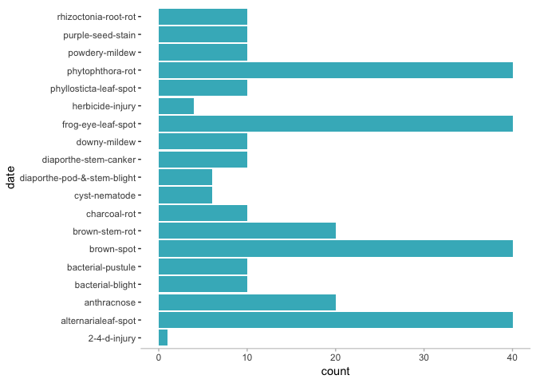

The thing is that we have too many variables to do this for each of them. So, we are going to apply the methods for filtering recommended by the authors. First, will use the `summary` function to look for outliers.

``` r
summary <- summary(soyBean)
summary
```

    ##                   date       plantstand precip  temp    hail    crophist
    ##  alternarialeaf-spot: 40   5      :65   ?:  8   ?: 11   ?:  7   ?: 41   
    ##  brown-spot         : 40   4      :58   0:160   0: 39   0: 41   0:211   
    ##  frog-eye-leaf-spot : 40   3      :53   1:139   1: 47   1:179   1: 55   
    ##  phytophthora-rot   : 40   2      :41           2:210   2: 80           
    ##  anthracnose        : 20   6      :41                                   
    ##  brown-stem-rot     : 20   1      :36                                   
    ##  (Other)            :107   (Other):13                                   
    ##  areadamaged severity seedtmt germination plantgrowth leaves 
    ##  ?: 1        ?:  1    ?: 41   ?: 41       ?:36        ?:  1  
    ##  0:35        0: 51    0: 87   0:140       0:84        0:202  
    ##  1:79        1:101    1:151   1:106       1:99        1:104  
    ##  2:99        2: 63    2: 28   2: 20       2:88               
    ##  3:93        3: 91                                           
    ##                                                              
    ##                                                              
    ##  leafspotshalo    leafspotsmarg leafspotsize leafshread leafmalf leafmild
    ##  Min.   :0.0000   ?: 25         ?: 25        ?: 25      ?: 26    ?: 25   
    ##  1st Qu.:1.0000   0:111         0:160        0: 25      0:233    0:268   
    ##  Median :1.0000   1: 19         1: 11        1:147      1: 48    1: 14   
    ##  Mean   :0.8925   2:152         2:111        2:110                       
    ##  3rd Qu.:1.0000                                                          
    ##  Max.   :1.0000                                                          
    ##                                                                          
    ##  stem    lodging stemcankers cankerlesion fruitingbodies external decay
    ##  ?: 30   ?:  1   ?: 41       ?: 11        ?: 11          ?: 35         
    ##  0:257   0:140   0:248       0:179        0:151          0:226         
    ##  1: 10   1:166   1: 18       1: 23        1: 38          1: 46         
    ##  2: 10                       2: 21        2: 75                        
    ##                              3: 73        3: 32                        
    ##                                                                        
    ##                                                                        
    ##  mycelium intdiscolor sclerotia fruitpods fruit spots seed    moldgrowth
    ##  ?: 11    ?: 11       ?: 11     ?: 11     ?: 25       ?: 35   ?: 29     
    ##  0:232    0:294       0:266     0:286     0:193       0:164   0:227     
    ##  1: 64    1:  2       1: 20     1: 10     1: 53       1: 29   1: 51     
    ##                       2: 10               2:  6       2: 25             
    ##                                           3: 30       4: 54             
    ##                                                                         
    ##                                                                         
    ##  seeddiscolor seedsize shriveling roots   V36    
    ##  ?: 29        ?: 35    ?: 29      ?: 35   ?:  7  
    ##  0:247        0:244    0:251      0:256   0:260  
    ##  1: 31        1: 28    1: 27      1: 16   1: 33  
    ##                                           2:  7  
    ##                                                  
    ##                                                  
    ## 

We see that many variables have a lot of *?*. We'll handle them in the next section.

The `nearZeroVar` will tell us what predictors have almost no variability.

``` r
names(soyBean[nearZeroVar(soyBean)])
```

    ## [1] "intdiscolor" "fruitpods"

We find two variables with almost no variability. We could just remove them from our model.

``` r
filtereddf <- soyBean[, -nearZeroVar(soyBean)]
```

### Roughly 18% of the data are missing. Are there particular predictors that are more likely to be missing? Is the pattern of missing data related to the classes?

Let's see how much data is missing for each of the variables.

Chapter 4: Over-Fitting and Model Tuning
========================================

Brodnjak-Vonina et al. (2005) develop a methodology for food laboratories to determine the type of oil from a sample. In their procedure, they used a gas chromatograph to measure seven different fatty acids in an oil. These measurements would then be used to predict the type of oil in a food samples. To create their model, they used 96 samples of seven types of oils.
---------------------------------------------------------------------------------------------------------------------------------------------------------------------------------------------------------------------------------------------------------------------------------------------------------------------------------------------------------------------------------

The types are pumpkim (A), sunflower (B), peanut (C), olive (D), soybean (E), rapeseed (F), and corn (G). In R

``` r
data(oil)
table(oilType)
```

    ## oilType
    ##  A  B  C  D  E  F  G 
    ## 37 26  3  7 11 10  2

a- Use `sample` to crete a completely random sample of 60 oils. How do the frequencies of the random sample match the original samples? Repeat this procedures several times to understand the variation in the sampling process.

``` r
proptable <- round(table(oilType)/length(oilType), 2)
sampled <- sample(oilType, size = 60)
proptablesample <- round(table(sampled)/length(sampled), 2)
difference <- proptable - proptablesample
difference
```

    ## oilType
    ##     A     B     C     D     E     F     G 
    ## -0.03  0.00  0.01 -0.01 -0.02  0.02  0.02

b- Use the `caret` package function `createDataPartition` to create a stratified random sample. How does this compare to the completely random samples?

``` r
rowsStratified <- createDataPartition(oilType, 
                                  p = 0.75,
                                  list = FALSE)
stratified <- oilType[rowsStratified]
propStratified <- round(table(stratified)/length(stratified),2)
difference2 <- proptable - propStratified
difference2
```

    ## oilType
    ##     A     B     C     D     E     F     G 
    ##  0.02  0.01 -0.01 -0.01 -0.01 -0.01 -0.01

c- Which such a small sample size (n=96) what are the options for determining performance of the model? Shouldl a test set be used?

No, it is better to use re-sampling when we have small sample sizes so we can train the model with all its samples.

Chapter 6
=========

R for predicting fat content in food from Infrared spectroscopy technology instead of analytical chemistry
----------------------------------------------------------------------------------------------------------

a- Start `R` and use the following commands

``` r
library(caret)
library(tidyverse)
```

    ## ── Attaching packages ───────────────────────────────────────────────────────────────────────────────────────────────────────────────── tidyverse 1.2.1 ──

    ## ✔ tibble  1.4.2     ✔ purrr   0.2.5
    ## ✔ tidyr   0.8.1     ✔ dplyr   0.7.6
    ## ✔ readr   1.1.1     ✔ stringr 1.3.1
    ## ✔ tibble  1.4.2     ✔ forcats 0.3.0

    ## ── Conflicts ──────────────────────────────────────────────────────────────────────────────────────────────────────────────────── tidyverse_conflicts() ──
    ## ✖ dplyr::filter() masks stats::filter()
    ## ✖ dplyr::lag()    masks stats::lag()
    ## ✖ purrr::lift()   masks caret::lift()

``` r
data(tecator)
#?tecator
```

The matrix `absorp` contains the 100 abosorbance values for the 215 samples, while matrix `endpoints` contains the percent of moisture, fat, and protein in columns 1-3, respectively.

b- In this example the predictors are the measurements at the individual frequencies. Because the frequencies lie in a systematic order (850-1050nm), the preductirs have a high degree of correlation. Hence, the data lie in a smaller dimension than the total number of predictors (100). Use PCA to determine the effective dimension of these data. What is the effective dimension?

``` r
# trans <- preProcess(absorp,
#                     method = c("center", "scale", "pca"))
# trans

pcaObject <- prcomp(absorp,
                center = TRUE,
                scale. = TRUE)

percentVariance <- (pcaObject$sdev^2) / sum(pcaObject$sdev^2) * 100

dfPercentVariance<- as.data.frame(percentVariance)

dfPercentVariance <- dfPercentVariance %>% 
  mutate(comp = c(1:length(percentVariance)))

ggplot(data = dfPercentVariance, aes(x = comp, y = percentVariance)) +
  geom_point(color = '#41b6c4') + 
  geom_line(color = '#41b6c4') +
  theme(panel.grid = element_blank(),
        panel.background = element_blank(),
        axis.line = element_line(colour = "grey"),
        axis.ticks = element_line(colour = "grey")
        )
```

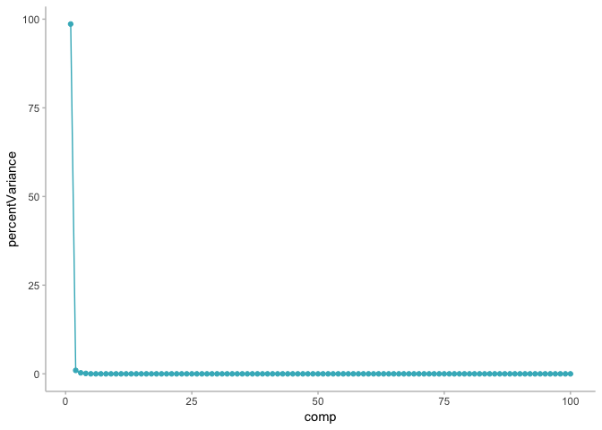

Since the set contains 100 absorbance values for each of the 215 samples, it makes sense to find that only one of the values could explain almost all the set's variation. Nonetheless, we could never keep only one variable to try to explain all the problem, it would give very bad results.

c- Split the data into training and test set, pre-process the data, and build each variaty of models described in this chapter. For those models with tuning parameters, what are the optimal values of the tuning parameters?

``` r
fat <- endpoints[,2]

trainRows <- createDataPartition(fat,
                                 p = .8,
                                 list = FALSE)
```

The train and test set will be

``` r
trainPredictors <- as.data.frame(absorp[trainRows,])
trainTarget <- fat[trainRows]

testPredictors <- as.data.frame(absorp[-trainRows,])
testTarget <- fat[-trainRows]

dftrain <- cbind(trainPredictors, trainTarget)
```

The sample is small, we don't have many samples in the data sets. We'll need to use resample techniques to get the most out of our data. Nonetheless we can start with a simple linear regression and see how it goes.

### Simple Linear Regression

``` r
lmFitAllPredictors <- lm(trainTarget ~ ., data = dftrain)
summary(lmFitAllPredictors)
```

    ## 
    ## Call:
    ## lm(formula = trainTarget ~ ., data = dftrain)
    ## 
    ## Residuals:
    ##      Min       1Q   Median       3Q      Max 
    ## -2.18354 -0.44438  0.04746  0.47586  2.68745 
    ## 
    ## Coefficients:
    ##               Estimate Std. Error t value Pr(>|t|)    
    ## (Intercept)     10.533      2.361   4.460 2.91e-05 ***
    ## V1           11070.000   4078.852   2.714  0.00829 ** 
    ## V2          -12965.844   6878.288  -1.885  0.06340 .  
    ## V3           -5918.306  11619.561  -0.509  0.61205    
    ## V4           22948.772  20648.681   1.111  0.27005    
    ## V5          -27678.940  25321.394  -1.093  0.27794    
    ## V6           14184.910  21736.499   0.653  0.51607    
    ## V7          -11756.249  13917.520  -0.845  0.40103    
    ## V8            8600.472   8334.792   1.032  0.30554    
    ## V9             329.914   6298.091   0.052  0.95837    
    ## V10          -3169.470   8013.596  -0.396  0.69362    
    ## V11           -865.911  12302.463  -0.070  0.94408    
    ## V12          17870.208  20873.940   0.856  0.39474    
    ## V13         -16062.659  26705.405  -0.601  0.54939    
    ## V14           6113.033  23414.525   0.261  0.79477    
    ## V15           6397.472  16204.380   0.395  0.69414    
    ## V16         -13791.011  10584.111  -1.303  0.19667    
    ## V17          -1800.501   8198.742  -0.220  0.82679    
    ## V18           6070.864   8261.091   0.735  0.46477    
    ## V19          15196.832  11543.949   1.316  0.19215    
    ## V20         -11131.177  18376.292  -0.606  0.54657    
    ## V21         -38286.257  25373.117  -1.509  0.13563    
    ## V22          61666.371  29068.726   2.121  0.03728 *  
    ## V23         -23645.236  24808.064  -0.953  0.34367    
    ## V24         -15593.709  17667.106  -0.883  0.38033    
    ## V25          16471.770  12008.917   1.372  0.17438    
    ## V26          -2728.277   7843.523  -0.348  0.72896    
    ## V27          -8045.794   7743.321  -1.039  0.30221    
    ## V28          30408.718  10091.165   3.013  0.00355 ** 
    ## V29         -41419.859  14850.439  -2.789  0.00674 ** 
    ## V30          17645.504  21999.803   0.802  0.42511    
    ## V31          -1340.132  26731.203  -0.050  0.96015    
    ## V32           4464.691  24379.304   0.183  0.85520    
    ## V33           5582.135  17892.956   0.312  0.75595    
    ## V34         -19907.815  13797.506  -1.443  0.15334    
    ## V35           7297.745  10367.275   0.704  0.48372    
    ## V36           8296.144   7333.055   1.131  0.26162    
    ## V37          -8280.913   7538.369  -1.099  0.27560    
    ## V38          -6683.410  11071.048  -0.604  0.54793    
    ## V39          26290.917  15903.919   1.653  0.10260    
    ## V40         -21689.267  20140.306  -1.077  0.28507    
    ## V41          20066.420  26145.194   0.767  0.44526    
    ## V42         -24716.966  28386.850  -0.871  0.38676    
    ## V43           9076.197  23925.441   0.379  0.70553    
    ## V44          -9783.267  14931.355  -0.655  0.51439    
    ## V45          27045.353  10543.578   2.565  0.01237 *  
    ## V46         -14294.311   8174.546  -1.749  0.08456 .  
    ## V47          -5382.868   4456.466  -1.208  0.23099    
    ## V48           6824.383   5833.480   1.170  0.24586    
    ## V49          -6644.245  10354.519  -0.642  0.52309    
    ## V50          -2807.832  12516.150  -0.224  0.82312    
    ## V51          22656.238  16128.186   1.405  0.16433    
    ## V52         -26682.816  19568.721  -1.364  0.17690    
    ## V53           -254.929  20306.559  -0.013  0.99002    
    ## V54          34460.692  17170.903   2.007  0.04846 *  
    ## V55         -38612.629  13276.360  -2.908  0.00481 ** 
    ## V56          14966.297   7864.715   1.903  0.06099 .  
    ## V57           2483.032   5469.439   0.454  0.65119    
    ## V58          -1187.449   5837.032  -0.203  0.83936    
    ## V59          -8283.939   6400.720  -1.294  0.19967    
    ## V60          10980.819   5103.950   2.151  0.03475 *  
    ## V61          -4196.823   4779.533  -0.878  0.38278    
    ## V62          -1416.269   4853.771  -0.292  0.77128    
    ## V63          12037.464   6316.478   1.906  0.06062 .  
    ## V64         -10638.699   8863.677  -1.200  0.23392    
    ## V65          -7402.232  11249.079  -0.658  0.51259    
    ## V66           9534.703  13530.180   0.705  0.48324    
    ## V67           8941.247  13364.389   0.669  0.50558    
    ## V68         -30527.586  12009.198  -2.542  0.01314 *  
    ## V69          23804.413  10539.298   2.259  0.02689 *  
    ## V70           1160.906   9502.253   0.122  0.90310    
    ## V71          -9680.486   8645.976  -1.120  0.26653    
    ## V72          -2951.934   8561.564  -0.345  0.73124    
    ## V73          17096.015   7437.188   2.299  0.02439 *  
    ## V74         -10310.721   7727.736  -1.334  0.18627    
    ## V75           5107.443   6457.540   0.791  0.43155    
    ## V76          -4358.336   6303.945  -0.691  0.49153    
    ## V77           1620.775   6269.754   0.259  0.79674    
    ## V78          -4579.891   7297.335  -0.628  0.53222    
    ## V79           7375.316   7940.170   0.929  0.35602    
    ## V80         -17598.249   9459.833  -1.860  0.06687 .  
    ## V81          16808.413  10528.978   1.596  0.11472    
    ## V82          -7806.118  12578.800  -0.621  0.53681    
    ## V83           6035.270  16339.268   0.369  0.71292    
    ## V84         -20572.582  18462.822  -1.114  0.26882    
    ## V85          41165.621  20160.232   2.042  0.04477 *  
    ## V86         -23657.975  20879.317  -1.133  0.26089    
    ## V87           3183.661  21538.305   0.148  0.88290    
    ## V88         -10522.342  20253.822  -0.520  0.60497    
    ## V89          12329.124  18042.282   0.683  0.49655    
    ## V90          -6310.145  18206.254  -0.347  0.72989    
    ## V91            615.012  18991.477   0.032  0.97425    
    ## V92           8432.179  17639.233   0.478  0.63405    
    ## V93          -2116.430  14559.739  -0.145  0.88483    
    ## V94          -5998.820  13371.325  -0.449  0.65503    
    ## V95          10956.503  11849.025   0.925  0.35818    
    ## V96         -16857.046  10962.357  -1.538  0.12844    
    ## V97           4085.156   9664.352   0.423  0.67375    
    ## V98          -2590.900   9478.313  -0.273  0.78536    
    ## V99           5866.814  10105.187   0.581  0.56332    
    ## V100          -114.767   4706.030  -0.024  0.98061    
    ## ---
    ## Signif. codes:  0 '***' 0.001 '**' 0.01 '*' 0.05 '.' 0.1 ' ' 1
    ## 
    ## Residual standard error: 1.253 on 73 degrees of freedom
    ## Multiple R-squared:  0.996,  Adjusted R-squared:  0.9905 
    ## F-statistic:   181 on 100 and 73 DF,  p-value: < 2.2e-16

It seems to be overfitted. Let's take a look and see how it works with the test set.

``` r
lmPred1 <- predict(lmFitAllPredictors, as.data.frame(testPredictors))
```

We can see how it went like this

``` r
lmValues <- data.frame(obs = testTarget, pred = lmPred1)
lmSummary <- defaultSummary(lmValues)
summary <- data.frame(lm = lmSummary)
summary
```

    ##                 lm
    ## RMSE     3.6379722
    ## Rsquared 0.9320481
    ## MAE      1.6448651

We see that the R^2 is still good but the RMSE seems pretty high. We can make a grap to take a deeper look. Let's make a graph that shows the predicted values against the actual values to evaluate how it went.

``` r
ggplot(lmValues, aes(x = pred, y = obs)) +
  geom_point(color = '#41b6c4') +
  geom_abline() +
  labs(title = 'LM') +
  theme(panel.grid = element_blank(),
      panel.background = element_blank(),
      axis.line.x = element_line(colour = "grey"),
      axis.line.y = element_line(colour = "grey"),
      axis.ticks.x = element_line(colour = "grey"),
      axis.ticks.y = element_line(colour = "grey")
      )
```

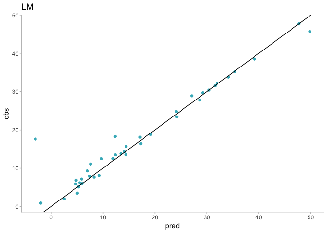

The model looks pretty good actually. The main issue seems to be that one sample that looks like an outlier. Nonetheless, since we have a small sample we can't be sure.

### Robust Linear Model

Our sample is very small, so we are going to use resample methods to improve our results. Also, we've seen that the PCA analysis could save us a lot of work.

``` r
library(MASS)
```

    ## 
    ## Attaching package: 'MASS'

    ## The following object is masked from 'package:dplyr':
    ## 
    ##     select

``` r
ctrl <- trainControl(method = 'cv', number = 10)

set.seed(100)
rlmFit <- train(x = as.data.frame(trainPredictors),y = trainTarget, 
                method = "rlm",
                preProcess = c("center","scale"),
                trControl = ctrl)

rlmFit
```

    ## Robust Linear Model 
    ## 
    ## 174 samples
    ## 100 predictors
    ## 
    ## Pre-processing: centered (100), scaled (100) 
    ## Resampling: Cross-Validated (10 fold) 
    ## Summary of sample sizes: 155, 157, 158, 157, 156, 158, ... 
    ## Resampling results across tuning parameters:
    ## 
    ##   intercept  psi           RMSE        Rsquared   MAE      
    ##   FALSE      psi.huber      18.508637  0.9491964  18.241814
    ##   FALSE      psi.hampel     18.508637  0.9491964  18.241814
    ##   FALSE      psi.bisquare   18.508314  0.9490833  18.240847
    ##    TRUE      psi.huber       3.230020  0.9428533   2.342975
    ##    TRUE      psi.hampel      4.309651  0.8866193   2.982085
    ##    TRUE      psi.bisquare  105.130241  0.7108838  52.378380
    ## 
    ## RMSE was used to select the optimal model using the smallest value.
    ## The final values used for the model were intercept = TRUE and psi
    ##  = psi.huber.

``` r
# ctrl <- trainControl(method = 'cv', number = 10)
# 
# set.seed(100)
# lmFit1 <- train(x = solTrainXtrans, y = solTrainY,
#                 method = 'lm',
#                 trControl = ctrl)
# lmFit1
```

We'll see if this model works better.

``` r
rlmValues <- data.frame(pred = predict(rlmFit, as.data.frame(testPredictors)), obs = testTarget)
rlmSummary <- defaultSummary(rlmValues)
summary <- cbind.data.frame(summary, rlm = rlmSummary)
summary
```

    ##                 lm       rlm
    ## RMSE     3.6379722 3.9534210
    ## Rsquared 0.9320481 0.9191233
    ## MAE      1.6448651 1.7689930

Looks like the previous model was a bit better.

Graphically, it looks similar though.

``` r
ggplot(rlmValues, aes(x = pred, y = obs)) +
  geom_point(color = '#41b6c4') +
  geom_abline() +
  labs(title = 'RLM') +
  theme(panel.grid = element_blank(),
      panel.background = element_blank(),
      axis.line.x = element_line(colour = "grey"),
      axis.line.y = element_line(colour = "grey"),
      axis.ticks.x = element_line(colour = "grey"),
      axis.ticks.y = element_line(colour = "grey")
      )
```

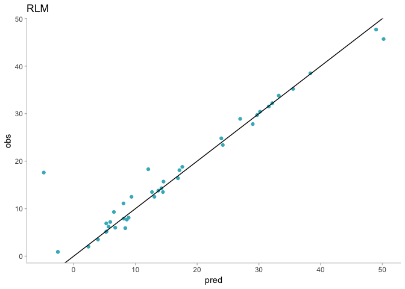

### Partial Least Squares

``` r
set.seed(100)

plsTune <- train(trainPredictors, trainTarget,
                 method = 'pls',
                 trControl = ctrl,
                 tuneLength = 20,
                 preProcess = c("center", "scale"))

plsTune
```

    ## Partial Least Squares 
    ## 
    ## 174 samples
    ## 100 predictors
    ## 
    ## Pre-processing: centered (100), scaled (100) 
    ## Resampling: Cross-Validated (10 fold) 
    ## Summary of sample sizes: 155, 157, 158, 157, 156, 158, ... 
    ## Resampling results across tuning parameters:
    ## 
    ##   ncomp  RMSE       Rsquared   MAE     
    ##    1     11.489764  0.2367174  9.465354
    ##    2      8.147041  0.6180326  6.361671
    ##    3      5.324678  0.8126169  4.116973
    ##    4      4.134392  0.8977716  3.432786
    ##    5      3.166255  0.9505152  2.524945
    ##    6      3.118569  0.9530746  2.515704
    ##    7      3.069020  0.9552846  2.410936
    ##    8      2.881547  0.9595293  2.319552
    ##    9      2.919949  0.9561578  2.355910
    ##   10      2.930011  0.9547437  2.349254
    ##   11      2.835504  0.9568025  2.302124
    ##   12      2.739696  0.9612606  2.153099
    ##   13      2.551750  0.9675769  1.968369
    ##   14      2.518626  0.9668958  1.981162
    ##   15      2.458402  0.9671658  1.893163
    ##   16      2.482027  0.9654510  1.853190
    ##   17      2.532099  0.9659252  1.897044
    ##   18      2.599639  0.9622324  1.943723
    ##   19      2.765890  0.9550976  2.025175
    ##   20      2.753152  0.9531800  2.069110
    ## 
    ## RMSE was used to select the optimal model using the smallest value.
    ## The final value used for the model was ncomp = 15.

Looks like 14 components is the best option for us. If we were to see it graphically

``` r
ggplot(data = plsTune$results, aes(x = ncomp, y = RMSE)) +
  geom_line(color = '#41b6c4') +
  geom_point(color = '#41b6c4') +
  labs(title = '# Components vs RMSE for PLS model', x = '# Components') +
  theme(panel.grid = element_blank(),
      panel.background = element_blank(),
      axis.line.x = element_line(colour = "grey"),
      axis.line.y = element_line(colour = "grey"),
      axis.ticks.x = element_line(colour = "grey"),
      axis.ticks.y = element_line(colour = "grey")
      )
```

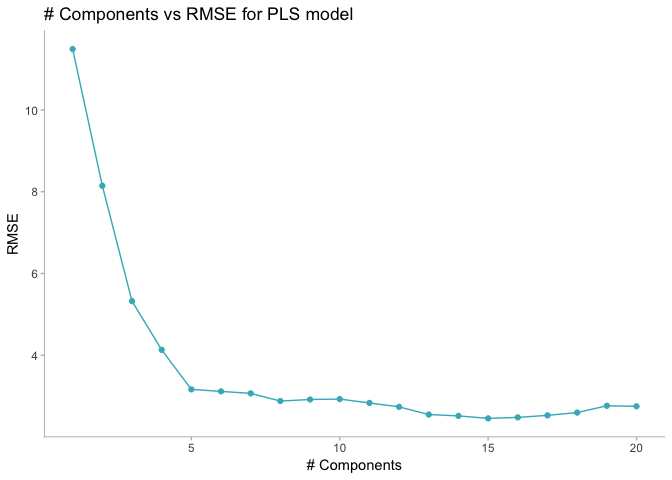

``` r
ggplot(data = plsTune$results, aes(x = ncomp, y = Rsquared)) +
  geom_line(color = '#41b6c4') +
  geom_point(color = '#41b6c4') +
  labs(title = '# Components vs Rsquared for PLS model', x = '# Components') +
  theme(panel.grid = element_blank(),
      panel.background = element_blank(),
      axis.line.x = element_line(colour = "grey"),
      axis.line.y = element_line(colour = "grey"),
      axis.ticks.x = element_line(colour = "grey"),
      axis.ticks.y = element_line(colour = "grey")
      )
```

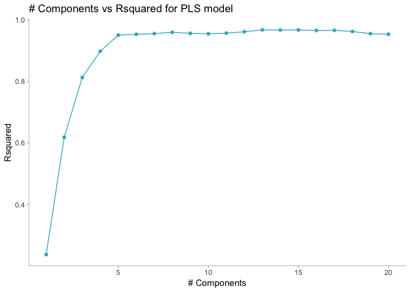

Now we'll try it on the test set

``` r
plsPredictions <- predict(plsTune, testPredictors)
plsValues <- data.frame(pred = plsPredictions, obs = testTarget)
plsSummary <- defaultSummary(plsValues)
summary <- cbind.data.frame(summary, pls = plsSummary)
summary
```

    ##                 lm       rlm       pls
    ## RMSE     3.6379722 3.9534210 2.0201761
    ## Rsquared 0.9320481 0.9191233 0.9729501
    ## MAE      1.6448651 1.7689930 1.5063823

PLS looks much better than the other two models. Let's take a look at the graph.

``` r
ggplot(plsValues, aes(x = pred, y = obs)) +
  geom_point(color = '#41b6c4') +
  geom_abline() +
  labs(title = 'PLS') +
  theme(panel.grid = element_blank(),
      panel.background = element_blank(),
      axis.line.x = element_line(colour = "grey"),
      axis.line.y = element_line(colour = "grey"),
      axis.ticks.x = element_line(colour = "grey"),
      axis.ticks.y = element_line(colour = "grey")
      )
```

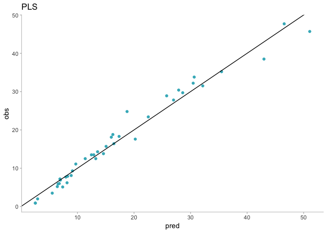

Looks like this model improves the estimations a lot. It doesn't estimate any negative values as the others models did and the RMSE is much lower.

### Penalized models

Lastly, we will consider an `elastic net` model with different tuning parameters to choose the best one.

``` r
enetGrid <- expand.grid(.lambda = seq(0, 0.1, length = 5),
                        .fraction = seq(.05, 1, length = 20))
set.seed(100)
enetTune <- train(trainPredictors, trainTarget,
                  method = 'enet',
                  tuneGrid = enetGrid,
                  trControl = ctrl,
                  preProcess = c("center", "scale"))

enetTune
```

    ## Elasticnet 
    ## 
    ## 174 samples
    ## 100 predictors
    ## 
    ## Pre-processing: centered (100), scaled (100) 
    ## Resampling: Cross-Validated (10 fold) 
    ## Summary of sample sizes: 155, 157, 158, 157, 156, 158, ... 
    ## Resampling results across tuning parameters:
    ## 
    ##   lambda  fraction  RMSE       Rsquared   MAE     
    ##   0.000   0.05       2.517814  0.9629790  1.924721
    ##   0.000   0.10       2.597292  0.9588814  1.906793
    ##   0.000   0.15       2.575251  0.9581218  1.817200
    ##   0.000   0.20       2.490193  0.9624414  1.720106
    ##   0.000   0.25       2.384736  0.9675729  1.697285
    ##   0.000   0.30       2.323536  0.9697391  1.665465
    ##   0.000   0.35       2.249492  0.9717584  1.633092
    ##   0.000   0.40       2.215066  0.9724968  1.619058
    ##   0.000   0.45       2.205553  0.9721439  1.632732
    ##   0.000   0.50       2.238200  0.9707959  1.660219
    ##   0.000   0.55       2.272583  0.9694196  1.678227
    ##   0.000   0.60       2.306344  0.9681353  1.698677
    ##   0.000   0.65       2.354235  0.9664169  1.726195
    ##   0.000   0.70       2.419609  0.9641319  1.762253
    ##   0.000   0.75       2.495951  0.9614797  1.807560
    ##   0.000   0.80       2.578771  0.9586212  1.861080
    ##   0.000   0.85       2.652109  0.9561539  1.914116
    ##   0.000   0.90       2.718757  0.9539258  1.963463
    ##   0.000   0.95       2.784327  0.9516646  2.009884
    ##   0.000   1.00       2.852370  0.9491961  2.057489
    ##   0.025   0.05      10.828580  0.3310251  8.970690
    ##   0.025   0.10      10.171892  0.4323927  8.422566
    ##   0.025   0.15       9.532722  0.5273836  7.908262
    ##   0.025   0.20       8.924855  0.6088153  7.416448
    ##   0.025   0.25       8.339785  0.6763023  6.941481
    ##   0.025   0.30       7.784715  0.7295206  6.476152
    ##   0.025   0.35       7.265890  0.7699104  6.026489
    ##   0.025   0.40       6.800082  0.7993764  5.609365
    ##   0.025   0.45       6.409732  0.8220807  5.276910
    ##   0.025   0.50       6.007469  0.8436112  4.954245
    ##   0.025   0.55       5.622371  0.8610269  4.642138
    ##   0.025   0.60       5.279123  0.8740125  4.364592
    ##   0.025   0.65       4.995731  0.8827396  4.122589
    ##   0.025   0.70       4.752369  0.8893098  3.915793
    ##   0.025   0.75       4.547272  0.8943755  3.748451
    ##   0.025   0.80       4.392491  0.8978743  3.631130
    ##   0.025   0.85       4.267934  0.9006657  3.548172
    ##   0.025   0.90       4.179034  0.9026676  3.489293
    ##   0.025   0.95       4.113971  0.9041163  3.443115
    ##   0.025   1.00       4.069382  0.9050449  3.408599
    ##   0.050   0.05      10.894824  0.3194519  9.014327
    ##   0.050   0.10      10.299635  0.4095716  8.517303
    ##   0.050   0.15       9.725533  0.4948954  8.051930
    ##   0.050   0.20       9.168583  0.5720652  7.605274
    ##   0.050   0.25       8.639663  0.6375163  7.178974
    ##   0.050   0.30       8.139508  0.6909680  6.765607
    ##   0.050   0.35       7.669844  0.7335767  6.364550
    ##   0.050   0.40       7.230675  0.7669484  5.980417
    ##   0.050   0.45       6.845298  0.7922497  5.637959
    ##   0.050   0.50       6.514538  0.8127231  5.364262
    ##   0.050   0.55       6.180264  0.8305231  5.096570
    ##   0.050   0.60       5.869137  0.8448522  4.838409
    ##   0.050   0.65       5.583155  0.8562432  4.600105
    ##   0.050   0.70       5.336087  0.8647740  4.392868
    ##   0.050   0.75       5.119111  0.8713096  4.212725
    ##   0.050   0.80       4.933335  0.8762356  4.061925
    ##   0.050   0.85       4.784195  0.8797751  3.932849
    ##   0.050   0.90       4.667418  0.8822176  3.828190
    ##   0.050   0.95       4.578887  0.8838541  3.747854
    ##   0.050   1.00       4.512254  0.8849586  3.685568
    ##   0.075   0.05      10.943227  0.3112165  9.042258
    ##   0.075   0.10      10.394087  0.3926131  8.583164
    ##   0.075   0.15       9.864299  0.4707161  8.152791
    ##   0.075   0.20       9.358863  0.5414297  7.746578
    ##   0.075   0.25       8.874928  0.6033290  7.354892
    ##   0.075   0.30       8.414218  0.6558914  6.975448
    ##   0.075   0.35       7.977249  0.6993758  6.602978
    ##   0.075   0.40       7.566340  0.7346347  6.241963
    ##   0.075   0.45       7.199540  0.7617166  5.914056
    ##   0.075   0.50       6.890397  0.7833938  5.645384
    ##   0.075   0.55       6.581352  0.8026459  5.399166
    ##   0.075   0.60       6.283378  0.8188276  5.154902
    ##   0.075   0.65       6.016093  0.8315372  4.928632
    ##   0.075   0.70       5.771540  0.8417430  4.721045
    ##   0.075   0.75       5.552714  0.8497811  4.537909
    ##   0.075   0.80       5.363799  0.8558802  4.386765
    ##   0.075   0.85       5.206451  0.8603373  4.258310
    ##   0.075   0.90       5.075460  0.8636007  4.147467
    ##   0.075   0.95       4.972941  0.8658416  4.058659
    ##   0.075   1.00       4.888245  0.8675260  3.980385
    ##   0.100   0.05      10.979090  0.3044605  9.060074
    ##   0.100   0.10      10.474484  0.3786180  8.635116
    ##   0.100   0.15       9.983849  0.4500923  8.234219
    ##   0.100   0.20       9.512218  0.5163355  7.850128
    ##   0.100   0.25       9.059802  0.5754027  7.480966
    ##   0.100   0.30       8.625500  0.6268051  7.118279
    ##   0.100   0.35       8.215630  0.6699988  6.764952
    ##   0.100   0.40       7.834198  0.7053305  6.429630
    ##   0.100   0.45       7.480850  0.7340849  6.115164
    ##   0.100   0.50       7.187148  0.7566622  5.857364
    ##   0.100   0.55       6.896678  0.7769592  5.623888
    ##   0.100   0.60       6.619153  0.7940015  5.400212
    ##   0.100   0.65       6.362336  0.8080261  5.185161
    ##   0.100   0.70       6.124452  0.8195779  4.980169
    ##   0.100   0.75       5.910539  0.8287870  4.795671
    ##   0.100   0.80       5.724877  0.8358688  4.641390
    ##   0.100   0.85       5.565931  0.8412373  4.517477
    ##   0.100   0.90       5.429327  0.8453702  4.406165
    ##   0.100   0.95       5.316452  0.8484458  4.308767
    ##   0.100   1.00       5.220276  0.8508170  4.228171
    ## 
    ## RMSE was used to select the optimal model using the smallest value.
    ## The final values used for the model were fraction = 0.45 and lambda = 0.

``` r
#plot(enetTune)
#?expand.grid
```

According to the model, the best tuning parameters are `fraction = 0.05 and lambda = 0`. This actually means that the **lasso** model has been the best.

``` r
#enetTune$results
ggplot(enetTune$results, aes(x = fraction, y = RMSE, group = lambda)) +
  geom_line(aes(color = as.character(lambda))) +
  geom_point(aes(color = as.character(lambda))) +
  labs(title = 'Elastic net for different values of λ1', x = 'Fraction of full solution') +
  theme(panel.grid = element_blank(),
      panel.background = element_blank(),
      axis.line.x = element_line(colour = "grey"),
      axis.line.y = element_line(colour = "grey"),
      axis.ticks.x = element_line(colour = "grey"),
      axis.ticks.y = element_line(colour = "grey"),
      legend.position = c(0.75, 0.8),
      legend.title = element_blank()
      )
```

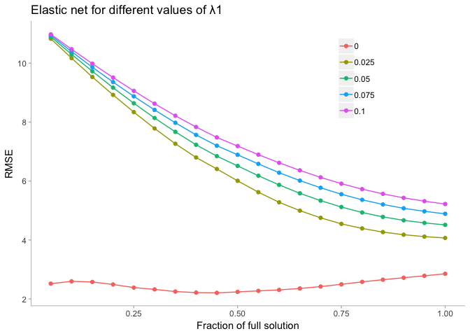

We can test it now with our test set

``` r
enetPredictions <- predict(enetTune, testPredictors)
enetValues <- data.frame(pred = enetPredictions, obs = testTarget)
enetSummary <- defaultSummary(enetValues)
summary <- cbind.data.frame(summary, enet = enetSummary)
summary
```

    ##                 lm       rlm       pls      enet
    ## RMSE     3.6379722 3.9534210 2.0201761 2.1002389
    ## Rsquared 0.9320481 0.9191233 0.9729501 0.9755935
    ## MAE      1.6448651 1.7689930 1.5063823 1.2937858

Looks like **lasso** bits all the other models.

Let's try to graphicate the lasso. Although we may have too many variables to get something out of the graph.

``` r
library(elasticnet)
```

    ## Loading required package: lars

    ## Loaded lars 1.2

``` r
standarizedbeta <- enetTune$finalModel$beta.pure/max(abs(enetTune$finalModel$beta.pure))
lambda1 <- enetTune$finalModel$tuneValue$lambda
fraction <- enetTune$finalModel$tuneValue$fraction

enetModel1 <- enet(x = as.matrix(trainPredictors), y= trainTarget,
                  lambda = lambda1, normalize = TRUE)

enetPred1 <- predict(enetModel1, newx = as.matrix(testPredictors),
                    s = fraction, mode = 'fraction',
                    type = 'fit')

enetCoef1 <- predict(enetModel1, newx = as.matrix(testPredictions),
                    s = fraction, mode = 'fraction',
                    type = 'coefficients')

# finalmodel <- enetTune$finalModel
# finalmodel
beta <- enetTune$finalModel$beta.pure
tmp <- as.data.frame(as.matrix(beta))
tmp$coef <- row.names(tmp)
tmp <- reshape::melt(tmp, id = "coef")
tmp$norm <- enetModel1$L1norm # compute L1 norm


# x11(width = 13/2.54, height = 9/2.54)
g1 <- ggplot(tmp, aes(norm, value, color = variable)) + 
  geom_line() +
  theme(panel.grid = element_blank(),
        panel.background = element_blank(),
        axis.line.x = element_line(colour = "grey"),
        axis.line.y = element_line(colour = "grey"),
        axis.ticks.x = element_line(colour = "grey"),
        axis.ticks.y = element_line(colour = "grey"),
        legend.position = "none")

g1
```

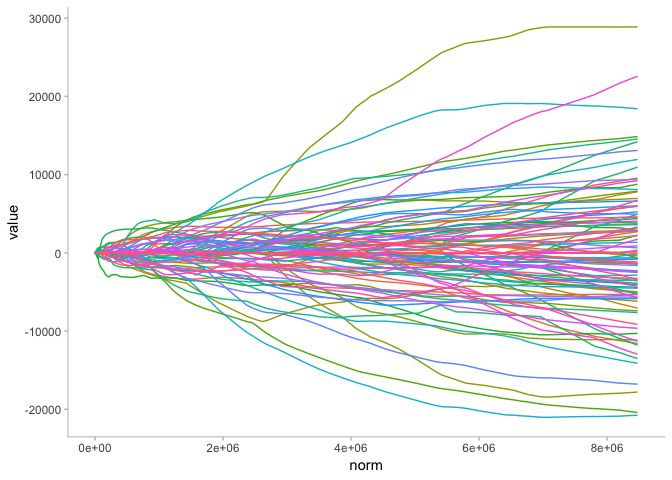

``` r
tmp1 <- tmp %>% 
  filter(norm < 1000)

tmp2 <- tmp1 %>% 
  group_by(variable) %>% 
  summarize(sum = sum(value)) %>% 
  filter(sum != 0)

tmp1 <- tmp1 %>% 
  filter(variable %in% tmp2$variable)

g <- ggplot(tmp1, aes(norm, value, color = variable)) + 
  geom_line() +
  labs(title = "Lasso", x = "L1 norm", y = "Standarized coefficients") +
  #scale_color_brewer(palette="Set3") +
  theme(panel.grid = element_blank(),
        panel.background = element_blank(),
        axis.line.x = element_line(colour = "grey"),
        axis.line.y = element_line(colour = "grey"),
        axis.ticks.x = element_line(colour = "grey"),
        axis.ticks.y = element_line(colour = "grey"),
        legend.direction = "horizontal",
        legend.position = "bottom",
        legend.title = element_blank())

g
```

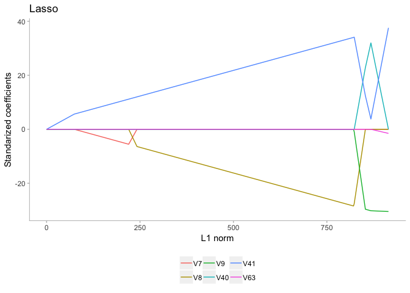

Developing a model to predict permeability
------------------------------------------

a- Start `R` and use these commands to load the data:

``` r
library(AppliedPredictiveModeling)
data("permeability")
```

The matrix `fingerprints` contains the 1107 binary molecular predictors for the 165 compounds, while `permeability` contains the permeability response.

b- The fingerprint predictors indicate the presence or absence of substructures of a molecule and are often sparse meaining that relatively few of the molecules contain each substructure. Filter out the predictors that have low frequencies using the `nearZeroVar` function from the `caret` package. How many predictors are left for modeling?

``` r
#?nearZeroVar
nearZero <- nearZeroVar(fingerprints)
fingerprintsFiltered <- fingerprints[ , -nearZero]
paste("There are ", ncol(fingerprintsFiltered), " predictors left", sep = "")
```

    ## [1] "There are 388 predictors left"

c- Split the data into a training and a test set, pre-process the data, and tune a PLS model. How many latent variables are optimal and what is the corresponding resampled estimate of R^2

We start creating the train and test set

``` r
trainRows <- createDataPartition(permeability,
                                 p = .8,
                                 list = FALSE)

trainPredictors <- fingerprintsFiltered[trainRows, ]
trainPermeability <- permeability[trainRows]

testPredictors <- fingerprintsFiltered[-trainRows, ]
testPermeability <- permeability[-trainRows]
```

Now we can specify the cross-validation we want to make.

``` r
ctrl <- trainControl(method = "cv", number = 10)
```

Let's tune the PLS model now

``` r
set.seed(100)
plsModel <- train(x = trainPredictors, y = trainPermeability,
                  method = "pls",
                  tuneLength = 20,
                  trControl = ctrl,
                  preProcess = c("center", "scale"))

plsModel
```

    ## Partial Least Squares 
    ## 
    ## 133 samples
    ## 388 predictors
    ## 
    ## Pre-processing: centered (388), scaled (388) 
    ## Resampling: Cross-Validated (10 fold) 
    ## Summary of sample sizes: 119, 119, 118, 120, 119, 120, ... 
    ## Resampling results across tuning parameters:
    ## 
    ##   ncomp  RMSE      Rsquared   MAE      
    ##    1     13.34294  0.2859035   9.995096
    ##    2     12.19269  0.4443215   8.488218
    ##    3     12.23054  0.4376987   8.972280
    ##    4     12.32531  0.4583480   9.208618
    ##    5     12.24322  0.4887654   8.903236
    ##    6     12.28544  0.4894242   9.062887
    ##    7     12.30035  0.4781474   9.038038
    ##    8     12.20384  0.4802717   9.018589
    ##    9     12.40140  0.4651335   9.098292
    ##   10     12.57874  0.4654587   8.973563
    ##   11     12.92814  0.4443399   9.222686
    ##   12     12.95642  0.4417439   9.335096
    ##   13     13.13507  0.4250362   9.454476
    ##   14     13.45052  0.4085549   9.507092
    ##   15     13.53629  0.3968971   9.491064
    ##   16     13.59310  0.3798963   9.486430
    ##   17     13.72291  0.3818779   9.576360
    ##   18     13.78063  0.3797801   9.673688
    ##   19     13.93619  0.3738806   9.949515
    ##   20     14.18472  0.3633987  10.192088
    ## 
    ## RMSE was used to select the optimal model using the smallest value.
    ## The final value used for the model was ncomp = 2.

Looks like 8 components (latent variables) is the best option for PLS, but all of them seem pretty bad models.

d- Predict the response for the test set. What is the test set estimate of R^2?

Let's try it for the test set now.

``` r
plsPredictions <- predict(plsModel, testPredictors)
plsValues <- data.frame(pred = plsPredictions, obs = testPermeability)
defaultSummary(plsValues)
```

    ##       RMSE   Rsquared        MAE 
    ## 10.9148564  0.5260698  7.5734041

e- Try building other models discussed in this chapter. Do any of them have better predictive performance?

``` r
set.seed(100)

lmModel <- train(x = trainPredictors, y = trainPermeability,
                  method = "lm",
                  trControl = ctrl,
                  preProcess = c("center", "scale"))
lmModel
```

    ## Linear Regression 
    ## 
    ## 133 samples
    ## 388 predictors
    ## 
    ## Pre-processing: centered (388), scaled (388) 
    ## Resampling: Cross-Validated (10 fold) 
    ## Summary of sample sizes: 119, 119, 118, 120, 119, 120, ... 
    ## Resampling results:
    ## 
    ##   RMSE      Rsquared   MAE     
    ##   26.28519  0.1888143  16.79275
    ## 
    ## Tuning parameter 'intercept' was held constant at a value of TRUE

``` r
set.seed(100)
enetGrid <- expand.grid(.lambda = c(0, 0.01, .1),
                        .fraction = seq(.05, 1, length = 20))

enetModel <- train(x = trainPredictors, y = trainPermeability,
                  method = "enet",
                  tuneGrid = enetGrid,
                  trControl = ctrl,
                  preProcess = c("center", "scale"))
enetModel
```

    ## Elasticnet 
    ## 
    ## 133 samples
    ## 388 predictors
    ## 
    ## Pre-processing: centered (388), scaled (388) 
    ## Resampling: Cross-Validated (10 fold) 
    ## Summary of sample sizes: 119, 119, 118, 120, 119, 120, ... 
    ## Resampling results across tuning parameters:
    ## 
    ##   lambda  fraction  RMSE        Rsquared   MAE        
    ##   0.00    0.05        12.18700  0.4435999     9.141684
    ##   0.00    0.10        11.90897  0.4477104     8.488890
    ##   0.00    0.15        11.87883  0.4625035     8.355923
    ##   0.00    0.20        11.94333  0.4684274     8.350881
    ##   0.00    0.25        11.92507  0.4702276     8.373206
    ##   0.00    0.30        11.90369  0.4693320     8.438678
    ##   0.00    0.35        11.92808  0.4689361     8.530066
    ##   0.00    0.40        12.03572  0.4625488     8.678067
    ##   0.00    0.45        12.16527  0.4551118     8.832498
    ##   0.00    0.50        12.28839  0.4468351     8.949556
    ##   0.00    0.55        12.39195  0.4427579     9.013117
    ##   0.00    0.60        12.54909  0.4355112     9.126581
    ##   0.00    0.65        12.71771  0.4273634     9.250580
    ##   0.00    0.70        12.92543  0.4200105     9.400108
    ##   0.00    0.75        13.13095  0.4131959     9.527462
    ##   0.00    0.80        13.25685  0.4052119     9.587698
    ##   0.00    0.85        13.38714  0.3981163     9.655814
    ##   0.00    0.90        13.53179  0.3906386     9.790778
    ##   0.00    0.95        13.66247  0.3841291     9.901271
    ##   0.00    1.00        13.79417  0.3773093     9.987331
    ##   0.01    0.05       190.91271  0.4002973   119.290854
    ##   0.01    0.10       358.83167  0.4000112   211.419921
    ##   0.01    0.15       527.03534  0.4174089   307.829549
    ##   0.01    0.20       691.52720  0.4301556   403.165870
    ##   0.01    0.25       846.54014  0.4275647   489.946436
    ##   0.01    0.30      1000.16961  0.4186372   575.382802
    ##   0.01    0.35      1153.99463  0.4047108   660.864630
    ##   0.01    0.40      1308.02630  0.3855791   746.430309
    ##   0.01    0.45      1461.73033  0.3693812   830.807700
    ##   0.01    0.50      1614.35651  0.3602763   913.670748
    ##   0.01    0.55      1767.08456  0.3531488  1001.600270
    ##   0.01    0.60      1919.90175  0.3468162  1089.526571
    ##   0.01    0.65      2072.77402  0.3421761  1177.454918
    ##   0.01    0.70      2225.69758  0.3371089  1265.373749
    ##   0.01    0.75      2378.71269  0.3292374  1353.344275
    ##   0.01    0.80      2531.78178  0.3201353  1441.334891
    ##   0.01    0.85      2684.87510  0.3128421  1529.316904
    ##   0.01    0.90      2838.17105  0.3064129  1618.319244
    ##   0.01    0.95      2990.29848  0.3004984  1709.027549
    ##   0.01    1.00      3142.40818  0.2951201  1799.760432
    ##   0.10    0.05        12.10206  0.4576352     9.079155
    ##   0.10    0.10        11.77274  0.4577117     8.142348
    ##   0.10    0.15        12.00659  0.4514629     8.269947
    ##   0.10    0.20        11.86471  0.4712420     8.309319
    ##   0.10    0.25        11.84136  0.4812554     8.374681
    ##   0.10    0.30        11.91118  0.4842310     8.444398
    ##   0.10    0.35        11.96309  0.4864359     8.445274
    ##   0.10    0.40        12.04110  0.4853152     8.492187
    ##   0.10    0.45        12.15380  0.4814046     8.572417
    ##   0.10    0.50        12.23789  0.4791145     8.615463
    ##   0.10    0.55        12.31115  0.4779718     8.675458
    ##   0.10    0.60        12.36792  0.4760609     8.704760
    ##   0.10    0.65        12.43500  0.4724691     8.734218
    ##   0.10    0.70        12.50573  0.4690793     8.787857
    ##   0.10    0.75        12.58654  0.4652200     8.844428
    ##   0.10    0.80        12.68305  0.4602938     8.904972
    ##   0.10    0.85        12.77636  0.4556537     8.951599
    ##   0.10    0.90        12.86160  0.4509355     9.000485
    ##   0.10    0.95        12.94042  0.4465949     9.043319
    ##   0.10    1.00        13.01884  0.4425470     9.077824
    ## 
    ## RMSE was used to select the optimal model using the smallest value.
    ## The final values used for the model were fraction = 0.1 and lambda = 0.1.

f- None of the models reaches to a 60% R^2, I would not recommend any of these models to replace the laboratory experiment.

A chemical manufacturing process for a pharmaceutical product was discussed in Sect 1.4. It has biological raw material's predictors which cannot be changed and manufacturing preductors that could be changed if needed.
--------------------------------------------------------------------------------------------------------------------------------------------------------------------------------------------------------------------------

a- Start `R` and use these commands to load the data:

``` r
library(AppliedPredictiveModeling)
data("ChemicalManufacturingProcess")
```

The matrix `preprocessPredictors` contains the 57 predictors (12 describing the input biological material and 45 describing the preocess predictors) for the 176 manufacturing runs. `yield` contains the percent yield for each run.

b- A small percentage of cells in the predictor set contain missing values. Use an imputation function to fill in these missing values (See section 3.8)

``` r
#?ChemicalManufacturingProcess
yield <- ChemicalManufacturingProcess[ ,1]
preprocessPredictors <- ChemicalManufacturingProcess[ ,-1]

summary(preprocessPredictors)
```

    ##  BiologicalMaterial01 BiologicalMaterial02 BiologicalMaterial03
    ##  Min.   :4.580        Min.   :46.87        Min.   :56.97       
    ##  1st Qu.:5.978        1st Qu.:52.68        1st Qu.:64.98       
    ##  Median :6.305        Median :55.09        Median :67.22       
    ##  Mean   :6.411        Mean   :55.69        Mean   :67.70       
    ##  3rd Qu.:6.870        3rd Qu.:58.74        3rd Qu.:70.43       
    ##  Max.   :8.810        Max.   :64.75        Max.   :78.25       
    ##                                                                
    ##  BiologicalMaterial04 BiologicalMaterial05 BiologicalMaterial06
    ##  Min.   : 9.38        Min.   :13.24        Min.   :40.60       
    ##  1st Qu.:11.24        1st Qu.:17.23        1st Qu.:46.05       
    ##  Median :12.10        Median :18.49        Median :48.46       
    ##  Mean   :12.35        Mean   :18.60        Mean   :48.91       
    ##  3rd Qu.:13.22        3rd Qu.:19.90        3rd Qu.:51.34       
    ##  Max.   :23.09        Max.   :24.85        Max.   :59.38       
    ##                                                                
    ##  BiologicalMaterial07 BiologicalMaterial08 BiologicalMaterial09
    ##  Min.   :100.0        Min.   :15.88        Min.   :11.44       
    ##  1st Qu.:100.0        1st Qu.:17.06        1st Qu.:12.60       
    ##  Median :100.0        Median :17.51        Median :12.84       
    ##  Mean   :100.0        Mean   :17.49        Mean   :12.85       
    ##  3rd Qu.:100.0        3rd Qu.:17.88        3rd Qu.:13.13       
    ##  Max.   :100.8        Max.   :19.14        Max.   :14.08       
    ##                                                                
    ##  BiologicalMaterial10 BiologicalMaterial11 BiologicalMaterial12
    ##  Min.   :1.770        Min.   :135.8        Min.   :18.35       
    ##  1st Qu.:2.460        1st Qu.:143.8        1st Qu.:19.73       
    ##  Median :2.710        Median :146.1        Median :20.12       
    ##  Mean   :2.801        Mean   :147.0        Mean   :20.20       
    ##  3rd Qu.:2.990        3rd Qu.:149.6        3rd Qu.:20.75       
    ##  Max.   :6.870        Max.   :158.7        Max.   :22.21       
    ##                                                                
    ##  ManufacturingProcess01 ManufacturingProcess02 ManufacturingProcess03
    ##  Min.   : 0.00          Min.   : 0.00          Min.   :1.47          
    ##  1st Qu.:10.80          1st Qu.:19.30          1st Qu.:1.53          
    ##  Median :11.40          Median :21.00          Median :1.54          
    ##  Mean   :11.21          Mean   :16.68          Mean   :1.54          
    ##  3rd Qu.:12.15          3rd Qu.:21.50          3rd Qu.:1.55          
    ##  Max.   :14.10          Max.   :22.50          Max.   :1.60          
    ##  NA's   :1              NA's   :3              NA's   :15            
    ##  ManufacturingProcess04 ManufacturingProcess05 ManufacturingProcess06
    ##  Min.   :911.0          Min.   : 923.0         Min.   :203.0         
    ##  1st Qu.:928.0          1st Qu.: 986.8         1st Qu.:205.7         
    ##  Median :934.0          Median : 999.2         Median :206.8         
    ##  Mean   :931.9          Mean   :1001.7         Mean   :207.4         
    ##  3rd Qu.:936.0          3rd Qu.:1008.9         3rd Qu.:208.7         
    ##  Max.   :946.0          Max.   :1175.3         Max.   :227.4         
    ##  NA's   :1              NA's   :1              NA's   :2             
    ##  ManufacturingProcess07 ManufacturingProcess08 ManufacturingProcess09
    ##  Min.   :177.0          Min.   :177.0          Min.   :38.89         
    ##  1st Qu.:177.0          1st Qu.:177.0          1st Qu.:44.89         
    ##  Median :177.0          Median :178.0          Median :45.73         
    ##  Mean   :177.5          Mean   :177.6          Mean   :45.66         
    ##  3rd Qu.:178.0          3rd Qu.:178.0          3rd Qu.:46.52         
    ##  Max.   :178.0          Max.   :178.0          Max.   :49.36         
    ##  NA's   :1              NA's   :1                                    
    ##  ManufacturingProcess10 ManufacturingProcess11 ManufacturingProcess12
    ##  Min.   : 7.500         Min.   : 7.500         Min.   :   0.0        
    ##  1st Qu.: 8.700         1st Qu.: 9.000         1st Qu.:   0.0        
    ##  Median : 9.100         Median : 9.400         Median :   0.0        
    ##  Mean   : 9.179         Mean   : 9.386         Mean   : 857.8        
    ##  3rd Qu.: 9.550         3rd Qu.: 9.900         3rd Qu.:   0.0        
    ##  Max.   :11.600         Max.   :11.500         Max.   :4549.0        
    ##  NA's   :9              NA's   :10             NA's   :1             
    ##  ManufacturingProcess13 ManufacturingProcess14 ManufacturingProcess15
    ##  Min.   :32.10          Min.   :4701           Min.   :5904          
    ##  1st Qu.:33.90          1st Qu.:4828           1st Qu.:6010          
    ##  Median :34.60          Median :4856           Median :6032          
    ##  Mean   :34.51          Mean   :4854           Mean   :6039          
    ##  3rd Qu.:35.20          3rd Qu.:4882           3rd Qu.:6061          
    ##  Max.   :38.60          Max.   :5055           Max.   :6233          
    ##                         NA's   :1                                    
    ##  ManufacturingProcess16 ManufacturingProcess17 ManufacturingProcess18
    ##  Min.   :   0           Min.   :31.30          Min.   :   0          
    ##  1st Qu.:4561           1st Qu.:33.50          1st Qu.:4813          
    ##  Median :4588           Median :34.40          Median :4835          
    ##  Mean   :4566           Mean   :34.34          Mean   :4810          
    ##  3rd Qu.:4619           3rd Qu.:35.10          3rd Qu.:4862          
    ##  Max.   :4852           Max.   :40.00          Max.   :4971          
    ##                                                                      
    ##  ManufacturingProcess19 ManufacturingProcess20 ManufacturingProcess21
    ##  Min.   :5890           Min.   :   0           Min.   :-1.8000       
    ##  1st Qu.:6001           1st Qu.:4553           1st Qu.:-0.6000       
    ##  Median :6022           Median :4582           Median :-0.3000       
    ##  Mean   :6028           Mean   :4556           Mean   :-0.1642       
    ##  3rd Qu.:6050           3rd Qu.:4610           3rd Qu.: 0.0000       
    ##  Max.   :6146           Max.   :4759           Max.   : 3.6000       
    ##                                                                      
    ##  ManufacturingProcess22 ManufacturingProcess23 ManufacturingProcess24
    ##  Min.   : 0.000         Min.   :0.000          Min.   : 0.000        
    ##  1st Qu.: 3.000         1st Qu.:2.000          1st Qu.: 4.000        
    ##  Median : 5.000         Median :3.000          Median : 8.000        
    ##  Mean   : 5.406         Mean   :3.017          Mean   : 8.834        
    ##  3rd Qu.: 8.000         3rd Qu.:4.000          3rd Qu.:14.000        
    ##  Max.   :12.000         Max.   :6.000          Max.   :23.000        
    ##  NA's   :1              NA's   :1              NA's   :1             
    ##  ManufacturingProcess25 ManufacturingProcess26 ManufacturingProcess27
    ##  Min.   :   0           Min.   :   0           Min.   :   0          
    ##  1st Qu.:4832           1st Qu.:6020           1st Qu.:4560          
    ##  Median :4855           Median :6047           Median :4587          
    ##  Mean   :4828           Mean   :6016           Mean   :4563          
    ##  3rd Qu.:4877           3rd Qu.:6070           3rd Qu.:4609          
    ##  Max.   :4990           Max.   :6161           Max.   :4710          
    ##  NA's   :5              NA's   :5              NA's   :5             
    ##  ManufacturingProcess28 ManufacturingProcess29 ManufacturingProcess30
    ##  Min.   : 0.000         Min.   : 0.00          Min.   : 0.000        
    ##  1st Qu.: 0.000         1st Qu.:19.70          1st Qu.: 8.800        
    ##  Median :10.400         Median :19.90          Median : 9.100        
    ##  Mean   : 6.592         Mean   :20.01          Mean   : 9.161        
    ##  3rd Qu.:10.750         3rd Qu.:20.40          3rd Qu.: 9.700        
    ##  Max.   :11.500         Max.   :22.00          Max.   :11.200        
    ##  NA's   :5              NA's   :5              NA's   :5             
    ##  ManufacturingProcess31 ManufacturingProcess32 ManufacturingProcess33
    ##  Min.   : 0.00          Min.   :143.0          Min.   :56.00         
    ##  1st Qu.:70.10          1st Qu.:155.0          1st Qu.:62.00         
    ##  Median :70.80          Median :158.0          Median :64.00         
    ##  Mean   :70.18          Mean   :158.5          Mean   :63.54         
    ##  3rd Qu.:71.40          3rd Qu.:162.0          3rd Qu.:65.00         
    ##  Max.   :72.50          Max.   :173.0          Max.   :70.00         
    ##  NA's   :5                                     NA's   :5             
    ##  ManufacturingProcess34 ManufacturingProcess35 ManufacturingProcess36
    ##  Min.   :2.300          Min.   :463.0          Min.   :0.01700       
    ##  1st Qu.:2.500          1st Qu.:490.0          1st Qu.:0.01900       
    ##  Median :2.500          Median :495.0          Median :0.02000       
    ##  Mean   :2.494          Mean   :495.6          Mean   :0.01957       
    ##  3rd Qu.:2.500          3rd Qu.:501.5          3rd Qu.:0.02000       
    ##  Max.   :2.600          Max.   :522.0          Max.   :0.02200       
    ##  NA's   :5              NA's   :5              NA's   :5             
    ##  ManufacturingProcess37 ManufacturingProcess38 ManufacturingProcess39
    ##  Min.   :0.000          Min.   :0.000          Min.   :0.000         
    ##  1st Qu.:0.700          1st Qu.:2.000          1st Qu.:7.100         
    ##  Median :1.000          Median :3.000          Median :7.200         
    ##  Mean   :1.014          Mean   :2.534          Mean   :6.851         
    ##  3rd Qu.:1.300          3rd Qu.:3.000          3rd Qu.:7.300         
    ##  Max.   :2.300          Max.   :3.000          Max.   :7.500         
    ##                                                                      
    ##  ManufacturingProcess40 ManufacturingProcess41 ManufacturingProcess42
    ##  Min.   :0.00000        Min.   :0.00000        Min.   : 0.00         
    ##  1st Qu.:0.00000        1st Qu.:0.00000        1st Qu.:11.40         
    ##  Median :0.00000        Median :0.00000        Median :11.60         
    ##  Mean   :0.01771        Mean   :0.02371        Mean   :11.21         
    ##  3rd Qu.:0.00000        3rd Qu.:0.00000        3rd Qu.:11.70         
    ##  Max.   :0.10000        Max.   :0.20000        Max.   :12.10         
    ##  NA's   :1              NA's   :1                                    
    ##  ManufacturingProcess43 ManufacturingProcess44 ManufacturingProcess45
    ##  Min.   : 0.0000        Min.   :0.000          Min.   :0.000         
    ##  1st Qu.: 0.6000        1st Qu.:1.800          1st Qu.:2.100         
    ##  Median : 0.8000        Median :1.900          Median :2.200         
    ##  Mean   : 0.9119        Mean   :1.805          Mean   :2.138         
    ##  3rd Qu.: 1.0250        3rd Qu.:1.900          3rd Qu.:2.300         
    ##  Max.   :11.0000        Max.   :2.100          Max.   :2.600         
    ## 

We see some missing values there. Let's try to make an imputation.

``` r
#?preProcess
imputation <- preProcess(preprocessPredictors,
                   method = c("center", "scale"),
                   k = 5,
                   knnSummary = mean)
```

b- Split the data into training and a test set, pre-process the data, and tune a model of your choice from this chapter. What is the optimal value of the performance metric?

``` r
trainRows <- createDataPartition(yield, 
                    p = .8,
                    list = FALSE)

trainPredictors <- preprocessPredictors[trainRows, ]
trainYield <- yield[trainRows]

testPredictors <- preprocessPredictors[-trainRows, ]
testYield <- yield[-trainRows]

ctrl <- trainControl(method = "cv", number = 10)

enetGrid <- expand.grid(.lambda = seq(0, .1, length.out = 5),
                        .fraction = seq(.05, 1, length = 20))

enetModel <- train(x = trainPredictors, y = trainYield,
                   method = "enet",
                   tuneGrid = enetGrid,
                   preProcess = c("center", "scale", "knnImpute"),
                   trControl = ctrl
                   )
enetModel
```

    ## Elasticnet 
    ## 
    ## 144 samples
    ##  57 predictor
    ## 
    ## Pre-processing: centered (57), scaled (57), nearest neighbor
    ##  imputation (57) 
    ## Resampling: Cross-Validated (10 fold) 
    ## Summary of sample sizes: 128, 130, 130, 129, 130, 130, ... 
    ## Resampling results across tuning parameters:
    ## 
    ##   lambda  fraction  RMSE      Rsquared   MAE      
    ##   0.000   0.05      1.191894  0.6405914  0.9837295
    ##   0.000   0.10      1.151508  0.6232310  0.9470206
    ##   0.000   0.15      1.424524  0.5352371  1.0421350
    ##   0.000   0.20      2.084548  0.4543960  1.2323615
    ##   0.000   0.25      2.780749  0.4314577  1.4342103
    ##   0.000   0.30      2.796711  0.4263945  1.4452377
    ##   0.000   0.35      2.988295  0.4189162  1.5079531
    ##   0.000   0.40      3.441667  0.4109075  1.6486651
    ##   0.000   0.45      3.823195  0.4085633  1.7671839
    ##   0.000   0.50      2.965977  0.4100823  1.5492530
    ##   0.000   0.55      2.269336  0.4250958  1.3640549
    ##   0.000   0.60      2.214536  0.4266682  1.3563689
    ##   0.000   0.65      2.176392  0.4246160  1.3537652
    ##   0.000   0.70      2.135008  0.4230676  1.3498253
    ##   0.000   0.75      2.124664  0.4208637  1.3536125
    ##   0.000   0.80      2.133782  0.4183107  1.3624305
    ##   0.000   0.85      2.138490  0.4116989  1.3662594
    ##   0.000   0.90      2.819235  0.3931598  1.5659345
    ##   0.000   0.95      3.562962  0.3873403  1.7711498
    ##   0.000   1.00      4.296301  0.3828696  1.9725020
    ##   0.025   0.05      1.622399  0.5978172  1.3148788
    ##   0.025   0.10      1.391385  0.6303362  1.1250610
    ##   0.025   0.15      1.227821  0.6373651  1.0026626
    ##   0.025   0.20      1.193823  0.6140139  0.9633703
    ##   0.025   0.25      1.181198  0.6191713  0.9540005
    ##   0.025   0.30      1.188542  0.6166678  0.9574137
    ##   0.025   0.35      1.313847  0.5838470  1.0030567
    ##   0.025   0.40      1.596672  0.5473086  1.0886883
    ##   0.025   0.45      1.906437  0.5043192  1.1880167
    ##   0.025   0.50      2.154259  0.4787633  1.2566154
    ##   0.025   0.55      2.295884  0.4675135  1.2972783
    ##   0.025   0.60      2.383678  0.4615555  1.3244085
    ##   0.025   0.65      2.487685  0.4548609  1.3584065
    ##   0.025   0.70      2.625928  0.4487551  1.3989242
    ##   0.025   0.75      2.711805  0.4446722  1.4260237
    ##   0.025   0.80      2.781318  0.4417613  1.4484454
    ##   0.025   0.85      2.834218  0.4392409  1.4662805
    ##   0.025   0.90      2.851795  0.4374221  1.4750814
    ##   0.025   0.95      2.853536  0.4362317  1.4797055
    ##   0.025   1.00      2.853760  0.4350601  1.4838491
    ##   0.050   0.05      1.662511  0.5791428  1.3479192
    ##   0.050   0.10      1.458353  0.6267007  1.1815323
    ##   0.050   0.15      1.296868  0.6326230  1.0515962
    ##   0.050   0.20      1.188718  0.6401051  0.9742623
    ##   0.050   0.25      1.198461  0.6105068  0.9651120
    ##   0.050   0.30      1.190260  0.6161009  0.9593035
    ##   0.050   0.35      1.194515  0.6156918  0.9607796
    ##   0.050   0.40      1.353752  0.5857717  1.0153138
    ##   0.050   0.45      1.595726  0.5535091  1.0865702
    ##   0.050   0.50      1.823340  0.5246232  1.1625010
    ##   0.050   0.55      2.045329  0.4910067  1.2301506
    ##   0.050   0.60      2.181148  0.4768971  1.2703377
    ##   0.050   0.65      2.261482  0.4705159  1.2955593
    ##   0.050   0.70      2.346723  0.4646528  1.3244780
    ##   0.050   0.75      2.435140  0.4594450  1.3525626
    ##   0.050   0.80      2.484467  0.4553204  1.3699997
    ##   0.050   0.85      2.517447  0.4527628  1.3824283
    ##   0.050   0.90      2.543235  0.4508386  1.3930518
    ##   0.050   0.95      2.558809  0.4495993  1.4014680
    ##   0.050   1.00      2.573314  0.4487470  1.4092191
    ##   0.075   0.05      1.682534  0.5668160  1.3645633
    ##   0.075   0.10      1.494843  0.6240337  1.2111595
    ##   0.075   0.15      1.339047  0.6316765  1.0843666
    ##   0.075   0.20      1.220174  0.6406712  0.9971882
    ##   0.075   0.25      1.191002  0.6178023  0.9672126
    ##   0.075   0.30      1.201380  0.6099213  0.9629737
    ##   0.075   0.35      1.195141  0.6153787  0.9640728
    ##   0.075   0.40      1.274995  0.6023785  0.9877314
    ##   0.075   0.45      1.436430  0.5775590  1.0429746
    ##   0.075   0.50      1.637194  0.5530037  1.1017239
    ##   0.075   0.55      1.839284  0.5271793  1.1681555
    ##   0.075   0.60      2.009031  0.4989149  1.2213556
    ##   0.075   0.65      2.118399  0.4849652  1.2550114
    ##   0.075   0.70      2.199943  0.4783468  1.2825803
    ##   0.075   0.75      2.275032  0.4714705  1.3084259
    ##   0.075   0.80      2.309273  0.4667644  1.3224090
    ##   0.075   0.85      2.341630  0.4630705  1.3352285
    ##   0.075   0.90      2.374883  0.4606010  1.3486483
    ##   0.075   0.95      2.395610  0.4592631  1.3581354
    ##   0.075   1.00      2.409692  0.4585438  1.3657438
    ##   0.100   0.05      1.694926  0.5568621  1.3747915
    ##   0.100   0.10      1.518002  0.6216080  1.2298306
    ##   0.100   0.15      1.367269  0.6312673  1.1073736
    ##   0.100   0.20      1.247182  0.6395133  1.0155421
    ##   0.100   0.25      1.181909  0.6311760  0.9681019
    ##   0.100   0.30      1.207869  0.6067811  0.9701745
    ##   0.100   0.35      1.202558  0.6117879  0.9655560
    ##   0.100   0.40      1.246992  0.6055539  0.9804172
    ##   0.100   0.45      1.355128  0.5948467  1.0161964
    ##   0.100   0.50      1.523838  0.5684555  1.0721676
    ##   0.100   0.55      1.694932  0.5488514  1.1234175
    ##   0.100   0.60      1.864774  0.5229355  1.1802060
    ##   0.100   0.65      2.003279  0.5005489  1.2240958
    ##   0.100   0.70      2.094199  0.4901013  1.2519006
    ##   0.100   0.75      2.145897  0.4837786  1.2724781
    ##   0.100   0.80      2.189951  0.4773808  1.2898387
    ##   0.100   0.85      2.222059  0.4730260  1.3024073
    ##   0.100   0.90      2.252466  0.4696419  1.3149029
    ##   0.100   0.95      2.279186  0.4675477  1.3270477
    ##   0.100   1.00      2.297332  0.4662787  1.3359128
    ## 
    ## RMSE was used to select the optimal model using the smallest value.
    ## The final values used for the model were fraction = 0.1 and lambda = 0.

``` r
#plot(enetModel)
ggplot(enetModel$results, aes(x = fraction, y = RMSE, group = lambda)) +
  geom_line(aes(color = as.character(lambda))) +
  geom_point(aes(color = as.character(lambda))) +
  labs(title = 'Elastic net for different values of λ1', x = 'Fraction of full solution') +
  theme(panel.grid = element_blank(),
      panel.background = element_blank(),
      axis.line.x = element_line(colour = "grey"),
      axis.line.y = element_line(colour = "grey"),
      axis.ticks.x = element_line(colour = "grey"),
      axis.ticks.y = element_line(colour = "grey"),
      legend.position = c(0.75, 0.8),
      legend.title = element_blank()
      )
```

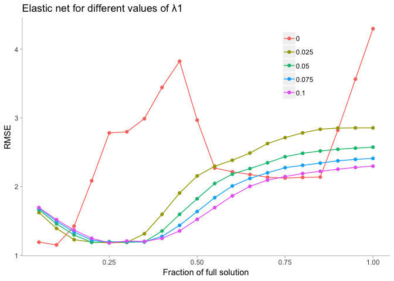

d- Predict the response for the test set. What is the value of the performance metrix and how does it compare with the resampled performance metric of the training set.

``` r
enetFit <- predict(enetModel, testPredictors)
enetValues <- data.frame(pred = enetFit, obs = testYield)
enetSummary <- defaultSummary(enetValues)
enetSummary
```

    ##      RMSE  Rsquared       MAE 
    ## 1.0500311 0.5584592 0.8786869

``` r
ggplot(enetValues, aes(x = pred, y = obs)) +
  geom_point(color = '#41b6c4') +
  geom_abline() +
  labs(title = 'Enet') +
  theme(panel.grid = element_blank(),
      panel.background = element_blank(),
      axis.line.x = element_line(colour = "grey"),
      axis.line.y = element_line(colour = "grey"),
      axis.ticks.x = element_line(colour = "grey"),
      axis.ticks.y = element_line(colour = "grey")
      )
```

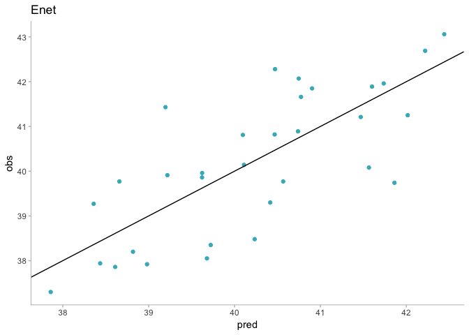

e- Which predictors are most important in the model you have trained? Do either the biological or process predictors dominate the list?

``` r
plot(enetModel)
```

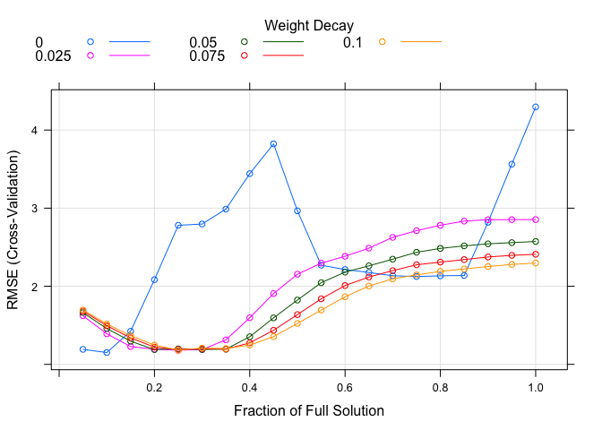

``` r
beta <- enetModel$finalModel$beta.pure
tmp <- as.data.frame(as.matrix(beta))
tmp$coef <- row.names(tmp)
tmp <- reshape::melt(tmp, id = "coef")
tmp$norm <- enetModel$finalModel$L1norm # compute L1 norm


# x11(width = 13/2.54, height = 9/2.54)
g1 <- ggplot(tmp, aes(norm, value, color = variable)) + 
  geom_line() +
  theme(panel.grid = element_blank(),
        panel.background = element_blank(),
        axis.line.x = element_line(colour = "grey"),
        axis.line.y = element_line(colour = "grey"),
        axis.ticks.x = element_line(colour = "grey"),
        axis.ticks.y = element_line(colour = "grey"),
        legend.position = "none")

g1
```

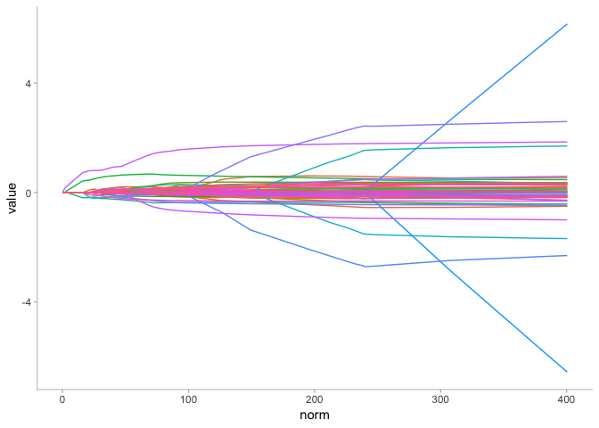

Let's take a deeper look to see what are the variables with the highest influence in the outcome.

``` r
tmp1 <- tmp %>% 
  filter(norm < 20)

tmp2 <- tmp1 %>% 
  group_by(variable) %>% 
  summarize(sum = sum(value)) %>% 
  filter(sum != 0)

tmp1 <- tmp1 %>% 
  filter(variable %in% tmp2$variable)

g <- ggplot(tmp1, aes(norm, value, color = variable)) + 
  geom_line() +
  labs(title = "Lasso", x = "L1 norm", y = "Standarized coefficients") +
  #scale_color_brewer(palette="Set3") +
  theme(panel.grid = element_blank(),
        panel.background = element_blank(),
        axis.line.x = element_line(colour = "grey"),
        axis.line.y = element_line(colour = "grey"),
        axis.ticks.x = element_line(colour = "grey"),
        axis.ticks.y = element_line(colour = "grey"),
        legend.direction = "horizontal",
        legend.position = "bottom",
        legend.title = element_blank())

g
```


All of them are manufacturing variables that we could manipulate to get the outcome we want in yield.

I saw that I've been using the lasso plot a lot and it takes a lot of code to get the plot I wanted. To solve that problem I created my own function. It takes the object that you get as a result from the `train` function of the `caret` package when you use `method = enet`.

``` r
source("/Users/santiagotoso/GoogleDrive/Master/R/Functions/enetPlot.R")

enetPlot(enetModel = enetModel, L1norm = 20, maxlegend = 10)
```

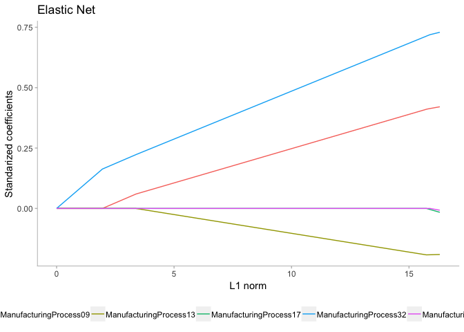

``` r
source("/Users/santiagotoso/GoogleDrive/Master/R/Functions/enetPlotCompare.R")
enetPlotCompare(enetModel)
```


