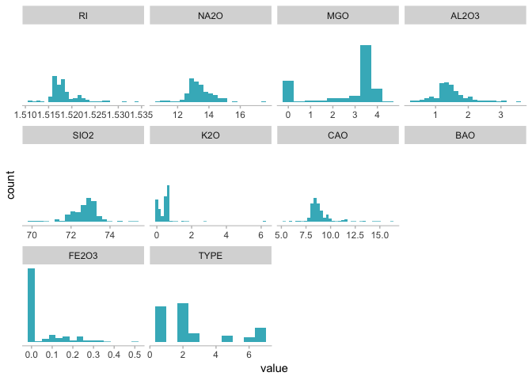
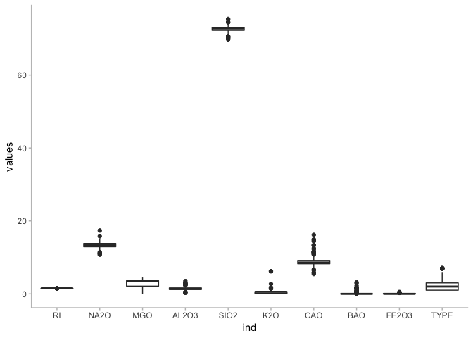
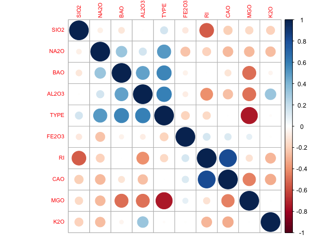
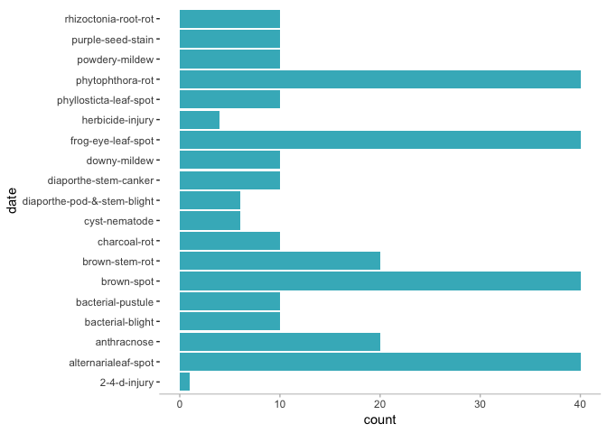

Applied Predictive Modeling
================
Santiago Toso

Chapter 3: Data Pre-Processing
==============================

The [UC Irvine Machine Learning Repository](http://archive.ics.uci.edu/ml/index.html) contains a data set related to glass identification. The data consist of 214 glass samples labeled as one of seven class categories. There are nince predictors, including the refractive index and precentage of eight elements: Na, Mg, Al, Si, K, Ca, Ba, and Fe.
----------------------------------------------------------------------------------------------------------------------------------------------------------------------------------------------------------------------------------------------------------------------------------------------------------------------------------------------------------

The data can be accessed via:

``` r
glassIdentification <- read.table( "https://archive.ics.uci.edu/ml/machine-learning-databases/glass/glass.data",
                           sep=",")
names(glassIdentification) <- c('ID', 'RI', 'NA2O', 'MGO', 'AL2O3', 'SIO2', 'K2O', 'CAO', 'BAO', 'FE2O3', 'TYPE')
glassIdentification <- glassIdentification[ , -1]
str(glassIdentification)
```

    ## 'data.frame':    214 obs. of  10 variables:
    ##  $ RI   : num  1.52 1.52 1.52 1.52 1.52 ...
    ##  $ NA2O : num  13.6 13.9 13.5 13.2 13.3 ...
    ##  $ MGO  : num  4.49 3.6 3.55 3.69 3.62 3.61 3.6 3.61 3.58 3.6 ...
    ##  $ AL2O3: num  1.1 1.36 1.54 1.29 1.24 1.62 1.14 1.05 1.37 1.36 ...
    ##  $ SIO2 : num  71.8 72.7 73 72.6 73.1 ...
    ##  $ K2O  : num  0.06 0.48 0.39 0.57 0.55 0.64 0.58 0.57 0.56 0.57 ...
    ##  $ CAO  : num  8.75 7.83 7.78 8.22 8.07 8.07 8.17 8.24 8.3 8.4 ...
    ##  $ BAO  : num  0 0 0 0 0 0 0 0 0 0 ...
    ##  $ FE2O3: num  0 0 0 0 0 0.26 0 0 0 0.11 ...
    ##  $ TYPE : int  1 1 1 1 1 1 1 1 1 1 ...

a- Using visualizations, explore the predictor variables to understand their distributions as well as the relationships between predictors.

Will start with the skewness and then see the histograms.

    ##         RI       NA2O        MGO      AL2O3       SIO2        K2O 
    ##  1.6027151  0.4478343 -1.1364523  0.8946104 -0.7202392  6.4600889 
    ##        CAO        BAO      FE2O3       TYPE 
    ##  2.0184463  3.3686800  1.7298107  1.0993342

    ## No id variables; using all as measure variables

    ## Warning: Computation failed in `stat_bin()`:
    ## `binwidth` must be positive



They look pretty skewed. Maybe with the box-plot is easier to identify outliers.



We see a lot of points here that tell us we have some outliers.

Maybe we can check their correlations too before doing anything else.

|       |          RI|        NA2O|         MGO|       AL2O3|        SIO2|         K2O|         CAO|         BAO|       FE2O3|        TYPE|
|-------|-----------:|-----------:|-----------:|-----------:|-----------:|-----------:|-----------:|-----------:|-----------:|-----------:|
| RI    |   1.0000000|  -0.1918854|  -0.1222740|  -0.4073260|  -0.5420522|  -0.2898327|   0.8104027|  -0.0003860|   0.1430096|  -0.1642372|
| NA2O  |  -0.1918854|   1.0000000|  -0.2737320|   0.1567937|  -0.0698088|  -0.2660865|  -0.2754425|   0.3266029|  -0.2413464|   0.5028980|
| MGO   |  -0.1222740|  -0.2737320|   1.0000000|  -0.4817985|  -0.1659267|   0.0053957|  -0.4437500|  -0.4922621|   0.0830595|  -0.7449929|
| AL2O3 |  -0.4073260|   0.1567937|  -0.4817985|   1.0000000|  -0.0055237|   0.3259584|  -0.2595920|   0.4794039|  -0.0744022|   0.5988292|
| SIO2  |  -0.5420522|  -0.0698088|  -0.1659267|  -0.0055237|   1.0000000|  -0.1933309|  -0.2087322|  -0.1021513|  -0.0942007|   0.1515653|
| K2O   |  -0.2898327|  -0.2660865|   0.0053957|   0.3259584|  -0.1933309|   1.0000000|  -0.3178362|  -0.0426181|  -0.0077190|  -0.0100545|
| CAO   |   0.8104027|  -0.2754425|  -0.4437500|  -0.2595920|  -0.2087322|  -0.3178362|   1.0000000|  -0.1128410|   0.1249682|   0.0009522|
| BAO   |  -0.0003860|   0.3266029|  -0.4922621|   0.4794039|  -0.1021513|  -0.0426181|  -0.1128410|   1.0000000|  -0.0586918|   0.5751615|
| FE2O3 |   0.1430096|  -0.2413464|   0.0830595|  -0.0744022|  -0.0942007|  -0.0077190|   0.1249682|  -0.0586918|   1.0000000|  -0.1882776|
| TYPE  |  -0.1642372|   0.5028980|  -0.7449929|   0.5988292|   0.1515653|  -0.0100545|   0.0009522|   0.5751615|  -0.1882776|   1.0000000|

    ## corrplot 0.84 loaded



b- Do they appear to be any outliers in the data? Any predictors skewed?

We see that all predictors are skewed:

|       |           x|
|-------|-----------:|
| MGO   |  -1.1364523|
| SIO2  |  -0.7202392|
| NA2O  |   0.4478343|
| AL2O3 |   0.8946104|
| TYPE  |   1.0993342|
| RI    |   1.6027151|
| FE2O3 |   1.7298107|
| CAO   |   2.0184463|
| BAO   |   3.3686800|
| K2O   |   6.4600889|

The one with the lowest skewness is Na2O with 0.44, which is still, pretty skewed.

We also see many outliers as shown in the Box plot below.

c- Are there any relevant transformations of one or more predictors that might improve the classification model?

We can use the `preProcess` function to find the right transformations to use, scale the data, center it, and finally apply PCA.

    ## Loading required package: lattice

    ## Created from 214 samples and 10 variables
    ## 
    ## Pre-processing:
    ##   - Box-Cox transformation (6)
    ##   - centered (10)
    ##   - ignored (0)
    ##   - principal component signal extraction (10)
    ##   - scaled (10)
    ## 
    ## Lambda estimates for Box-Cox transformation:
    ## -2, -0.1, 0.5, 2, -1.1, -0.4
    ## PCA needed 7 components to capture 95 percent of the variance

It transformed 6 out of 10 variables and centered and scaled all of them. After the PCA transformation 7 principal components are needed to get the 95% of the variance.

The soybean data can also be found at the UC Irvine Machine Learning Repository. Data were collected to predict disease in 683 soybeans. The 35 predictors are mostly categorical and include information on te environmental condictions (e.g., temperature, precipitation) and plant conditions (e.g. left spots, mold growth). The outcome laels consist of 19 distinct classes.
-----------------------------------------------------------------------------------------------------------------------------------------------------------------------------------------------------------------------------------------------------------------------------------------------------------------------------------------------------------------------------------

The data can be loaded via:

    ## 'data.frame':    307 obs. of  36 variables:
    ##  $ date          : Factor w/ 19 levels "2-4-d-injury",..: 11 11 11 11 11 11 11 11 11 11 ...
    ##  $ plantstand    : Factor w/ 8 levels "?","0","1","2",..: 8 6 5 5 8 7 7 6 8 6 ...
    ##  $ precip        : Factor w/ 3 levels "?","0","1": 2 2 2 2 2 2 2 2 2 2 ...
    ##  $ temp          : Factor w/ 4 levels "?","0","1","2": 4 4 4 4 4 4 4 4 4 4 ...
    ##  $ hail          : Factor w/ 4 levels "?","0","1","2": 3 3 3 3 3 3 3 3 3 3 ...
    ##  $ crophist      : Factor w/ 3 levels "?","0","1": 2 2 2 2 2 2 2 3 2 2 ...
    ##  $ areadamaged   : Factor w/ 5 levels "?","0","1","2",..: 3 4 3 3 4 5 4 3 5 4 ...
    ##  $ severity      : Factor w/ 5 levels "?","0","1","2",..: 3 2 2 2 2 2 2 2 2 2 ...
    ##  $ seedtmt       : Factor w/ 4 levels "?","0","1","2": 3 4 4 4 3 3 3 3 3 4 ...
    ##  $ germination   : Factor w/ 4 levels "?","0","1","2": 2 3 3 2 2 2 3 2 3 2 ...
    ##  $ plantgrowth   : Factor w/ 4 levels "?","0","1","2": 2 3 4 3 4 3 2 4 3 4 ...
    ##  $ leaves        : Factor w/ 3 levels "?","0","1": 3 3 3 3 3 3 3 3 3 3 ...
    ##  $ leafspotshalo : int  1 1 1 1 1 1 1 1 1 1 ...
    ##  $ leafspotsmarg : Factor w/ 4 levels "?","0","1","2": 2 2 2 2 2 2 2 2 2 2 ...
    ##  $ leafspotsize  : Factor w/ 4 levels "?","0","1","2": 4 4 4 4 4 4 4 4 4 4 ...
    ##  $ leafshread    : Factor w/ 4 levels "?","0","1","2": 4 4 4 4 4 4 4 4 4 4 ...
    ##  $ leafmalf      : Factor w/ 3 levels "?","0","1": 2 2 2 2 2 2 2 2 2 2 ...
    ##  $ leafmild      : Factor w/ 3 levels "?","0","1": 2 2 2 2 2 2 2 2 2 2 ...
    ##  $ stem          : Factor w/ 4 levels "?","0","1","2": 2 2 2 2 2 2 2 2 2 2 ...
    ##  $ lodging       : Factor w/ 3 levels "?","0","1": 3 3 3 3 3 3 3 3 3 3 ...
    ##  $ stemcankers   : Factor w/ 3 levels "?","0","1": 3 2 2 2 2 2 3 2 2 2 ...
    ##  $ cankerlesion  : Factor w/ 5 levels "?","0","1","2",..: 5 5 5 5 5 5 5 5 5 5 ...
    ##  $ fruitingbodies: Factor w/ 5 levels "?","0","1","2",..: 3 3 2 2 3 2 3 3 3 3 ...
    ##  $ external decay: Factor w/ 3 levels "?","0","1": 3 3 3 3 3 3 3 3 3 3 ...
    ##  $ mycelium      : Factor w/ 3 levels "?","0","1": 3 3 3 3 3 3 3 3 3 3 ...
    ##  $ intdiscolor   : Factor w/ 3 levels "?","0","1": 2 2 2 2 2 2 2 2 2 2 ...
    ##  $ sclerotia     : Factor w/ 4 levels "?","0","1","2": 2 2 2 2 2 2 2 2 2 2 ...
    ##  $ fruitpods     : Factor w/ 3 levels "?","0","1": 2 2 2 2 2 2 2 2 2 2 ...
    ##  $ fruit spots   : Factor w/ 5 levels "?","0","1","2",..: 2 2 2 2 2 2 2 2 2 2 ...
    ##  $ seed          : Factor w/ 5 levels "?","0","1","2",..: 5 5 5 5 5 5 5 5 5 5 ...
    ##  $ moldgrowth    : Factor w/ 3 levels "?","0","1": 2 2 2 2 2 2 2 2 2 2 ...
    ##  $ seeddiscolor  : Factor w/ 3 levels "?","0","1": 2 2 2 2 2 2 2 2 2 2 ...
    ##  $ seedsize      : Factor w/ 3 levels "?","0","1": 2 2 2 2 2 2 2 2 2 2 ...
    ##  $ shriveling    : Factor w/ 3 levels "?","0","1": 2 2 2 2 2 2 2 2 2 2 ...
    ##  $ roots         : Factor w/ 3 levels "?","0","1": 2 2 2 2 2 2 2 2 2 2 ...
    ##  $ V36           : Factor w/ 4 levels "?","0","1","2": 2 2 2 2 2 2 2 2 2 2 ...

### Ivestigate the frequency distributions for the categorical predictors. Are any of the distributions defenarete in the ways discussed earlier in this chapter?

Almost all the variables are categorical. To explore them we could start with a contingency table for each of the variables.

``` r
mytable <- table(soyBean$date)
kable(mytable)
```

| Var1                        |  Freq|
|:----------------------------|-----:|
| 2-4-d-injury                |     1|
| alternarialeaf-spot         |    40|
| anthracnose                 |    20|
| bacterial-blight            |    10|
| bacterial-pustule           |    10|
| brown-spot                  |    40|
| brown-stem-rot              |    20|
| charcoal-rot                |    10|
| cyst-nematode               |     6|
| diaporthe-pod-&-stem-blight |     6|
| diaporthe-stem-canker       |    10|
| downy-mildew                |    10|
| frog-eye-leaf-spot          |    40|
| herbicide-injury            |     4|
| phyllosticta-leaf-spot      |    10|
| phytophthora-rot            |    40|
| powdery-mildew              |    10|
| purple-seed-stain           |    10|
| rhizoctonia-root-rot        |    10|

In proportions that would be like this:

``` r
kable(prop.table(mytable))
```

| Var1                        |       Freq|
|:----------------------------|----------:|
| 2-4-d-injury                |  0.0032573|
| alternarialeaf-spot         |  0.1302932|
| anthracnose                 |  0.0651466|
| bacterial-blight            |  0.0325733|
| bacterial-pustule           |  0.0325733|
| brown-spot                  |  0.1302932|
| brown-stem-rot              |  0.0651466|
| charcoal-rot                |  0.0325733|
| cyst-nematode               |  0.0195440|
| diaporthe-pod-&-stem-blight |  0.0195440|
| diaporthe-stem-canker       |  0.0325733|
| downy-mildew                |  0.0325733|
| frog-eye-leaf-spot          |  0.1302932|
| herbicide-injury            |  0.0130293|
| phyllosticta-leaf-spot      |  0.0325733|
| phytophthora-rot            |  0.1302932|
| powdery-mildew              |  0.0325733|
| purple-seed-stain           |  0.0325733|
| rhizoctonia-root-rot        |  0.0325733|

``` r
barpt <- ggplot(soyBean, aes(x = date)) +
  geom_bar(fill = '#41b6c4') +
  coord_flip() +
  theme(panel.grid = element_blank(),
        panel.background = element_blank(),
        axis.line.x = element_line(colour = "grey"),
        axis.line.y = element_blank(),
        axis.ticks.x = element_line(colour = "grey")
        )
barpt
```



The thing is that we have too many variables to do this for each of them. So, we are going to apply the methods for filtering recommended by the authors. First, will use the `summary` function to look for outliers.

``` r
summary <- summary(soyBean)
summary
```

    ##                   date       plantstand precip  temp    hail    crophist
    ##  alternarialeaf-spot: 40   5      :65   ?:  8   ?: 11   ?:  7   ?: 41   
    ##  brown-spot         : 40   4      :58   0:160   0: 39   0: 41   0:211   
    ##  frog-eye-leaf-spot : 40   3      :53   1:139   1: 47   1:179   1: 55   
    ##  phytophthora-rot   : 40   2      :41           2:210   2: 80           
    ##  anthracnose        : 20   6      :41                                   
    ##  brown-stem-rot     : 20   1      :36                                   
    ##  (Other)            :107   (Other):13                                   
    ##  areadamaged severity seedtmt germination plantgrowth leaves 
    ##  ?: 1        ?:  1    ?: 41   ?: 41       ?:36        ?:  1  
    ##  0:35        0: 51    0: 87   0:140       0:84        0:202  
    ##  1:79        1:101    1:151   1:106       1:99        1:104  
    ##  2:99        2: 63    2: 28   2: 20       2:88               
    ##  3:93        3: 91                                           
    ##                                                              
    ##                                                              
    ##  leafspotshalo    leafspotsmarg leafspotsize leafshread leafmalf leafmild
    ##  Min.   :0.0000   ?: 25         ?: 25        ?: 25      ?: 26    ?: 25   
    ##  1st Qu.:1.0000   0:111         0:160        0: 25      0:233    0:268   
    ##  Median :1.0000   1: 19         1: 11        1:147      1: 48    1: 14   
    ##  Mean   :0.8925   2:152         2:111        2:110                       
    ##  3rd Qu.:1.0000                                                          
    ##  Max.   :1.0000                                                          
    ##                                                                          
    ##  stem    lodging stemcankers cankerlesion fruitingbodies external decay
    ##  ?: 30   ?:  1   ?: 41       ?: 11        ?: 11          ?: 35         
    ##  0:257   0:140   0:248       0:179        0:151          0:226         
    ##  1: 10   1:166   1: 18       1: 23        1: 38          1: 46         
    ##  2: 10                       2: 21        2: 75                        
    ##                              3: 73        3: 32                        
    ##                                                                        
    ##                                                                        
    ##  mycelium intdiscolor sclerotia fruitpods fruit spots seed    moldgrowth
    ##  ?: 11    ?: 11       ?: 11     ?: 11     ?: 25       ?: 35   ?: 29     
    ##  0:232    0:294       0:266     0:286     0:193       0:164   0:227     
    ##  1: 64    1:  2       1: 20     1: 10     1: 53       1: 29   1: 51     
    ##                       2: 10               2:  6       2: 25             
    ##                                           3: 30       4: 54             
    ##                                                                         
    ##                                                                         
    ##  seeddiscolor seedsize shriveling roots   V36    
    ##  ?: 29        ?: 35    ?: 29      ?: 35   ?:  7  
    ##  0:247        0:244    0:251      0:256   0:260  
    ##  1: 31        1: 28    1: 27      1: 16   1: 33  
    ##                                           2:  7  
    ##                                                  
    ##                                                  
    ## 

We see that many variables have a lot of *?*. We'll handle them in the next section.

The `nearZeroVar` will tell us what predictors have almost no variability.

``` r
names(soyBean[nearZeroVar(soyBean)])
```

    ## [1] "intdiscolor" "fruitpods"

We find two variables with almost no variability. We could just remove them from our model.

``` r
filtereddf <- soyBean[, -nearZeroVar(soyBean)]
```

### Roughly 18% of the data are missing. Are there particular predictors that are more likely to be missing? Is the pattern of missing data related to the classes?

Let's see how much data is missing for each of the variables.
