Applied Predictive Modeling
================
Santiago Toso

Chapter 6: Linear Regression and Its Cousins
============================================

R for predicting fat content in food from Infrared spectroscopy technology instead of analytical chemistry
----------------------------------------------------------------------------------------------------------

a- Start `R` and use the following commands

``` r
library(caret)
```

    ## Loading required package: lattice

    ## Loading required package: ggplot2

``` r
library(tidyverse)
```

    ## ── Attaching packages ───────────────────────────────────────────────────────────────────────────────────────────────────────────────── tidyverse 1.2.1 ──

    ## ✔ tibble  1.4.2     ✔ purrr   0.2.5
    ## ✔ tidyr   0.8.1     ✔ dplyr   0.7.6
    ## ✔ readr   1.1.1     ✔ stringr 1.3.1
    ## ✔ tibble  1.4.2     ✔ forcats 0.3.0

    ## ── Conflicts ──────────────────────────────────────────────────────────────────────────────────────────────────────────────────── tidyverse_conflicts() ──
    ## ✖ dplyr::filter() masks stats::filter()
    ## ✖ dplyr::lag()    masks stats::lag()
    ## ✖ purrr::lift()   masks caret::lift()

``` r
data(tecator)
#?tecator
```

The matrix `absorp` contains the 100 abosorbance values for the 215 samples, while matrix `endpoints` contains the percent of moisture, fat, and protein in columns 1-3, respectively.

b- In this example the predictors are the measurements at the individual frequencies. Because the frequencies lie in a systematic order (850-1050nm), the preductirs have a high degree of correlation. Hence, the data lie in a smaller dimension than the total number of predictors (100). Use PCA to determine the effective dimension of these data. What is the effective dimension?

``` r
# trans <- preProcess(absorp,
#                     method = c("center", "scale", "pca"))
# trans

pcaObject <- prcomp(absorp,
                center = TRUE,
                scale. = TRUE)

percentVariance <- (pcaObject$sdev^2) / sum(pcaObject$sdev^2) * 100

dfPercentVariance<- as.data.frame(percentVariance)

dfPercentVariance <- dfPercentVariance %>% 
  mutate(comp = c(1:length(percentVariance)))

ggplot(data = dfPercentVariance, aes(x = comp, y = percentVariance)) +
  geom_point(color = '#41b6c4') + 
  geom_line(color = '#41b6c4') +
  theme(panel.grid = element_blank(),
        panel.background = element_blank(),
        axis.line = element_line(colour = "grey"),
        axis.ticks = element_line(colour = "grey")
        )
```

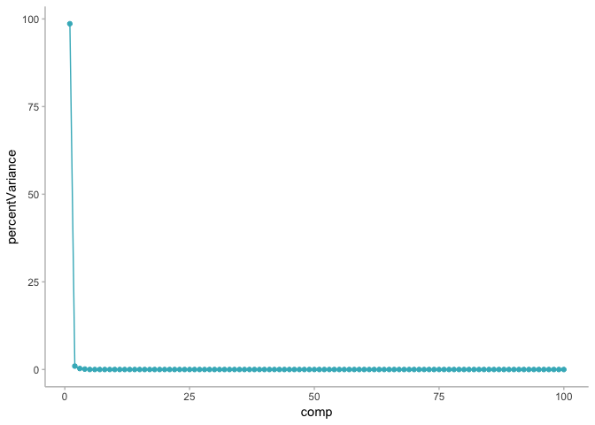

Since the set contains 100 absorbance values for each of the 215 samples, it makes sense to find that only one of the values could explain almost all the set's variation. Nonetheless, we could never keep only one variable to try to explain all the problem, it would give very bad results.

c- Split the data into training and test set, pre-process the data, and build each variaty of models described in this chapter. For those models with tuning parameters, what are the optimal values of the tuning parameters?

``` r
fat <- endpoints[,2]

trainRows <- createDataPartition(fat,
                                 p = .8,
                                 list = FALSE)
```

The train and test set will be

``` r
trainPredictors <- as.data.frame(absorp[trainRows,])
trainTarget <- fat[trainRows]

testPredictors <- as.data.frame(absorp[-trainRows,])
testTarget <- fat[-trainRows]

dftrain <- cbind(trainPredictors, trainTarget)
```

The sample is small, we don't have many samples in the data sets. We'll need to use resample techniques to get the most out of our data. Nonetheless we can start with a simple linear regression and see how it goes.

### Simple Linear Regression

``` r
lmFitAllPredictors <- lm(trainTarget ~ ., data = dftrain)
summary(lmFitAllPredictors)
```

    ## 
    ## Call:
    ## lm(formula = trainTarget ~ ., data = dftrain)
    ## 
    ## Residuals:
    ##      Min       1Q   Median       3Q      Max 
    ## -2.11170 -0.44320 -0.01981  0.44472  2.21090 
    ## 
    ## Coefficients:
    ##               Estimate Std. Error t value Pr(>|t|)    
    ## (Intercept)      7.535      2.164   3.483 0.000843 ***
    ## V1           14690.364   3930.184   3.738 0.000366 ***
    ## V2          -19379.322   7059.979  -2.745 0.007613 ** 
    ## V3           -6652.585  10469.020  -0.635 0.527119    
    ## V4           39435.085  21465.696   1.837 0.070262 .  
    ## V5          -47445.873  27899.359  -1.701 0.093273 .  
    ## V6           17929.373  22289.646   0.804 0.423789    
    ## V7          -10734.807  13616.934  -0.788 0.433049    
    ## V8            3979.468   8675.970   0.459 0.647829    
    ## V9            6654.806   6406.016   1.039 0.302309    
    ## V10            245.059   8075.915   0.030 0.975875    
    ## V11           -491.825  13569.244  -0.036 0.971185    
    ## V12          16834.030  23818.419   0.707 0.481962    
    ## V13         -17992.870  28531.578  -0.631 0.530252    
    ## V14           8463.693  24627.785   0.344 0.732087    
    ## V15           3759.285  16288.765   0.231 0.818124    
    ## V16         -18375.368   9742.304  -1.886 0.063254 .  
    ## V17           7133.699   7220.650   0.988 0.326437    
    ## V18           5208.534   7288.948   0.715 0.477148    
    ## V19          -2915.616  11255.187  -0.259 0.796328    
    ## V20          14703.340  20258.821   0.726 0.470297    
    ## V21         -53037.608  27817.323  -1.907 0.060503 .  
    ## V22          64061.468  29788.565   2.151 0.034824 *  
    ## V23         -33009.198  23895.817  -1.381 0.171376    
    ## V24           4478.666  15894.608   0.282 0.778915    
    ## V25           6036.329   9583.331   0.630 0.530741    
    ## V26             90.979   7238.053   0.013 0.990006    
    ## V27          -9977.638   7488.855  -1.332 0.186896    
    ## V28          27153.715  11033.733   2.461 0.016221 *  
    ## V29         -42689.025  16904.272  -2.525 0.013730 *  
    ## V30          37133.517  22345.385   1.662 0.100842    
    ## V31         -32153.169  24752.462  -1.299 0.198036    
    ## V32          31877.609  22825.804   1.397 0.166778    
    ## V33         -12621.590  16120.569  -0.783 0.436189    
    ## V34          -7336.007  10397.437  -0.706 0.482708    
    ## V35            322.229   8734.012   0.037 0.970671    
    ## V36           4626.605   7052.012   0.656 0.513843    
    ## V37          -5802.245   7996.795  -0.726 0.470421    
    ## V38            -25.920   9954.655  -0.003 0.997930    
    ## V39          22624.882  14002.966   1.616 0.110469    
    ## V40         -33305.175  20557.532  -1.620 0.109524    
    ## V41          36552.444  23829.743   1.534 0.129377    
    ## V42         -27069.548  25815.937  -1.049 0.297840    
    ## V43           3774.442  23433.282   0.161 0.872482    
    ## V44          -8030.655  13695.601  -0.586 0.559437    
    ## V45          25976.356  10721.793   2.423 0.017884 *  
    ## V46         -12533.087   8881.317  -1.411 0.162441    
    ## V47          -4886.678   4619.904  -1.058 0.293660    
    ## V48            466.572   5856.899   0.080 0.936724    
    ## V49           7492.224   8959.155   0.836 0.405735    
    ## V50         -15222.668  10776.883  -1.413 0.162043    
    ## V51          25851.688  15780.991   1.638 0.105693    
    ## V52         -30658.959  19749.190  -1.552 0.124888    
    ## V53          12492.748  19979.792   0.625 0.533744    
    ## V54          14763.955  16379.308   0.901 0.370351    
    ## V55         -18566.006  12630.537  -1.470 0.145878    
    ## V56           6678.695   7712.244   0.866 0.389335    
    ## V57           -489.881   5794.372  -0.085 0.932855    
    ## V58          -2198.796   5603.581  -0.392 0.695913    
    ## V59          -4031.184   5295.103  -0.761 0.448928    
    ## V60           9310.622   4609.379   2.020 0.047061 *  
    ## V61          -4231.056   4499.508  -0.940 0.350146    
    ## V62           2146.710   5295.324   0.405 0.686371    
    ## V63          18153.410   6681.978   2.717 0.008226 ** 
    ## V64         -27380.723  10403.059  -2.632 0.010352 *  
    ## V65           8180.307  16618.607   0.492 0.624028    
    ## V66          -4651.466  21887.335  -0.213 0.832295    
    ## V67          17562.298  22452.503   0.782 0.436628    
    ## V68         -33579.937  20133.825  -1.668 0.099633 .  
    ## V69          29365.387  16161.210   1.817 0.073317 .  
    ## V70          -7420.972  11885.821  -0.624 0.534341    
    ## V71          -8839.395   9142.332  -0.967 0.336804    
    ## V72           -332.661   8330.178  -0.040 0.968254    
    ## V73          21295.942   7091.894   3.003 0.003661 ** 
    ## V74         -21581.864   7310.983  -2.952 0.004244 ** 
    ## V75          11341.188   6278.329   1.806 0.074977 .  
    ## V76           1628.474   5808.729   0.280 0.780002    
    ## V77          -4628.300   6082.967  -0.761 0.449190    
    ## V78             28.286   6946.112   0.004 0.996762    
    ## V79           6828.413   8126.613   0.840 0.403510    
    ## V80         -14615.077   9383.430  -1.558 0.123667    
    ## V81           2107.504  10386.602   0.203 0.839773    
    ## V82          15085.784  12545.354   1.202 0.233056    
    ## V83          -9010.314  13925.455  -0.647 0.519636    
    ## V84         -18044.713  14914.092  -1.210 0.230217    
    ## V85          24851.373  15713.672   1.582 0.118084    
    ## V86           1466.657  17718.832   0.083 0.934258    
    ## V87         -15630.070  18810.474  -0.831 0.408726    
    ## V88           3740.544  17373.993   0.215 0.830137    
    ## V89           6968.614  15234.731   0.457 0.648730    
    ## V90         -19873.137  17358.149  -1.145 0.255995    
    ## V91          24008.271  18375.050   1.307 0.195461    
    ## V92          -4351.607  16257.071  -0.268 0.789705    
    ## V93           7745.907  13946.353   0.555 0.580314    
    ## V94         -16608.101  12576.710  -1.321 0.190779    
    ## V95          16656.062  11638.111   1.431 0.156650    
    ## V96         -14816.388  10077.267  -1.470 0.145784    
    ## V97           2407.660   9241.820   0.261 0.795198    
    ## V98         -10009.556   8919.737  -1.122 0.265463    
    ## V99          11365.666   9780.731   1.162 0.249002    
    ## V100          -495.853   4530.300  -0.109 0.913144    
    ## ---
    ## Signif. codes:  0 '***' 0.001 '**' 0.01 '*' 0.05 '.' 0.1 ' ' 1
    ## 
    ## Residual standard error: 1.187 on 73 degrees of freedom
    ## Multiple R-squared:  0.996,  Adjusted R-squared:  0.9906 
    ## F-statistic: 183.8 on 100 and 73 DF,  p-value: < 2.2e-16

It seems to be overfitted. Let's take a look and see how it works with the test set.

``` r
lmPred1 <- predict(lmFitAllPredictors, as.data.frame(testPredictors))
```

We can see how it went like this

``` r
lmValues <- data.frame(obs = testTarget, pred = lmPred1)
lmSummary <- defaultSummary(lmValues)
summary <- data.frame(lm = lmSummary)
summary
```

    ##                 lm
    ## RMSE     4.8876839
    ## Rsquared 0.9307693
    ## MAE      2.5238908

We see that the R^2 is still good but the RMSE seems pretty high. We can make a grap to take a deeper look. Let's make a graph that shows the predicted values against the actual values to evaluate how it went.

``` r
ggplot(lmValues, aes(x = pred, y = obs)) +
  geom_point(color = '#41b6c4') +
  geom_abline() +
  labs(title = 'LM') +
  theme(panel.grid = element_blank(),
      panel.background = element_blank(),
      axis.line.x = element_line(colour = "grey"),
      axis.line.y = element_line(colour = "grey"),
      axis.ticks.x = element_line(colour = "grey"),
      axis.ticks.y = element_line(colour = "grey")
      )
```

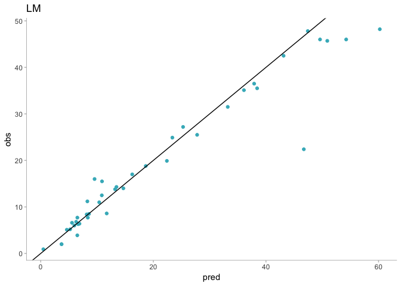

The model looks pretty good actually. The main issue seems to be that one sample that looks like an outlier. Nonetheless, since we have a small sample we can't be sure.

### Robust Linear Model

Our sample is very small, so we are going to use resample methods to improve our results. Also, we've seen that the PCA analysis could save us a lot of work.

``` r
library(MASS)
```

    ## 
    ## Attaching package: 'MASS'

    ## The following object is masked from 'package:dplyr':
    ## 
    ##     select

``` r
ctrl <- trainControl(method = 'cv', number = 10)

set.seed(100)
rlmFit <- train(x = as.data.frame(trainPredictors),y = trainTarget, 
                method = "rlm",
                preProcess = c("center","scale"),
                trControl = ctrl)

rlmFit
```

    ## Robust Linear Model 
    ## 
    ## 174 samples
    ## 100 predictors
    ## 
    ## Pre-processing: centered (100), scaled (100) 
    ## Resampling: Cross-Validated (10 fold) 
    ## Summary of sample sizes: 155, 157, 156, 158, 156, 157, ... 
    ## Resampling results across tuning parameters:
    ## 
    ##   intercept  psi           RMSE       Rsquared   MAE      
    ##   FALSE      psi.huber     18.902369  0.8976595  18.374424
    ##   FALSE      psi.hampel    18.902369  0.8976595  18.374424
    ##   FALSE      psi.bisquare  18.905000  0.8973039  18.375073
    ##    TRUE      psi.huber      3.547948  0.9098598   2.275833
    ##    TRUE      psi.hampel     4.628838  0.8683727   2.820024
    ##    TRUE      psi.bisquare  10.720873  0.7574395   6.327628
    ## 
    ## RMSE was used to select the optimal model using the smallest value.
    ## The final values used for the model were intercept = TRUE and psi
    ##  = psi.huber.

``` r
# ctrl <- trainControl(method = 'cv', number = 10)
# 
# set.seed(100)
# lmFit1 <- train(x = solTrainXtrans, y = solTrainY,
#                 method = 'lm',
#                 trControl = ctrl)
# lmFit1
```

We'll see if this model works better.

``` r
rlmValues <- data.frame(pred = predict(rlmFit, as.data.frame(testPredictors)), obs = testTarget)
rlmSummary <- defaultSummary(rlmValues)
summary <- cbind.data.frame(summary, rlm = rlmSummary)
summary
```

    ##                 lm      rlm
    ## RMSE     4.8876839 8.307847
    ## Rsquared 0.9307693 0.816608
    ## MAE      2.5238908 3.277457

Looks like the previous model was a bit better.

Graphically, it looks similar though.

``` r
ggplot(rlmValues, aes(x = pred, y = obs)) +
  geom_point(color = '#41b6c4') +
  geom_abline() +
  labs(title = 'RLM') +
  theme(panel.grid = element_blank(),
      panel.background = element_blank(),
      axis.line.x = element_line(colour = "grey"),
      axis.line.y = element_line(colour = "grey"),
      axis.ticks.x = element_line(colour = "grey"),
      axis.ticks.y = element_line(colour = "grey")
      )
```

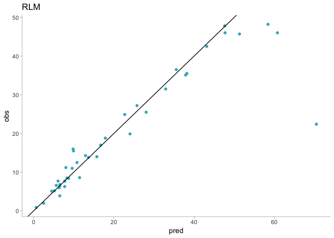

### Partial Least Squares

``` r
set.seed(100)

plsTune <- train(trainPredictors, trainTarget,
                 method = 'pls',
                 trControl = ctrl,
                 tuneLength = 20,
                 preProcess = c("center", "scale"))

plsTune
```

    ## Partial Least Squares 
    ## 
    ## 174 samples
    ## 100 predictors
    ## 
    ## Pre-processing: centered (100), scaled (100) 
    ## Resampling: Cross-Validated (10 fold) 
    ## Summary of sample sizes: 155, 157, 156, 158, 156, 157, ... 
    ## Resampling results across tuning parameters:
    ## 
    ##   ncomp  RMSE       Rsquared   MAE     
    ##    1     11.101488  0.2039101  9.092805
    ##    2      8.036292  0.6356107  6.189558
    ##    3      5.194965  0.8190465  3.917328
    ##    4      4.322651  0.8777613  3.482703
    ##    5      3.070599  0.9453224  2.382929
    ##    6      2.951146  0.9504556  2.299179
    ##    7      2.844764  0.9551968  2.205607
    ##    8      2.770475  0.9591139  2.122658
    ##    9      2.691909  0.9581388  2.094420
    ##   10      2.595650  0.9583697  2.048861
    ##   11      2.476587  0.9623670  1.952830
    ##   12      2.328804  0.9673600  1.831031
    ##   13      2.122929  0.9721291  1.636362
    ##   14      2.079512  0.9737924  1.606553
    ##   15      2.055860  0.9738944  1.553685
    ##   16      2.069335  0.9755790  1.531784
    ##   17      2.079679  0.9759530  1.546102
    ##   18      1.969997  0.9774427  1.461007
    ##   19      1.952421  0.9778104  1.471713
    ##   20      2.049341  0.9745441  1.490600
    ## 
    ## RMSE was used to select the optimal model using the smallest value.
    ## The final value used for the model was ncomp = 19.

Looks like 14 components is the best option for us. If we were to see it graphically

``` r
ggplot(data = plsTune$results, aes(x = ncomp, y = RMSE)) +
  geom_line(color = '#41b6c4') +
  geom_point(color = '#41b6c4') +
  labs(title = '# Components vs RMSE for PLS model', x = '# Components') +
  theme(panel.grid = element_blank(),
      panel.background = element_blank(),
      axis.line.x = element_line(colour = "grey"),
      axis.line.y = element_line(colour = "grey"),
      axis.ticks.x = element_line(colour = "grey"),
      axis.ticks.y = element_line(colour = "grey")
      )
```

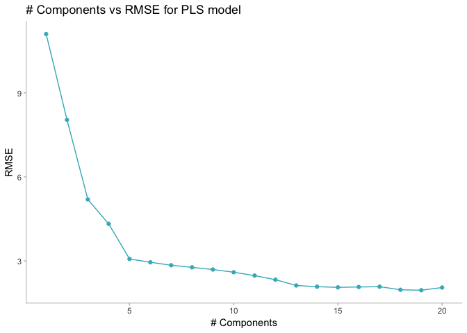

``` r
ggplot(data = plsTune$results, aes(x = ncomp, y = Rsquared)) +
  geom_line(color = '#41b6c4') +
  geom_point(color = '#41b6c4') +
  labs(title = '# Components vs Rsquared for PLS model', x = '# Components') +
  theme(panel.grid = element_blank(),
      panel.background = element_blank(),
      axis.line.x = element_line(colour = "grey"),
      axis.line.y = element_line(colour = "grey"),
      axis.ticks.x = element_line(colour = "grey"),
      axis.ticks.y = element_line(colour = "grey")
      )
```

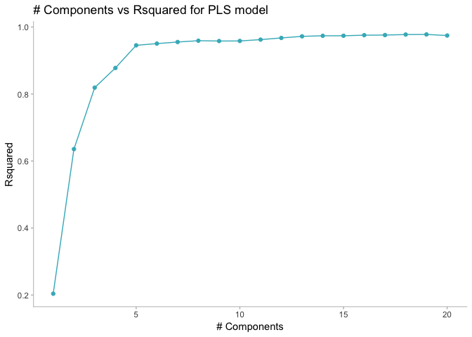

Now we'll try it on the test set

``` r
plsPredictions <- predict(plsTune, testPredictors)
plsValues <- data.frame(pred = plsPredictions, obs = testTarget)
plsSummary <- defaultSummary(plsValues)
summary <- cbind.data.frame(summary, pls = plsSummary)
summary
```

    ##                 lm      rlm      pls
    ## RMSE     4.8876839 8.307847 3.638749
    ## Rsquared 0.9307693 0.816608 0.947141
    ## MAE      2.5238908 3.277457 2.355629

PLS looks much better than the other two models. Let's take a look at the graph.

``` r
ggplot(plsValues, aes(x = pred, y = obs)) +
  geom_point(color = '#41b6c4') +
  geom_abline() +
  labs(title = 'PLS') +
  theme(panel.grid = element_blank(),
      panel.background = element_blank(),
      axis.line.x = element_line(colour = "grey"),
      axis.line.y = element_line(colour = "grey"),
      axis.ticks.x = element_line(colour = "grey"),
      axis.ticks.y = element_line(colour = "grey")
      )
```

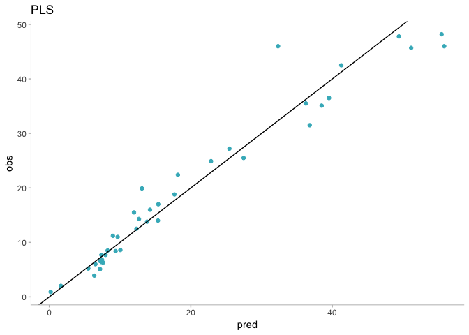

Looks like this model improves the estimations a lot. It doesn't estimate any negative values as the others models did and the RMSE is much lower.

### Penalized models

Lastly, we will consider an `elastic net` model with different tuning parameters to choose the best one.

``` r
enetGrid <- expand.grid(.lambda = seq(0, 0.1, length = 5),
                        .fraction = seq(.05, 1, length = 20))
set.seed(100)
enetTune <- train(trainPredictors, trainTarget,
                  method = 'enet',
                  tuneGrid = enetGrid,
                  trControl = ctrl,
                  preProcess = c("center", "scale"))

enetTune
```

    ## Elasticnet 
    ## 
    ## 174 samples
    ## 100 predictors
    ## 
    ## Pre-processing: centered (100), scaled (100) 
    ## Resampling: Cross-Validated (10 fold) 
    ## Summary of sample sizes: 155, 157, 156, 158, 156, 157, ... 
    ## Resampling results across tuning parameters:
    ## 
    ##   lambda  fraction  RMSE       Rsquared   MAE     
    ##   0.000   0.05       2.039239  0.9754477  1.469903
    ##   0.000   0.10       2.477885  0.9560720  1.609625
    ##   0.000   0.15       2.424387  0.9584017  1.557918
    ##   0.000   0.20       2.437262  0.9583278  1.579286
    ##   0.000   0.25       2.571640  0.9527717  1.654182
    ##   0.000   0.30       2.743541  0.9450801  1.726645
    ##   0.000   0.35       2.845810  0.9407014  1.787171
    ##   0.000   0.40       2.892312  0.9390255  1.826875
    ##   0.000   0.45       2.950315  0.9372420  1.867000
    ##   0.000   0.50       3.016432  0.9350097  1.902440
    ##   0.000   0.55       3.089696  0.9320607  1.940717
    ##   0.000   0.60       3.175621  0.9284138  1.984182
    ##   0.000   0.65       3.256170  0.9249893  2.027859
    ##   0.000   0.70       3.340327  0.9212870  2.070937
    ##   0.000   0.75       3.419344  0.9177070  2.117289
    ##   0.000   0.80       3.497783  0.9140681  2.161027
    ##   0.000   0.85       3.585174  0.9101279  2.207709
    ##   0.000   0.90       3.674868  0.9060104  2.254114
    ##   0.000   0.95       3.763016  0.9018382  2.300336
    ##   0.000   1.00       3.852656  0.8976569  2.348630
    ##   0.025   0.05      10.472950  0.3101916  8.609541
    ##   0.025   0.10       9.846184  0.4197698  8.088928
    ##   0.025   0.15       9.236865  0.5203377  7.597611
    ##   0.025   0.20       8.653738  0.6058219  7.135888
    ##   0.025   0.25       8.092980  0.6760222  6.692028
    ##   0.025   0.30       7.557284  0.7314771  6.251968
    ##   0.025   0.35       7.057643  0.7731542  5.828809
    ##   0.025   0.40       6.600414  0.8035473  5.431609
    ##   0.025   0.45       6.228425  0.8238944  5.116278
    ##   0.025   0.50       5.890230  0.8396172  4.827217
    ##   0.025   0.55       5.584755  0.8513789  4.568414
    ##   0.025   0.60       5.307847  0.8608254  4.328242
    ##   0.025   0.65       5.053081  0.8690257  4.104471
    ##   0.025   0.70       4.826734  0.8757947  3.909469
    ##   0.025   0.75       4.634935  0.8811617  3.740617
    ##   0.025   0.80       4.484489  0.8851769  3.615212
    ##   0.025   0.85       4.361180  0.8885281  3.519359
    ##   0.025   0.90       4.267983  0.8910750  3.445315
    ##   0.025   0.95       4.199783  0.8929034  3.394901
    ##   0.025   1.00       4.150866  0.8942145  3.358400
    ##   0.050   0.05      10.541651  0.2966801  8.654935
    ##   0.050   0.10       9.978390  0.3934845  8.188494
    ##   0.050   0.15       9.434800  0.4838819  7.744936
    ##   0.050   0.20       8.905122  0.5648786  7.327379
    ##   0.050   0.25       8.401093  0.6331684  6.933298
    ##   0.050   0.30       7.921450  0.6892999  6.547366
    ##   0.050   0.35       7.470971  0.7338609  6.172247
    ##   0.050   0.40       7.046303  0.7689499  5.812019
    ##   0.050   0.45       6.668405  0.7949829  5.484388
    ##   0.050   0.50       6.369583  0.8119463  5.227512
    ##   0.050   0.55       6.104431  0.8247861  4.993597
    ##   0.050   0.60       5.863344  0.8346810  4.782200
    ##   0.050   0.65       5.622681  0.8438804  4.571296
    ##   0.050   0.70       5.396665  0.8521247  4.379179
    ##   0.050   0.75       5.197417  0.8586342  4.205915
    ##   0.050   0.80       5.023411  0.8639184  4.048760
    ##   0.050   0.85       4.882651  0.8678010  3.923318
    ##   0.050   0.90       4.770237  0.8707167  3.821703
    ##   0.050   0.95       4.680811  0.8729288  3.736502
    ##   0.050   1.00       4.613454  0.8744447  3.670290
    ##   0.075   0.05      10.590213  0.2872789  8.683207
    ##   0.075   0.10      10.070469  0.3747729  8.253444
    ##   0.075   0.15       9.564733  0.4585895  7.838461
    ##   0.075   0.20       9.085365  0.5331492  7.458701
    ##   0.075   0.25       8.623835  0.5983931  7.097090
    ##   0.075   0.30       8.186359  0.6531899  6.747659
    ##   0.075   0.35       7.769257  0.6989710  6.402660
    ##   0.075   0.40       7.379194  0.7359141  6.068689
    ##   0.075   0.45       7.024291  0.7645355  5.761655
    ##   0.075   0.50       6.731173  0.7843986  5.504809
    ##   0.075   0.55       6.477796  0.7994245  5.280974
    ##   0.075   0.60       6.244272  0.8113353  5.073319
    ##   0.075   0.65       6.026114  0.8212744  4.882069
    ##   0.075   0.70       5.805247  0.8308942  4.693026
    ##   0.075   0.75       5.603551  0.8388177  4.523531
    ##   0.075   0.80       5.430663  0.8449473  4.374469
    ##   0.075   0.85       5.283825  0.8496935  4.242604
    ##   0.075   0.90       5.161761  0.8532867  4.132373
    ##   0.075   0.95       5.061682  0.8560093  4.037841
    ##   0.075   1.00       4.978356  0.8581106  3.955503
    ##   0.100   0.05      10.630157  0.2799156  8.703341
    ##   0.100   0.10      10.142946  0.3601715  8.300775
    ##   0.100   0.15       9.678144  0.4365528  7.917164
    ##   0.100   0.20       9.232784  0.5061755  7.560954
    ##   0.100   0.25       8.805838  0.5681076  7.224432
    ##   0.100   0.30       8.394572  0.6225087  6.895251
    ##   0.100   0.35       8.005799  0.6682165  6.573445
    ##   0.100   0.40       7.639397  0.7060692  6.257829
    ##   0.100   0.45       7.298234  0.7368143  5.962945
    ##   0.100   0.50       7.011318  0.7589764  5.711077
    ##   0.100   0.55       6.768452  0.7754812  5.494105
    ##   0.100   0.60       6.551508  0.7884642  5.299299
    ##   0.100   0.65       6.344415  0.7995201  5.118333
    ##   0.100   0.70       6.129083  0.8104244  4.935023
    ##   0.100   0.75       5.935149  0.8192709  4.767595
    ##   0.100   0.80       5.766094  0.8262476  4.620890
    ##   0.100   0.85       5.620035  0.8317372  4.494541
    ##   0.100   0.90       5.491991  0.8361562  4.382067
    ##   0.100   0.95       5.386022  0.8395207  4.287891
    ##   0.100   1.00       5.293449  0.8422977  4.201655
    ## 
    ## RMSE was used to select the optimal model using the smallest value.
    ## The final values used for the model were fraction = 0.05 and lambda = 0.

``` r
#plot(enetTune)
#?expand.grid
```

According to the model, the best tuning parameters are `fraction = 0.05 and lambda = 0`. This actually means that the **lasso** model has been the best.

``` r
#enetTune$results
ggplot(enetTune$results, aes(x = fraction, y = RMSE, group = lambda)) +
  geom_line(aes(color = as.character(lambda))) +
  geom_point(aes(color = as.character(lambda))) +
  labs(title = 'Elastic net for different values of λ1', x = 'Fraction of full solution') +
  theme(panel.grid = element_blank(),
      panel.background = element_blank(),
      axis.line.x = element_line(colour = "grey"),
      axis.line.y = element_line(colour = "grey"),
      axis.ticks.x = element_line(colour = "grey"),
      axis.ticks.y = element_line(colour = "grey"),
      legend.position = c(0.75, 0.8),
      legend.title = element_blank()
      )
```

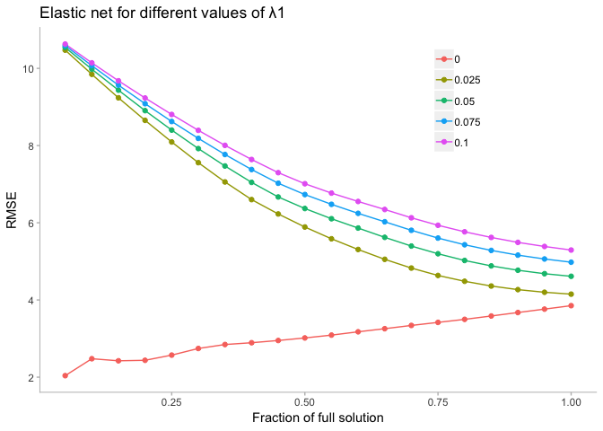

We can test it now with our test set

``` r
enetPredictions <- predict(enetTune, testPredictors)
enetValues <- data.frame(pred = enetPredictions, obs = testTarget)
enetSummary <- defaultSummary(enetValues)
summary <- cbind.data.frame(summary, enet = enetSummary)
summary
```

    ##                 lm      rlm      pls      enet
    ## RMSE     4.8876839 8.307847 3.638749 3.3419489
    ## Rsquared 0.9307693 0.816608 0.947141 0.9553974
    ## MAE      2.5238908 3.277457 2.355629 2.2088115

Looks like **lasso** bits all the other models.

Let's try to graphicate the lasso. Although we may have too many variables to get something out of the graph.

``` r
library(elasticnet)
```

    ## Loading required package: lars

    ## Loaded lars 1.2

``` r
standarizedbeta <- enetTune$finalModel$beta.pure/max(abs(enetTune$finalModel$beta.pure))
lambda1 <- enetTune$finalModel$tuneValue$lambda
fraction <- enetTune$finalModel$tuneValue$fraction

enetModel1 <- enet(x = as.matrix(trainPredictors), y= trainTarget,
                  lambda = lambda1, normalize = TRUE)

enetPred1 <- predict(enetModel1, newx = as.matrix(testPredictors),
                    s = fraction, mode = 'fraction',
                    type = 'fit')

enetCoef1 <- predict(enetModel1, newx = as.matrix(testPredictions),
                    s = fraction, mode = 'fraction',
                    type = 'coefficients')

# finalmodel <- enetTune$finalModel
# finalmodel
beta <- enetTune$finalModel$beta.pure
tmp <- as.data.frame(as.matrix(beta))
tmp$coef <- row.names(tmp)
tmp <- reshape::melt(tmp, id = "coef")
tmp$norm <- enetModel1$L1norm # compute L1 norm


# x11(width = 13/2.54, height = 9/2.54)
g1 <- ggplot(tmp, aes(norm, value, color = variable)) + 
  geom_line() +
  theme(panel.grid = element_blank(),
        panel.background = element_blank(),
        axis.line.x = element_line(colour = "grey"),
        axis.line.y = element_line(colour = "grey"),
        axis.ticks.x = element_line(colour = "grey"),
        axis.ticks.y = element_line(colour = "grey"),
        legend.position = "none")

g1
```

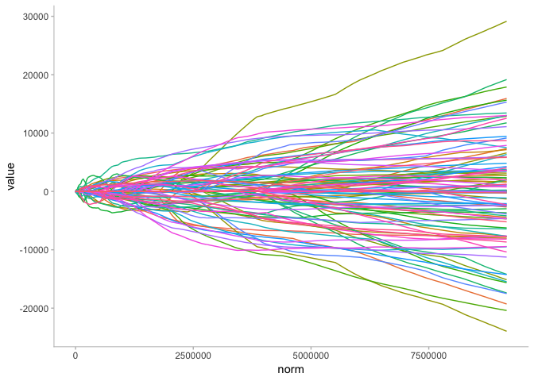

``` r
tmp1 <- tmp %>% 
  filter(norm < 1000)

tmp2 <- tmp1 %>% 
  group_by(variable) %>% 
  summarize(sum = sum(value)) %>% 
  filter(sum != 0)

tmp1 <- tmp1 %>% 
  filter(variable %in% tmp2$variable)

g <- ggplot(tmp1, aes(norm, value, color = variable)) + 
  geom_line() +
  labs(title = "Lasso", x = "L1 norm", y = "Standarized coefficients") +
  #scale_color_brewer(palette="Set3") +
  theme(panel.grid = element_blank(),
        panel.background = element_blank(),
        axis.line.x = element_line(colour = "grey"),
        axis.line.y = element_line(colour = "grey"),
        axis.ticks.x = element_line(colour = "grey"),
        axis.ticks.y = element_line(colour = "grey"),
        legend.direction = "horizontal",
        legend.position = "bottom",
        legend.title = element_blank())

g
```

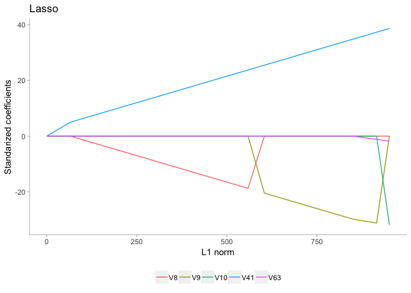

Developing a model to predict permeability
------------------------------------------

a- Start `R` and use these commands to load the data:

``` r
library(AppliedPredictiveModeling)
data("permeability")
```

The matrix `fingerprints` contains the 1107 binary molecular predictors for the 165 compounds, while `permeability` contains the permeability response.

b- The fingerprint predictors indicate the presence or absence of substructures of a molecule and are often sparse meaining that relatively few of the molecules contain each substructure. Filter out the predictors that have low frequencies using the `nearZeroVar` function from the `caret` package. How many predictors are left for modeling?

``` r
#?nearZeroVar
nearZero <- nearZeroVar(fingerprints)
fingerprintsFiltered <- fingerprints[ , -nearZero]
paste("There are ", ncol(fingerprintsFiltered), " predictors left", sep = "")
```

    ## [1] "There are 388 predictors left"

c- Split the data into a training and a test set, pre-process the data, and tune a PLS model. How many latent variables are optimal and what is the corresponding resampled estimate of R^2

We start creating the train and test set

``` r
trainRows <- createDataPartition(permeability,
                                 p = .8,
                                 list = FALSE)

trainPredictors <- fingerprintsFiltered[trainRows, ]
trainPermeability <- permeability[trainRows]

testPredictors <- fingerprintsFiltered[-trainRows, ]
testPermeability <- permeability[-trainRows]
```

Now we can specify the cross-validation we want to make.

``` r
ctrl <- trainControl(method = "cv", number = 10)
```

Let's tune the PLS model now

``` r
set.seed(100)
plsModel <- train(x = trainPredictors, y = trainPermeability,
                  method = "pls",
                  tuneLength = 20,
                  trControl = ctrl,
                  preProcess = c("center", "scale"))

plsModel
```

    ## Partial Least Squares 
    ## 
    ## 133 samples
    ## 388 predictors
    ## 
    ## Pre-processing: centered (388), scaled (388) 
    ## Resampling: Cross-Validated (10 fold) 
    ## Summary of sample sizes: 119, 119, 118, 120, 119, 120, ... 
    ## Resampling results across tuning parameters:
    ## 
    ##   ncomp  RMSE      Rsquared   MAE      
    ##    1     13.34294  0.2859035   9.995096
    ##    2     12.19269  0.4443215   8.488218
    ##    3     12.23054  0.4376987   8.972280
    ##    4     12.32531  0.4583480   9.208618
    ##    5     12.24322  0.4887654   8.903236
    ##    6     12.28544  0.4894242   9.062887
    ##    7     12.30035  0.4781474   9.038038
    ##    8     12.20384  0.4802717   9.018589
    ##    9     12.40140  0.4651335   9.098292
    ##   10     12.57874  0.4654587   8.973563
    ##   11     12.92814  0.4443399   9.222686
    ##   12     12.95642  0.4417439   9.335096
    ##   13     13.13507  0.4250362   9.454476
    ##   14     13.45052  0.4085549   9.507092
    ##   15     13.53629  0.3968971   9.491064
    ##   16     13.59310  0.3798963   9.486430
    ##   17     13.72291  0.3818779   9.576360
    ##   18     13.78063  0.3797801   9.673688
    ##   19     13.93619  0.3738806   9.949515
    ##   20     14.18472  0.3633987  10.192088
    ## 
    ## RMSE was used to select the optimal model using the smallest value.
    ## The final value used for the model was ncomp = 2.

Looks like 8 components (latent variables) is the best option for PLS, but all of them seem pretty bad models.

d- Predict the response for the test set. What is the test set estimate of R^2?

Let's try it for the test set now.

``` r
plsPredictions <- predict(plsModel, testPredictors)
plsValues <- data.frame(pred = plsPredictions, obs = testPermeability)
defaultSummary(plsValues)
```

    ##       RMSE   Rsquared        MAE 
    ## 10.9148564  0.5260698  7.5734041

e- Try building other models discussed in this chapter. Do any of them have better predictive performance?

``` r
set.seed(100)

lmModel <- train(x = trainPredictors, y = trainPermeability,
                  method = "lm",
                  trControl = ctrl,
                  preProcess = c("center", "scale"))
lmModel
```

    ## Linear Regression 
    ## 
    ## 133 samples
    ## 388 predictors
    ## 
    ## Pre-processing: centered (388), scaled (388) 
    ## Resampling: Cross-Validated (10 fold) 
    ## Summary of sample sizes: 119, 119, 118, 120, 119, 120, ... 
    ## Resampling results:
    ## 
    ##   RMSE      Rsquared   MAE     
    ##   26.28519  0.1888143  16.79275
    ## 
    ## Tuning parameter 'intercept' was held constant at a value of TRUE

``` r
set.seed(100)
enetGrid <- expand.grid(.lambda = c(0, 0.01, .1),
                        .fraction = seq(.05, 1, length = 20))

enetModel <- train(x = trainPredictors, y = trainPermeability,
                  method = "enet",
                  tuneGrid = enetGrid,
                  trControl = ctrl,
                  preProcess = c("center", "scale"))
enetModel
```

    ## Elasticnet 
    ## 
    ## 133 samples
    ## 388 predictors
    ## 
    ## Pre-processing: centered (388), scaled (388) 
    ## Resampling: Cross-Validated (10 fold) 
    ## Summary of sample sizes: 119, 119, 118, 120, 119, 120, ... 
    ## Resampling results across tuning parameters:
    ## 
    ##   lambda  fraction  RMSE        Rsquared   MAE        
    ##   0.00    0.05        12.18700  0.4435999     9.141684
    ##   0.00    0.10        11.90897  0.4477104     8.488890
    ##   0.00    0.15        11.87883  0.4625035     8.355923
    ##   0.00    0.20        11.94333  0.4684274     8.350881
    ##   0.00    0.25        11.92507  0.4702276     8.373206
    ##   0.00    0.30        11.90369  0.4693320     8.438678
    ##   0.00    0.35        11.92808  0.4689361     8.530066
    ##   0.00    0.40        12.03572  0.4625488     8.678067
    ##   0.00    0.45        12.16527  0.4551118     8.832498
    ##   0.00    0.50        12.28839  0.4468351     8.949556
    ##   0.00    0.55        12.39195  0.4427579     9.013117
    ##   0.00    0.60        12.54909  0.4355112     9.126581
    ##   0.00    0.65        12.71771  0.4273634     9.250580
    ##   0.00    0.70        12.92543  0.4200105     9.400108
    ##   0.00    0.75        13.13095  0.4131959     9.527462
    ##   0.00    0.80        13.25685  0.4052119     9.587698
    ##   0.00    0.85        13.38714  0.3981163     9.655814
    ##   0.00    0.90        13.53179  0.3906386     9.790778
    ##   0.00    0.95        13.66247  0.3841291     9.901271
    ##   0.00    1.00        13.79417  0.3773093     9.987331
    ##   0.01    0.05       190.91271  0.4002973   119.290854
    ##   0.01    0.10       358.83167  0.4000112   211.419921
    ##   0.01    0.15       527.03534  0.4174089   307.829549
    ##   0.01    0.20       691.52720  0.4301556   403.165870
    ##   0.01    0.25       846.54014  0.4275647   489.946436
    ##   0.01    0.30      1000.16961  0.4186372   575.382802
    ##   0.01    0.35      1153.99463  0.4047108   660.864630
    ##   0.01    0.40      1308.02630  0.3855791   746.430309
    ##   0.01    0.45      1461.73033  0.3693812   830.807700
    ##   0.01    0.50      1614.35651  0.3602763   913.670748
    ##   0.01    0.55      1767.08456  0.3531488  1001.600270
    ##   0.01    0.60      1919.90175  0.3468162  1089.526571
    ##   0.01    0.65      2072.77402  0.3421761  1177.454918
    ##   0.01    0.70      2225.69758  0.3371089  1265.373749
    ##   0.01    0.75      2378.71269  0.3292374  1353.344275
    ##   0.01    0.80      2531.78178  0.3201353  1441.334891
    ##   0.01    0.85      2684.87510  0.3128421  1529.316904
    ##   0.01    0.90      2838.17105  0.3064129  1618.319244
    ##   0.01    0.95      2990.29848  0.3004984  1709.027549
    ##   0.01    1.00      3142.40818  0.2951201  1799.760432
    ##   0.10    0.05        12.10206  0.4576352     9.079155
    ##   0.10    0.10        11.77274  0.4577117     8.142348
    ##   0.10    0.15        12.00659  0.4514629     8.269947
    ##   0.10    0.20        11.86471  0.4712420     8.309319
    ##   0.10    0.25        11.84136  0.4812554     8.374681
    ##   0.10    0.30        11.91118  0.4842310     8.444398
    ##   0.10    0.35        11.96309  0.4864359     8.445274
    ##   0.10    0.40        12.04110  0.4853152     8.492187
    ##   0.10    0.45        12.15380  0.4814046     8.572417
    ##   0.10    0.50        12.23789  0.4791145     8.615463
    ##   0.10    0.55        12.31115  0.4779718     8.675458
    ##   0.10    0.60        12.36792  0.4760609     8.704760
    ##   0.10    0.65        12.43500  0.4724691     8.734218
    ##   0.10    0.70        12.50573  0.4690793     8.787857
    ##   0.10    0.75        12.58654  0.4652200     8.844428
    ##   0.10    0.80        12.68305  0.4602938     8.904972
    ##   0.10    0.85        12.77636  0.4556537     8.951599
    ##   0.10    0.90        12.86160  0.4509355     9.000485
    ##   0.10    0.95        12.94042  0.4465949     9.043319
    ##   0.10    1.00        13.01884  0.4425470     9.077824
    ## 
    ## RMSE was used to select the optimal model using the smallest value.
    ## The final values used for the model were fraction = 0.1 and lambda = 0.1.

f- None of the models reaches to a 60% R^2, I would not recommend any of these models to replace the laboratory experiment.

A chemical manufacturing process for a pharmaceutical product was discussed in Sect 1.4. It has biological raw material's predictors which cannot be changed and manufacturing preductors that could be changed if needed.
--------------------------------------------------------------------------------------------------------------------------------------------------------------------------------------------------------------------------

a- Start `R` and use these commands to load the data:

``` r
library(AppliedPredictiveModeling)
data("ChemicalManufacturingProcess")
```

The matrix `preprocessPredictors` contains the 57 predictors (12 describing the input biological material and 45 describing the preocess predictors) for the 176 manufacturing runs. `yield` contains the percent yield for each run.

b- A small percentage of cells in the predictor set contain missing values. Use an imputation function to fill in these missing values (See section 3.8)

``` r
#?ChemicalManufacturingProcess
yield <- ChemicalManufacturingProcess[ ,1]
preprocessPredictors <- ChemicalManufacturingProcess[ ,-1]

summary(preprocessPredictors)
```

    ##  BiologicalMaterial01 BiologicalMaterial02 BiologicalMaterial03
    ##  Min.   :4.580        Min.   :46.87        Min.   :56.97       
    ##  1st Qu.:5.978        1st Qu.:52.68        1st Qu.:64.98       
    ##  Median :6.305        Median :55.09        Median :67.22       
    ##  Mean   :6.411        Mean   :55.69        Mean   :67.70       
    ##  3rd Qu.:6.870        3rd Qu.:58.74        3rd Qu.:70.43       
    ##  Max.   :8.810        Max.   :64.75        Max.   :78.25       
    ##                                                                
    ##  BiologicalMaterial04 BiologicalMaterial05 BiologicalMaterial06
    ##  Min.   : 9.38        Min.   :13.24        Min.   :40.60       
    ##  1st Qu.:11.24        1st Qu.:17.23        1st Qu.:46.05       
    ##  Median :12.10        Median :18.49        Median :48.46       
    ##  Mean   :12.35        Mean   :18.60        Mean   :48.91       
    ##  3rd Qu.:13.22        3rd Qu.:19.90        3rd Qu.:51.34       
    ##  Max.   :23.09        Max.   :24.85        Max.   :59.38       
    ##                                                                
    ##  BiologicalMaterial07 BiologicalMaterial08 BiologicalMaterial09
    ##  Min.   :100.0        Min.   :15.88        Min.   :11.44       
    ##  1st Qu.:100.0        1st Qu.:17.06        1st Qu.:12.60       
    ##  Median :100.0        Median :17.51        Median :12.84       
    ##  Mean   :100.0        Mean   :17.49        Mean   :12.85       
    ##  3rd Qu.:100.0        3rd Qu.:17.88        3rd Qu.:13.13       
    ##  Max.   :100.8        Max.   :19.14        Max.   :14.08       
    ##                                                                
    ##  BiologicalMaterial10 BiologicalMaterial11 BiologicalMaterial12
    ##  Min.   :1.770        Min.   :135.8        Min.   :18.35       
    ##  1st Qu.:2.460        1st Qu.:143.8        1st Qu.:19.73       
    ##  Median :2.710        Median :146.1        Median :20.12       
    ##  Mean   :2.801        Mean   :147.0        Mean   :20.20       
    ##  3rd Qu.:2.990        3rd Qu.:149.6        3rd Qu.:20.75       
    ##  Max.   :6.870        Max.   :158.7        Max.   :22.21       
    ##                                                                
    ##  ManufacturingProcess01 ManufacturingProcess02 ManufacturingProcess03
    ##  Min.   : 0.00          Min.   : 0.00          Min.   :1.47          
    ##  1st Qu.:10.80          1st Qu.:19.30          1st Qu.:1.53          
    ##  Median :11.40          Median :21.00          Median :1.54          
    ##  Mean   :11.21          Mean   :16.68          Mean   :1.54          
    ##  3rd Qu.:12.15          3rd Qu.:21.50          3rd Qu.:1.55          
    ##  Max.   :14.10          Max.   :22.50          Max.   :1.60          
    ##  NA's   :1              NA's   :3              NA's   :15            
    ##  ManufacturingProcess04 ManufacturingProcess05 ManufacturingProcess06
    ##  Min.   :911.0          Min.   : 923.0         Min.   :203.0         
    ##  1st Qu.:928.0          1st Qu.: 986.8         1st Qu.:205.7         
    ##  Median :934.0          Median : 999.2         Median :206.8         
    ##  Mean   :931.9          Mean   :1001.7         Mean   :207.4         
    ##  3rd Qu.:936.0          3rd Qu.:1008.9         3rd Qu.:208.7         
    ##  Max.   :946.0          Max.   :1175.3         Max.   :227.4         
    ##  NA's   :1              NA's   :1              NA's   :2             
    ##  ManufacturingProcess07 ManufacturingProcess08 ManufacturingProcess09
    ##  Min.   :177.0          Min.   :177.0          Min.   :38.89         
    ##  1st Qu.:177.0          1st Qu.:177.0          1st Qu.:44.89         
    ##  Median :177.0          Median :178.0          Median :45.73         
    ##  Mean   :177.5          Mean   :177.6          Mean   :45.66         
    ##  3rd Qu.:178.0          3rd Qu.:178.0          3rd Qu.:46.52         
    ##  Max.   :178.0          Max.   :178.0          Max.   :49.36         
    ##  NA's   :1              NA's   :1                                    
    ##  ManufacturingProcess10 ManufacturingProcess11 ManufacturingProcess12
    ##  Min.   : 7.500         Min.   : 7.500         Min.   :   0.0        
    ##  1st Qu.: 8.700         1st Qu.: 9.000         1st Qu.:   0.0        
    ##  Median : 9.100         Median : 9.400         Median :   0.0        
    ##  Mean   : 9.179         Mean   : 9.386         Mean   : 857.8        
    ##  3rd Qu.: 9.550         3rd Qu.: 9.900         3rd Qu.:   0.0        
    ##  Max.   :11.600         Max.   :11.500         Max.   :4549.0        
    ##  NA's   :9              NA's   :10             NA's   :1             
    ##  ManufacturingProcess13 ManufacturingProcess14 ManufacturingProcess15
    ##  Min.   :32.10          Min.   :4701           Min.   :5904          
    ##  1st Qu.:33.90          1st Qu.:4828           1st Qu.:6010          
    ##  Median :34.60          Median :4856           Median :6032          
    ##  Mean   :34.51          Mean   :4854           Mean   :6039          
    ##  3rd Qu.:35.20          3rd Qu.:4882           3rd Qu.:6061          
    ##  Max.   :38.60          Max.   :5055           Max.   :6233          
    ##                         NA's   :1                                    
    ##  ManufacturingProcess16 ManufacturingProcess17 ManufacturingProcess18
    ##  Min.   :   0           Min.   :31.30          Min.   :   0          
    ##  1st Qu.:4561           1st Qu.:33.50          1st Qu.:4813          
    ##  Median :4588           Median :34.40          Median :4835          
    ##  Mean   :4566           Mean   :34.34          Mean   :4810          
    ##  3rd Qu.:4619           3rd Qu.:35.10          3rd Qu.:4862          
    ##  Max.   :4852           Max.   :40.00          Max.   :4971          
    ##                                                                      
    ##  ManufacturingProcess19 ManufacturingProcess20 ManufacturingProcess21
    ##  Min.   :5890           Min.   :   0           Min.   :-1.8000       
    ##  1st Qu.:6001           1st Qu.:4553           1st Qu.:-0.6000       
    ##  Median :6022           Median :4582           Median :-0.3000       
    ##  Mean   :6028           Mean   :4556           Mean   :-0.1642       
    ##  3rd Qu.:6050           3rd Qu.:4610           3rd Qu.: 0.0000       
    ##  Max.   :6146           Max.   :4759           Max.   : 3.6000       
    ##                                                                      
    ##  ManufacturingProcess22 ManufacturingProcess23 ManufacturingProcess24
    ##  Min.   : 0.000         Min.   :0.000          Min.   : 0.000        
    ##  1st Qu.: 3.000         1st Qu.:2.000          1st Qu.: 4.000        
    ##  Median : 5.000         Median :3.000          Median : 8.000        
    ##  Mean   : 5.406         Mean   :3.017          Mean   : 8.834        
    ##  3rd Qu.: 8.000         3rd Qu.:4.000          3rd Qu.:14.000        
    ##  Max.   :12.000         Max.   :6.000          Max.   :23.000        
    ##  NA's   :1              NA's   :1              NA's   :1             
    ##  ManufacturingProcess25 ManufacturingProcess26 ManufacturingProcess27
    ##  Min.   :   0           Min.   :   0           Min.   :   0          
    ##  1st Qu.:4832           1st Qu.:6020           1st Qu.:4560          
    ##  Median :4855           Median :6047           Median :4587          
    ##  Mean   :4828           Mean   :6016           Mean   :4563          
    ##  3rd Qu.:4877           3rd Qu.:6070           3rd Qu.:4609          
    ##  Max.   :4990           Max.   :6161           Max.   :4710          
    ##  NA's   :5              NA's   :5              NA's   :5             
    ##  ManufacturingProcess28 ManufacturingProcess29 ManufacturingProcess30
    ##  Min.   : 0.000         Min.   : 0.00          Min.   : 0.000        
    ##  1st Qu.: 0.000         1st Qu.:19.70          1st Qu.: 8.800        
    ##  Median :10.400         Median :19.90          Median : 9.100        
    ##  Mean   : 6.592         Mean   :20.01          Mean   : 9.161        
    ##  3rd Qu.:10.750         3rd Qu.:20.40          3rd Qu.: 9.700        
    ##  Max.   :11.500         Max.   :22.00          Max.   :11.200        
    ##  NA's   :5              NA's   :5              NA's   :5             
    ##  ManufacturingProcess31 ManufacturingProcess32 ManufacturingProcess33
    ##  Min.   : 0.00          Min.   :143.0          Min.   :56.00         
    ##  1st Qu.:70.10          1st Qu.:155.0          1st Qu.:62.00         
    ##  Median :70.80          Median :158.0          Median :64.00         
    ##  Mean   :70.18          Mean   :158.5          Mean   :63.54         
    ##  3rd Qu.:71.40          3rd Qu.:162.0          3rd Qu.:65.00         
    ##  Max.   :72.50          Max.   :173.0          Max.   :70.00         
    ##  NA's   :5                                     NA's   :5             
    ##  ManufacturingProcess34 ManufacturingProcess35 ManufacturingProcess36
    ##  Min.   :2.300          Min.   :463.0          Min.   :0.01700       
    ##  1st Qu.:2.500          1st Qu.:490.0          1st Qu.:0.01900       
    ##  Median :2.500          Median :495.0          Median :0.02000       
    ##  Mean   :2.494          Mean   :495.6          Mean   :0.01957       
    ##  3rd Qu.:2.500          3rd Qu.:501.5          3rd Qu.:0.02000       
    ##  Max.   :2.600          Max.   :522.0          Max.   :0.02200       
    ##  NA's   :5              NA's   :5              NA's   :5             
    ##  ManufacturingProcess37 ManufacturingProcess38 ManufacturingProcess39
    ##  Min.   :0.000          Min.   :0.000          Min.   :0.000         
    ##  1st Qu.:0.700          1st Qu.:2.000          1st Qu.:7.100         
    ##  Median :1.000          Median :3.000          Median :7.200         
    ##  Mean   :1.014          Mean   :2.534          Mean   :6.851         
    ##  3rd Qu.:1.300          3rd Qu.:3.000          3rd Qu.:7.300         
    ##  Max.   :2.300          Max.   :3.000          Max.   :7.500         
    ##                                                                      
    ##  ManufacturingProcess40 ManufacturingProcess41 ManufacturingProcess42
    ##  Min.   :0.00000        Min.   :0.00000        Min.   : 0.00         
    ##  1st Qu.:0.00000        1st Qu.:0.00000        1st Qu.:11.40         
    ##  Median :0.00000        Median :0.00000        Median :11.60         
    ##  Mean   :0.01771        Mean   :0.02371        Mean   :11.21         
    ##  3rd Qu.:0.00000        3rd Qu.:0.00000        3rd Qu.:11.70         
    ##  Max.   :0.10000        Max.   :0.20000        Max.   :12.10         
    ##  NA's   :1              NA's   :1                                    
    ##  ManufacturingProcess43 ManufacturingProcess44 ManufacturingProcess45
    ##  Min.   : 0.0000        Min.   :0.000          Min.   :0.000         
    ##  1st Qu.: 0.6000        1st Qu.:1.800          1st Qu.:2.100         
    ##  Median : 0.8000        Median :1.900          Median :2.200         
    ##  Mean   : 0.9119        Mean   :1.805          Mean   :2.138         
    ##  3rd Qu.: 1.0250        3rd Qu.:1.900          3rd Qu.:2.300         
    ##  Max.   :11.0000        Max.   :2.100          Max.   :2.600         
    ## 

We see some missing values there. Let's try to make an imputation.

``` r
#?preProcess
imputation <- preProcess(preprocessPredictors,
                   method = c("center", "scale"),
                   k = 5,
                   knnSummary = mean)
```

b- Split the data into training and a test set, pre-process the data, and tune a model of your choice from this chapter. What is the optimal value of the performance metric?

``` r
trainRows <- createDataPartition(yield, 
                    p = .8,
                    list = FALSE)

trainPredictors <- preprocessPredictors[trainRows, ]
trainYield <- yield[trainRows]

testPredictors <- preprocessPredictors[-trainRows, ]
testYield <- yield[-trainRows]

ctrl <- trainControl(method = "cv", number = 10)

enetGrid <- expand.grid(.lambda = seq(0, .1, length.out = 5),
                        .fraction = seq(.05, 1, length = 20))

enetModel <- train(x = trainPredictors, y = trainYield,
                   method = "enet",
                   tuneGrid = enetGrid,
                   preProcess = c("center", "scale", "knnImpute"),
                   trControl = ctrl
                   )
enetModel
```

    ## Elasticnet 
    ## 
    ## 144 samples
    ##  57 predictor
    ## 
    ## Pre-processing: centered (57), scaled (57), nearest neighbor
    ##  imputation (57) 
    ## Resampling: Cross-Validated (10 fold) 
    ## Summary of sample sizes: 128, 130, 130, 129, 130, 130, ... 
    ## Resampling results across tuning parameters:
    ## 
    ##   lambda  fraction  RMSE      Rsquared   MAE      
    ##   0.000   0.05      1.191894  0.6405914  0.9837295
    ##   0.000   0.10      1.151508  0.6232310  0.9470206
    ##   0.000   0.15      1.424524  0.5352371  1.0421350
    ##   0.000   0.20      2.084548  0.4543960  1.2323615
    ##   0.000   0.25      2.780749  0.4314577  1.4342103
    ##   0.000   0.30      2.796711  0.4263945  1.4452377
    ##   0.000   0.35      2.988295  0.4189162  1.5079531
    ##   0.000   0.40      3.441667  0.4109075  1.6486651
    ##   0.000   0.45      3.823195  0.4085633  1.7671839
    ##   0.000   0.50      2.965977  0.4100823  1.5492530
    ##   0.000   0.55      2.269336  0.4250958  1.3640549
    ##   0.000   0.60      2.214536  0.4266682  1.3563689
    ##   0.000   0.65      2.176392  0.4246160  1.3537652
    ##   0.000   0.70      2.135008  0.4230676  1.3498253
    ##   0.000   0.75      2.124664  0.4208637  1.3536125
    ##   0.000   0.80      2.133782  0.4183107  1.3624305
    ##   0.000   0.85      2.138490  0.4116989  1.3662594
    ##   0.000   0.90      2.819235  0.3931598  1.5659345
    ##   0.000   0.95      3.562962  0.3873403  1.7711498
    ##   0.000   1.00      4.296301  0.3828696  1.9725020
    ##   0.025   0.05      1.622399  0.5978172  1.3148788
    ##   0.025   0.10      1.391385  0.6303362  1.1250610
    ##   0.025   0.15      1.227821  0.6373651  1.0026626
    ##   0.025   0.20      1.193823  0.6140139  0.9633703
    ##   0.025   0.25      1.181198  0.6191713  0.9540005
    ##   0.025   0.30      1.188542  0.6166678  0.9574137
    ##   0.025   0.35      1.313847  0.5838470  1.0030567
    ##   0.025   0.40      1.596672  0.5473086  1.0886883
    ##   0.025   0.45      1.906437  0.5043192  1.1880167
    ##   0.025   0.50      2.154259  0.4787633  1.2566154
    ##   0.025   0.55      2.295884  0.4675135  1.2972783
    ##   0.025   0.60      2.383678  0.4615555  1.3244085
    ##   0.025   0.65      2.487685  0.4548609  1.3584065
    ##   0.025   0.70      2.625928  0.4487551  1.3989242
    ##   0.025   0.75      2.711805  0.4446722  1.4260237
    ##   0.025   0.80      2.781318  0.4417613  1.4484454
    ##   0.025   0.85      2.834218  0.4392409  1.4662805
    ##   0.025   0.90      2.851795  0.4374221  1.4750814
    ##   0.025   0.95      2.853536  0.4362317  1.4797055
    ##   0.025   1.00      2.853760  0.4350601  1.4838491
    ##   0.050   0.05      1.662511  0.5791428  1.3479192
    ##   0.050   0.10      1.458353  0.6267007  1.1815323
    ##   0.050   0.15      1.296868  0.6326230  1.0515962
    ##   0.050   0.20      1.188718  0.6401051  0.9742623
    ##   0.050   0.25      1.198461  0.6105068  0.9651120
    ##   0.050   0.30      1.190260  0.6161009  0.9593035
    ##   0.050   0.35      1.194515  0.6156918  0.9607796
    ##   0.050   0.40      1.353752  0.5857717  1.0153138
    ##   0.050   0.45      1.595726  0.5535091  1.0865702
    ##   0.050   0.50      1.823340  0.5246232  1.1625010
    ##   0.050   0.55      2.045329  0.4910067  1.2301506
    ##   0.050   0.60      2.181148  0.4768971  1.2703377
    ##   0.050   0.65      2.261482  0.4705159  1.2955593
    ##   0.050   0.70      2.346723  0.4646528  1.3244780
    ##   0.050   0.75      2.435140  0.4594450  1.3525626
    ##   0.050   0.80      2.484467  0.4553204  1.3699997
    ##   0.050   0.85      2.517447  0.4527628  1.3824283
    ##   0.050   0.90      2.543235  0.4508386  1.3930518
    ##   0.050   0.95      2.558809  0.4495993  1.4014680
    ##   0.050   1.00      2.573314  0.4487470  1.4092191
    ##   0.075   0.05      1.682534  0.5668160  1.3645633
    ##   0.075   0.10      1.494843  0.6240337  1.2111595
    ##   0.075   0.15      1.339047  0.6316765  1.0843666
    ##   0.075   0.20      1.220174  0.6406712  0.9971882
    ##   0.075   0.25      1.191002  0.6178023  0.9672126
    ##   0.075   0.30      1.201380  0.6099213  0.9629737
    ##   0.075   0.35      1.195141  0.6153787  0.9640728
    ##   0.075   0.40      1.274995  0.6023785  0.9877314
    ##   0.075   0.45      1.436430  0.5775590  1.0429746
    ##   0.075   0.50      1.637194  0.5530037  1.1017239
    ##   0.075   0.55      1.839284  0.5271793  1.1681555
    ##   0.075   0.60      2.009031  0.4989149  1.2213556
    ##   0.075   0.65      2.118399  0.4849652  1.2550114
    ##   0.075   0.70      2.199943  0.4783468  1.2825803
    ##   0.075   0.75      2.275032  0.4714705  1.3084259
    ##   0.075   0.80      2.309273  0.4667644  1.3224090
    ##   0.075   0.85      2.341630  0.4630705  1.3352285
    ##   0.075   0.90      2.374883  0.4606010  1.3486483
    ##   0.075   0.95      2.395610  0.4592631  1.3581354
    ##   0.075   1.00      2.409692  0.4585438  1.3657438
    ##   0.100   0.05      1.694926  0.5568621  1.3747915
    ##   0.100   0.10      1.518002  0.6216080  1.2298306
    ##   0.100   0.15      1.367269  0.6312673  1.1073736
    ##   0.100   0.20      1.247182  0.6395133  1.0155421
    ##   0.100   0.25      1.181909  0.6311760  0.9681019
    ##   0.100   0.30      1.207869  0.6067811  0.9701745
    ##   0.100   0.35      1.202558  0.6117879  0.9655560
    ##   0.100   0.40      1.246992  0.6055539  0.9804172
    ##   0.100   0.45      1.355128  0.5948467  1.0161964
    ##   0.100   0.50      1.523838  0.5684555  1.0721676
    ##   0.100   0.55      1.694932  0.5488514  1.1234175
    ##   0.100   0.60      1.864774  0.5229355  1.1802060
    ##   0.100   0.65      2.003279  0.5005489  1.2240958
    ##   0.100   0.70      2.094199  0.4901013  1.2519006
    ##   0.100   0.75      2.145897  0.4837786  1.2724781
    ##   0.100   0.80      2.189951  0.4773808  1.2898387
    ##   0.100   0.85      2.222059  0.4730260  1.3024073
    ##   0.100   0.90      2.252466  0.4696419  1.3149029
    ##   0.100   0.95      2.279186  0.4675477  1.3270477
    ##   0.100   1.00      2.297332  0.4662787  1.3359128
    ## 
    ## RMSE was used to select the optimal model using the smallest value.
    ## The final values used for the model were fraction = 0.1 and lambda = 0.

``` r
#plot(enetModel)
ggplot(enetModel$results, aes(x = fraction, y = RMSE, group = lambda)) +
  geom_line(aes(color = as.character(lambda))) +
  geom_point(aes(color = as.character(lambda))) +
  labs(title = 'Elastic net for different values of λ1', x = 'Fraction of full solution') +
  theme(panel.grid = element_blank(),
      panel.background = element_blank(),
      axis.line.x = element_line(colour = "grey"),
      axis.line.y = element_line(colour = "grey"),
      axis.ticks.x = element_line(colour = "grey"),
      axis.ticks.y = element_line(colour = "grey"),
      legend.position = c(0.75, 0.8),
      legend.title = element_blank()
      )
```

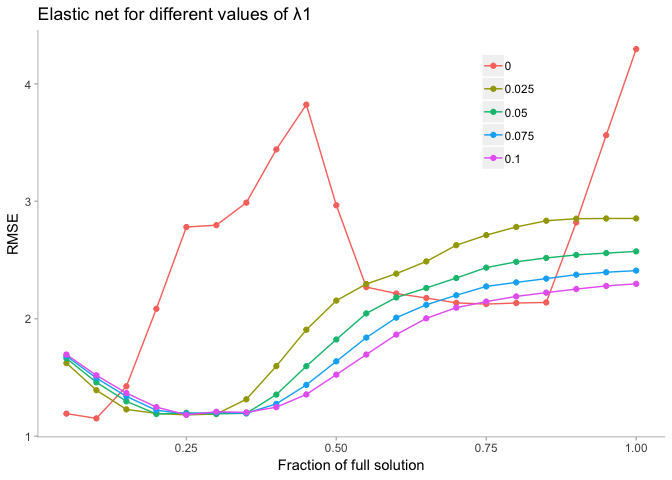

d- Predict the response for the test set. What is the value of the performance metrix and how does it compare with the resampled performance metric of the training set.

``` r
enetFit <- predict(enetModel, testPredictors)
enetValues <- data.frame(pred = enetFit, obs = testYield)
enetSummary <- defaultSummary(enetValues)
enetSummary
```

    ##      RMSE  Rsquared       MAE 
    ## 1.0500311 0.5584592 0.8786869

``` r
ggplot(enetValues, aes(x = pred, y = obs)) +
  geom_point(color = '#41b6c4') +
  geom_abline() +
  labs(title = 'Enet') +
  theme(panel.grid = element_blank(),
      panel.background = element_blank(),
      axis.line.x = element_line(colour = "grey"),
      axis.line.y = element_line(colour = "grey"),
      axis.ticks.x = element_line(colour = "grey"),
      axis.ticks.y = element_line(colour = "grey")
      )
```

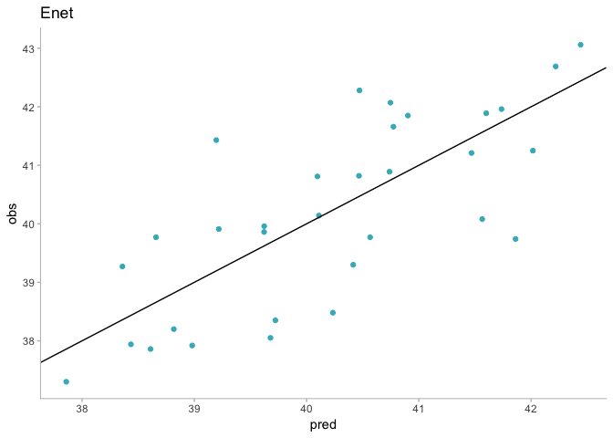

e- Which predictors are most important in the model you have trained? Do either the biological or process predictors dominate the list?

``` r
plot(enetModel)
```

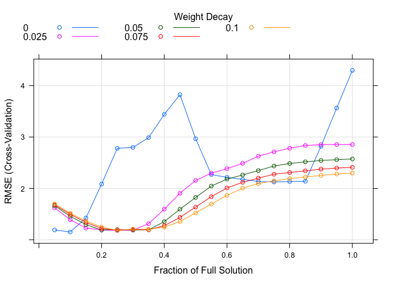

``` r
beta <- enetModel$finalModel$beta.pure
tmp <- as.data.frame(as.matrix(beta))
tmp$coef <- row.names(tmp)
tmp <- reshape::melt(tmp, id = "coef")
tmp$norm <- enetModel$finalModel$L1norm # compute L1 norm


# x11(width = 13/2.54, height = 9/2.54)
g1 <- ggplot(tmp, aes(norm, value, color = variable)) + 
  geom_line() +
  theme(panel.grid = element_blank(),
        panel.background = element_blank(),
        axis.line.x = element_line(colour = "grey"),
        axis.line.y = element_line(colour = "grey"),
        axis.ticks.x = element_line(colour = "grey"),
        axis.ticks.y = element_line(colour = "grey"),
        legend.position = "none")

g1
```

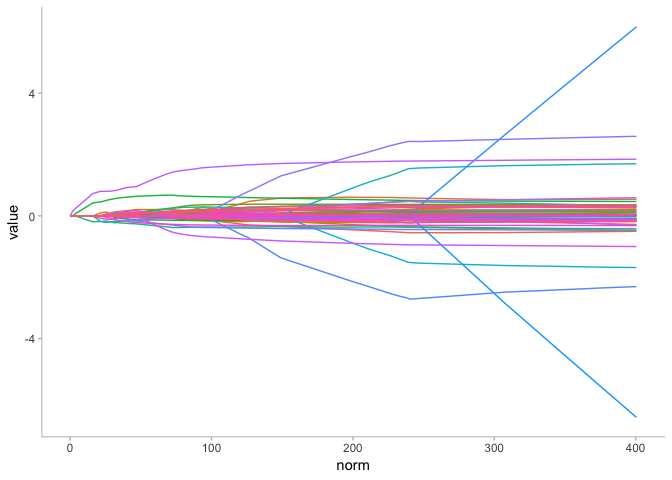

Let's take a deeper look to see what are the variables with the highest influence in the outcome.

``` r
tmp1 <- tmp %>% 
  filter(norm < 20)

tmp2 <- tmp1 %>% 
  group_by(variable) %>% 
  summarize(sum = sum(value)) %>% 
  filter(sum != 0)

tmp1 <- tmp1 %>% 
  filter(variable %in% tmp2$variable)

g <- ggplot(tmp1, aes(norm, value, color = variable)) + 
  geom_line() +
  labs(title = "Lasso", x = "L1 norm", y = "Standarized coefficients") +
  #scale_color_brewer(palette="Set3") +
  theme(panel.grid = element_blank(),
        panel.background = element_blank(),
        axis.line.x = element_line(colour = "grey"),
        axis.line.y = element_line(colour = "grey"),
        axis.ticks.x = element_line(colour = "grey"),
        axis.ticks.y = element_line(colour = "grey"),
        legend.direction = "horizontal",
        legend.position = "bottom",
        legend.title = element_blank())

g
```

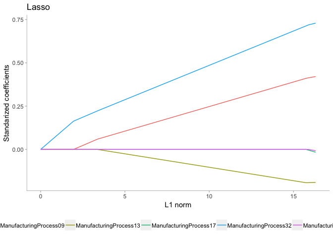

All of them are manufacturing variables that we could manipulate to get the outcome we want in yield.

I saw that I've been using the lasso plot a lot and it takes a lot of code to get the plot I wanted. To solve that problem I created my own function. It takes the object that you get as a result from the `train` function of the `caret` package when you use `method = enet`.

``` r
source("/Users/santiagotoso/GoogleDrive/Master/R/Functions/enetPlot.R")

enetPlot(enetModel = enetModel, L1norm = 20, maxlegend = 10)
```

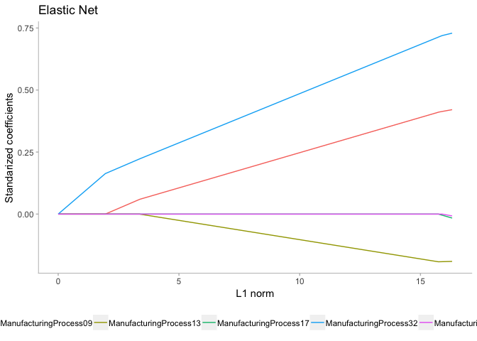

``` r
source("/Users/santiagotoso/GoogleDrive/Master/R/Functions/enetPlotCompare.R")
enetPlotCompare(enetModel)
```


